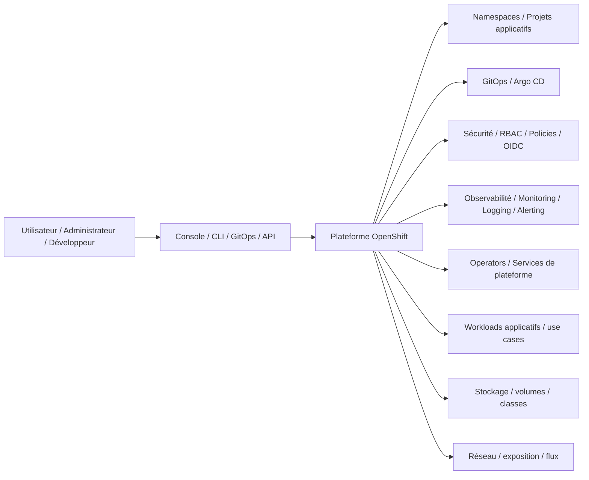

# Platform Overview

## 1. Objectif du document

Ce document présente la **vue d’ensemble de la plateforme cible** portée par le dépôt `openshift-platform-blueprints`.

Son rôle est de fournir un cadrage clair sur :

- le type de plateforme visé ;
- les principaux blocs techniques ;
- la logique d’organisation générale ;
- la place de GitOps, de la sécurité et de l’observabilité ;
- la trajectoire entre lab personnel, démonstrateur crédible et architecture de plateforme réutilisable.

Ce document ne cherche pas à détailler toutes les implémentations ni tous les manifests.
Il sert de **vue de synthèse structurante**.

---

## 2. Contexte

Le dépôt `openshift-platform-blueprints` sert de **dépôt principal de consolidation OpenShift**.

Il a vocation à rassembler dans un cadre cohérent :

- des éléments de compréhension OpenShift ;
- des architectures de référence ;
- des blueprints techniques ;
- des supports de progression ;
- des cas d’usage réutilisables ;
- des éléments de valorisation portfolio.

Dans cette logique, la plateforme décrite ici n’est pas limitée à un simple lab local.
Elle représente une **plateforme cible générique**, suffisamment réaliste pour soutenir :

- des démonstrations techniques ;
- des travaux GitOps ;
- des scénarios sécurité ;
- des usages observabilité / SRE ;
- des expérimentations applicatives structurées ;
- des projections vers des architectures plus industrielles.

---

## 3. Portée

Le document couvre principalement :

- la vue logique de la plateforme ;
- les grands blocs techniques ;
- les principes d’organisation ;
- la structuration des espaces projet ;
- les composants transverses ;
- les hypothèses de déploiement.

Le document ne couvre pas en détail :

- les manifests complets ;
- les choix d’implémentation de chaque composant ;
- les scénarios d’examen détaillés ;
- les procédures d’installation pas à pas.

Ces éléments sont traités ailleurs dans le dépôt.

---

## 4. Vision d’ensemble

La cible portée par ce dépôt est celle d’une **plateforme OpenShift structurée**, lisible et extensible, organisée autour de quelques principes simples :

- une base OpenShift claire ;
- une séparation entre composants plateforme et espaces applicatifs ;
- une gestion progressive par GitOps ;
- une approche orientée sécurité dès la base ;
- une couche d’observabilité pensée comme composant natif de la plateforme ;
- une capacité à accueillir des use cases concrets sans perdre la lisibilité globale.

Cette plateforme n’est pas présentée comme un produit figé.
Elle constitue une **architecture de référence évolutive**.

---

## 5. Hypothèses de départ

Dans l’état actuel du dépôt, la plateforme peut être pensée selon plusieurs niveaux de réalisation.

### Niveau 1 — Lab local ou personnel
Utilisé pour :

- apprentissage ;
- validation de patterns ;
- exercices liés aux certifications ;
- démonstrations simples.

Exemples de contexte :

- OpenShift Local ;
- cluster de lab ;
- environnement personnel de démonstration.

### Niveau 2 — Démonstrateur structuré
Utilisé pour :

- montrer des patterns reproductibles ;
- présenter une organisation plateforme ;
- illustrer GitOps, sécurité, observabilité et cas d’usage.

### Niveau 3 — Projection industrielle
Utilisé comme point d’appui pour raisonner sur :

- OpenShift on-prem ;
- OpenShift managé ;
- topologies multi-cluster ;
- industrialisation progressive.

Le dépôt cherche surtout à être crédible sur les niveaux 1 et 2, tout en préparant le niveau 3.

---

## 6. Vue logique de haut niveau

La plateforme peut être représentée comme un ensemble de blocs cohérents.

Cette vue exprime une idée simple : la plateforme OpenShift n’est pas seulement un cluster technique, mais un **socle organisé** où les préoccupations d’accès, de déploiement, de sécurité, de supervision et d’exécution sont pensées ensemble.

---

## 7. Blocs principaux de la plateforme

### 7.1. Socle OpenShift
Le socle OpenShift fournit :

- les mécanismes de scheduling et d’orchestration ;
- les primitives workloads, services, routes, volumes, operators ;
- les fonctions natives d’administration et d’exploitation ;
- les composants techniques permettant de structurer une vraie plateforme cloud-native.

Le dépôt n’a pas vocation à redécrire tout OpenShift.
Il s’appuie sur lui comme base de référence.

### 7.2. GitOps
Le bloc GitOps représente le mode de gestion cible des configurations réutilisables de plateforme.

Il couvre progressivement :

- la gestion déclarative d’éléments de configuration ;
- l’organisation des applications Argo CD ;
- la séparation entre blueprints plateforme et workloads ;
- la traçabilité des changements.

GitOps est un axe majeur du dépôt, car il relie l’architecture, la reproductibilité et l’industrialisation.

### 7.3. Sécurité
Le bloc sécurité couvre les préoccupations de base qui doivent apparaître dès la structure de la plateforme :

- gestion des rôles et droits ;
- séparation des responsabilités ;
- contrôle des accès ;
- politiques réseau ;
- gestion des secrets ;
- intégration potentielle à des mécanismes OIDC / SSO.

Le niveau d’implémentation peut varier selon le contexte, mais la sécurité ne doit pas être traitée comme un ajout tardif.

### 7.4. Observabilité
Le bloc observabilité couvre :

- métriques ;
- logs ;
- alerting ;
- vision SRE ;
- supervision des workloads et de la plateforme.

L’observabilité est considérée ici comme une brique structurante permettant d’aller au-delà d’un simple déploiement applicatif.

### 7.5. Réseau
Le bloc réseau couvre :

- exposition des services ;
- segmentation des flux ;
- communication inter-composants ;
- politiques réseau ;
- principes de publication applicative.

### 7.6. Stockage
Le bloc stockage couvre :

- la persistance nécessaire à certains workloads ;
- l’usage de volumes et de classes de stockage ;
- les hypothèses minimales de fonctionnement pour les services étatful.

### 7.7. Workloads et use cases
La plateforme doit pouvoir accueillir des cas d’usage concrets sans perdre sa lisibilité.

Les workloads visés peuvent inclure :

- applications de démonstration ;
- composants de sécurité ;
- composants observabilité ;
- cas d’usage orientés IAM / OIDC ;
- scénarios IBM ODM sur OpenShift ;
- scénarios event-driven / Kafka ;
- autres workloads cloud-native structurés.

---

## 8. Principes d’organisation

### 8.1. Séparation plateforme / applicatif
L’un des principes structurants du dépôt est de distinguer clairement :

- les composants de plateforme ;
- les espaces de travail applicatifs ;
- les éléments de démonstration ou de lab.

Cette séparation permet de garder une architecture lisible et de préparer une logique de gouvernance plus mature.

### 8.2. Lisibilité avant sophistication
La plateforme décrite ici ne cherche pas à impressionner par la complexité.
Elle cherche d’abord à être :

- compréhensible ;
- défendable ;
- progressive ;
- réutilisable.

### 8.3. Progression vers l’industrialisation
Même lorsque le point de départ est un lab ou un environnement personnel, les choix documentés doivent laisser apparaître une trajectoire réaliste vers :

- GitOps plus complet ;
- sécurité renforcée ;
- meilleure observabilité ;
- multi-cluster ;
- gouvernance plus avancée.

---

## 9. Organisation logique des namespaces

L’organisation cible des namespaces doit suivre une logique simple.

### 9.1. Espaces plateforme
Ils hébergent les composants transverses nécessaires à la plateforme, par exemple :

- GitOps ;
- observabilité ;
- opérateurs ;
- sécurité ;
- autres briques d’administration.

### 9.2. Espaces applicatifs / labs
Ils servent à :

- exécuter des workloads de démonstration ;
- porter les exercices liés aux certifications ;
- tester des cas d’usage ;
- isoler des expérimentations.

### 9.3. Espaces de sandbox
Ils permettent de tester des hypothèses ou des composants sans polluer les zones plus structurées.

Le détail exact des namespaces peut évoluer, mais le principe de séparation doit rester stable.

---

## 10. Place des autres dossiers du dépôt

### Avec `platform/`
Le dossier `platform/` porte les éléments techniques les plus proches de l’exécution : blueprints, manifests, GitOps, composants réutilisables.

### Avec `docs/`
Le dossier `docs/` apporte la connaissance de référence, les synthèses documentaires et la compréhension structurée des sujets OpenShift.

### Avec `certifications/`
Le dossier `certifications/` porte la progression, les labs et les supports de préparation.

Ainsi, `overview/platform-overview.md` sert de point de jonction entre ces différents blocs.

---

## 11. Limites assumées

Dans l’état actuel du dépôt, cette plateforme doit être présentée avec honnêteté.

Ce document décrit une cible cohérente, mais cela ne signifie pas que chaque composant est déjà industrialisé ni que tous les artefacts sont finalisés.

Le dépôt est dans une phase de consolidation.
La valeur du document est donc de fournir une **vision structurée et crédible**, pas de prétendre qu’un environnement complet de production est déjà livré clé en main.

---

## 12. Trajectoire cible

À moyen terme, l’ambition est que la plateforme documentée ici permette de démontrer :

- une base OpenShift claire ;
- une logique GitOps crédible ;
- des patterns sécurité et observabilité cohérents ;
- quelques use cases phares bien visibles ;
- une meilleure articulation entre documentation, architecture et blueprints ;
- une posture d’architecte technique / plateforme plus lisible pour un lecteur externe.

---

## 13. Conclusion

La plateforme décrite dans ce document doit être comprise comme une **architecture de référence pour le dépôt** `openshift-platform-blueprints`.

Elle fournit le cadre de lecture général nécessaire pour comprendre :

- la logique du dépôt ;
- la place des grands blocs ;
- les principes d’organisation ;
- la trajectoire entre lab, démonstration et industrialisation.

C’est sur cette base que les autres documents d’architecture, les blueprints techniques, les synthèses documentaires et les parcours de certification peuvent ensuite s’aligner.

---

## Auteur

**Zidane Djamal**  
Architecte technique / plateforme / cloud-native  
OpenShift | Kubernetes | GitOps | Sécurité | Observabilité | Architecture

