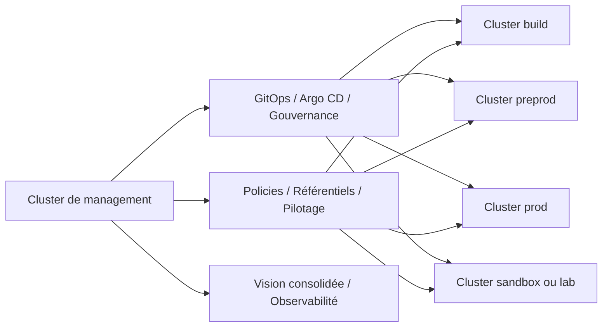

# Multi-Cluster Reference Architecture

## 1. Objectif du document

Ce document décrit l’**architecture de référence multi-cluster** du dépôt `openshift-platform-blueprints`.

Son rôle est de préciser comment la plateforme peut évoluer d’un périmètre simple de lab ou de démonstration vers une logique plus structurée impliquant plusieurs clusters, avec des préoccupations telles que :

- la séparation des environnements ;
- la centralisation partielle de la gouvernance ;
- l’extension de GitOps ;
- la cohérence de sécurité et d’observabilité ;
- la projection vers des usages plus industriels.

Ce document ne décrit pas une implémentation unique figée.
Il propose un **cadre d’architecture multi-cluster réaliste et progressif**.

---

## 2. Pourquoi introduire le multi-cluster

Le dépôt `openshift-platform-blueprints` ne vise pas seulement à montrer des déploiements sur un cluster isolé.

Il cherche aussi à démontrer une capacité à raisonner sur des plateformes OpenShift plus structurées, où plusieurs clusters peuvent être nécessaires pour :

- séparer des environnements ;
- répartir des rôles de plateforme ;
- distinguer management et workloads ;
- préparer des scénarios de gouvernance plus avancés ;
- aligner l’architecture sur des pratiques d’entreprise plus réalistes.

L’intérêt du sujet multi-cluster dans le dépôt est donc double :

- **architectural**, car il montre une lecture plus mature de la plateforme ;
- **portfolio**, car il rapproche le dépôt d’enjeux réellement rencontrés en mission.

---

## 3. Positionnement dans le dépôt

Le multi-cluster est un sujet transverse, relié à :

- `architecture/` pour la vision et les patterns ;
- `platform/` pour les artefacts réutilisables ;
- `docs/` pour l’approfondissement des briques OpenShift et gouvernance ;
- `certifications/` pour les parcours associés aux sujets avancés ;
- `use-cases/` lorsqu’un scénario doit être projeté sur plusieurs clusters.

Ce document donne la logique d’ensemble. Il ne remplace pas les fichiers techniques détaillés.

---

## 4. Principes directeurs

### 4.1. Le multi-cluster n’est pas une fin en soi
L’objectif n’est pas de multiplier les clusters pour le principe.
Le multi-cluster doit répondre à des besoins lisibles.

### 4.2. Séparation des responsabilités
Une architecture multi-cluster devient intéressante lorsqu’elle clarifie les responsabilités entre :

- gestion ;
- déploiement ;
- exploitation ;
- workloads ;
- environnements.

### 4.3. Progressivité
Le dépôt doit pouvoir rester crédible même sans implémentation complète de tous les scénarios multi-cluster.
La trajectoire compte autant que l’état final.

### 4.4. Gouvernance simple avant sophistication
La valeur d’une architecture multi-cluster tient à sa lisibilité.
Il vaut mieux une topologie simple et bien argumentée qu’un schéma trop ambitieux sans cohérence démontrable.

### 4.5. Cohérence avec GitOps, sécurité et observabilité
Le multi-cluster ne doit pas être traité isolément.
Il doit s’articuler avec les autres briques structurantes du dépôt.

---

## 5. Cas d’usage justifiant le multi-cluster

Dans le cadre du dépôt, plusieurs raisons peuvent justifier l’introduction d’une logique multi-cluster :

- séparation nette entre environnements de travail ;
- isolation de workloads ou composants sensibles ;
- pilotage centralisé de plusieurs clusters ;
- mise en cohérence de politiques ou configurations ;
- extension de GitOps à plusieurs cibles ;
- démonstration de gouvernance de plateforme à plus grande échelle.

Le dépôt n’a pas besoin de couvrir tous les cas à la fois.
Il doit montrer une lecture claire des raisons d’usage.

---

## 6. Topologie cible de référence

Une topologie simple et crédible pour le dépôt peut être représentée ainsi.

Cette vue exprime un modèle simple :

- un cluster ou plan de management pour piloter ;
- plusieurs clusters workload ou environnement ;
- une logique de gouvernance et de déploiement structurée.

---

## 7. Modèle hub and spoke

Le modèle le plus naturel à documenter dans le dépôt est une logique **hub and spoke**.

### 7.1. Hub de management
Le hub regroupe les fonctions qui gagnent à être centralisées, par exemple :

- pilotage GitOps ;
- gouvernance ;
- certaines politiques ;
- visibilité consolidée ;
- outils d’administration transverses.

### 7.2. Clusters spoke / workload
Les clusters spoke portent les workloads ou environnements :

- sandbox ;
- build ;
- preprod ;
- prod ;
- éventuellement clusters dédiés à certains besoins spécifiques.

### 7.3. Intérêt du modèle
Ce modèle est utile car il permet de montrer :

- une séparation plus mature entre management et exécution ;
- une capacité à projeter GitOps à plus grande échelle ;
- une meilleure cohérence de gouvernance.

---

## 8. Types de clusters et rôles associés

### 8.1. Cluster de management
Son rôle principal est de :

- piloter ;
- référencer ;
- centraliser certains éléments de gouvernance ;
- servir de point d’entrée de gestion globale.

### 8.2. Clusters d’environnement
Ils représentent les différentes cibles opérationnelles, par exemple :

- cluster de sandbox ;
- cluster de build ou intégration ;
- cluster de préproduction ;
- cluster de production.

### 8.3. Clusters spécialisés
À un niveau plus avancé, il peut exister des clusters dédiés à des besoins spécifiques :

- analytics ;
- edge ;
- workloads sensibles ;
- démonstrateurs techniques particuliers.

Le dépôt n’a pas besoin d’implémenter tous ces cas. Il doit surtout les cadrer proprement.

---

## 9. GitOps dans une logique multi-cluster

### 9.1. Extension naturelle de GitOps
Le multi-cluster prolonge naturellement l’architecture GitOps du dépôt.

GitOps peut alors servir à :

- cibler plusieurs clusters ;
- appliquer des configurations différenciées selon l’environnement ;
- mutualiser certains socles ;
- centraliser la visibilité de déploiement.

### 9.2. Gouvernance par environnement
Une logique multi-cluster saine distingue :

- ce qui est commun ;
- ce qui est spécifique à un environnement ;
- ce qui relève de la plateforme ;
- ce qui relève des workloads.

### 9.3. Progression raisonnable
Le dépôt peut commencer par documenter le modèle, puis montrer progressivement :

- applications multi-cibles ;
- overlays ou variantes d’environnement ;
- organisation de déploiement plus structurée.

---

## 10. Sécurité dans une architecture multi-cluster

Le multi-cluster renforce les besoins de clarté sécurité.

### 10.1. Séparation des périmètres
Chaque cluster doit avoir un rôle identifiable et des accès cohérents avec ce rôle.

### 10.2. Gouvernance des accès
Il devient particulièrement important de distinguer :

- les droits d’administration du management ;
- les droits d’exploitation par cluster ;
- les droits applicatifs par environnement.

### 10.3. Cohérence des politiques
Le multi-cluster crée aussi un besoin de cohérence sur :

- certaines conventions RBAC ;
- certaines politiques réseau ;
- certaines règles de déploiement ;
- certaines attentes de gouvernance.

---

## 11. Observabilité dans une architecture multi-cluster

Le multi-cluster soulève également des questions d’observabilité.

### 11.1. Visibilité locale et consolidée
Il faut pouvoir raisonner à deux niveaux :

- la visibilité propre à chaque cluster ;
- une lecture consolidée ou au moins comparable à l’échelle globale.

### 11.2. Intérêt pour l’exploitation
Cette approche permet de mieux :

- comparer les environnements ;
- diagnostiquer des écarts ;
- piloter la santé globale de la plateforme.

### 11.3. Intérêt pour le dépôt
Même si tout n’est pas implémenté, documenter cette logique renforce la crédibilité architecturale du dépôt.

---

## 12. Environnements et cycle de vie

Le multi-cluster s’inscrit aussi dans une logique de cycle de vie des environnements.

Une lecture simple et utile du dépôt peut s’articuler autour de :

- sandbox pour expérimentation ;
- build ou intégration pour assemblage et premiers tests ;
- preprod pour validation avancée ;
- prod pour exécution stabilisée.

Cette structuration aide à montrer qu’une plateforme ne se limite pas à un cluster unique où tout cohabite sans hiérarchie.

---

## 13. Place des outils de gouvernance avancée

Dans une trajectoire plus avancée, une architecture multi-cluster peut s’appuyer sur des outils de gouvernance et de management plus spécialisés.

Dans le contexte du dépôt, ils doivent être présentés comme :

- des extensions possibles ;
- des leviers de centralisation ;
- des outils cohérents avec une démarche de plateforme plus mature.

L’important n’est pas de tout implémenter immédiatement, mais de garder une architecture compatible avec ce type d’évolution.

---

## 14. Limites et vigilance

Pour rester crédible, le dépôt doit éviter plusieurs dérives sur le sujet multi-cluster.

### 14.1. Schémas trop ambitieux
Une topologie trop complexe sans artefacts ou cas d’usage visibles perd vite de sa valeur.

### 14.2. Mélange des rôles
Le cluster de management ne doit pas être confondu avec tous les autres rôles sans justification claire.

### 14.3. Promesses non démontrées
Le dépôt doit rester honnête sur ce qui est :

- déjà structuré ;
- en cours de consolidation ;
- simplement projeté comme trajectoire.

### 14.4. Rupture avec les autres briques
Le multi-cluster doit prolonger la logique GitOps, sécurité et observabilité, pas l’ignorer.

---

## 15. Trajectoire cible

### Étape 1 — Vision
- documenter clairement la logique multi-cluster ;
- expliciter les rôles des clusters ;
- garder une topologie simple.

### Étape 2 — Structuration
- distinguer management et workloads ;
- organiser les environnements ;
- aligner la nomenclature et les conventions.

### Étape 3 — Extension GitOps
- projeter des déploiements multi-cluster ;
- différencier les overlays ou variantes ;
- mieux cadrer la gouvernance par environnement.

### Étape 4 — Projection avancée
- introduire des outils ou patterns de management plus évolués ;
- renforcer les politiques globales ;
- améliorer la visibilité consolidée.

---

## 16. Conclusion

L’architecture multi-cluster décrite ici doit être comprise comme une **projection structurée et progressive** pour `openshift-platform-blueprints`.

Elle permet de montrer que la plateforme pensée dans le dépôt peut évoluer au-delà d’un seul cluster, vers une logique plus mature impliquant :

- séparation des environnements ;
- gouvernance plus claire ;
- extension naturelle de GitOps ;
- cohérence sécurité et observabilité ;
- posture d’architecte davantage tournée vers des contextes réels.

Cette brique renforce la crédibilité du dépôt dès lors qu’elle reste simple, cohérente et honnête sur son niveau de maturité.

---

## Auteur

**Zidane Djamal**  
Architecte technique / plateforme / cloud-native  
OpenShift | Kubernetes | GitOps | Sécurité | Observabilité | Architecture

