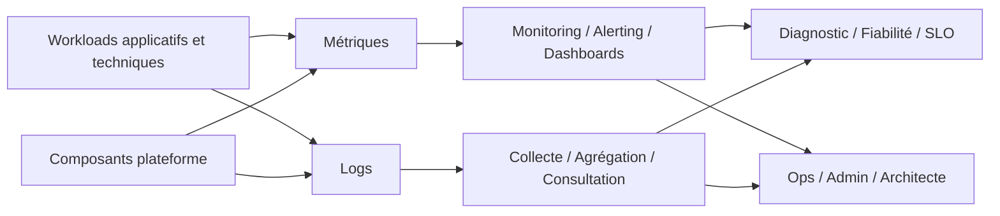

# Observability and SRE Reference Architecture

## 1. Objectif du document

Ce document décrit l’**architecture de référence observabilité / SRE** du dépôt `openshift-platform-blueprints`.

Son objectif est de préciser comment la plateforme cible intègre :

- la collecte et l’exploitation des métriques ;
- la centralisation et l’analyse des logs ;
- l’alerting ;
- la visibilité sur les composants plateforme et workloads ;
- une logique SRE adaptée à une plateforme OpenShift structurée.

Ce document n’est pas un guide d’installation détaillé.
Il sert de **cadre d’architecture** pour structurer la façon de penser l’observabilité dans le dépôt.

---

## 2. Pourquoi l’observabilité est centrale

Dans une plateforme OpenShift crédible, l’observabilité ne doit pas être traitée comme un ajout facultatif.

Elle joue plusieurs rôles essentiels :

- comprendre l’état réel de la plateforme ;
- superviser les workloads ;
- détecter les anomalies ;
- accélérer le diagnostic ;
- soutenir une posture d’exploitation et de fiabilité ;
- rendre la plateforme plus démontrable et plus défendable.

Pour le dépôt `openshift-platform-blueprints`, l’observabilité est aussi un marqueur de maturité : elle permet de dépasser un simple lab de déploiement pour entrer dans une logique plus proche de l’exploitation réelle.

---

## 3. Positionnement dans le dépôt

L’observabilité est un sujet transverse relié à plusieurs zones du dépôt :

- `architecture/` pour le cadre conceptuel et la structuration ;
- `platform/` pour les artefacts techniques réutilisables ;
- `docs/` pour la compréhension des briques OpenShift associées ;
- `certifications/` pour les labs et scénarios pratiques ;
- `use-cases/` lorsque des composants métiers ou techniques doivent être supervisés.

Ce document donne la vue d’architecture générale. Les implémentations détaillées doivent rester ailleurs.

---

## 4. Principes directeurs

### 4.1. Observabilité pensée dès la conception
L’observabilité doit être considérée comme une composante native de la plateforme, pas comme une correction tardive.

### 4.2. Couvrir plateforme et workloads
Une bonne observabilité doit rendre visibles à la fois :

- les composants transverses ;
- les espaces applicatifs ;
- les démonstrateurs ;
- les dépendances importantes.

### 4.3. Lisibilité avant sophistication
Il vaut mieux une chaîne simple, compréhensible et exploitable qu’une stack trop ambitieuse mais peu maîtrisée.

### 4.4. Progression réaliste
Le dépôt doit pouvoir partir d’un niveau simple, puis monter progressivement vers des scénarios plus complets.

### 4.5. Lien avec SRE
L’observabilité doit soutenir une logique SRE : indicateurs, signaux utiles, alertes pertinentes et diagnostic plus rapide.

---

## 5. Domaines couverts

L’architecture observabilité / SRE du dépôt couvre principalement :

- métriques ;
- logs ;
- alerting ;
- tableaux de bord ;
- principes de supervision ;
- premiers éléments de raisonnement SRE.

Elle ne couvre pas exhaustivement :

- toute la chaîne APM avancée ;
- la totalité des pratiques d’astreinte ;
- les runbooks détaillés de tous les incidents ;
- un dispositif SOC ou SIEM complet.

---

## 6. Vue de haut niveau

Cette vue montre que l’observabilité ne se réduit pas à des outils : elle relie la plateforme, les workloads, l’exploitation et la fiabilité.

---

## 7. Bloc métriques

### 7.1. Rôle
Le bloc métriques doit fournir une vision chiffrée de l’état de la plateforme et des workloads.

Il permet notamment de suivre :

- la santé des composants ;
- les consommations de ressources ;
- les erreurs ;
- certaines tendances de performance ;
- le comportement général du système.

### 7.2. Niveaux de visibilité attendus
Les métriques doivent pouvoir couvrir progressivement :

- le cluster et ses composants principaux ;
- les namespaces et workloads ;
- les applications instrumentées ;
- certaines briques transverses comme GitOps, IAM ou observabilité elle-même.

### 7.3. Place dans le dépôt
Dans le dépôt, les éléments liés aux métriques peuvent se matérialiser par :

- documentation d’architecture ;
- manifests de type `ServiceMonitor` ou assimilés ;
- dashboards ;
- cas d’usage instrumentés.

---

## 8. Bloc logs

### 8.1. Rôle
Le bloc logs permet de centraliser et consulter les événements textuels émis par les workloads et certains composants techniques.

Il est particulièrement utile pour :

- comprendre les échecs applicatifs ;
- suivre les démarrages, arrêts et erreurs ;
- diagnostiquer des comportements réseau ou sécurité ;
- conserver une lecture exploitable de ce qui se passe réellement.

### 8.2. Objectif architectural
Le dépôt doit montrer une approche claire de la journalisation :

- les logs ne doivent pas rester uniquement enfermés dans chaque pod ;
- leur collecte doit être pensée comme une brique de plateforme ;
- leur consultation doit s’inscrire dans une logique d’exploitation structurée.

### 8.3. Niveau de maturité attendu
Un niveau simple et crédible peut suffire au départ, à condition de rester cohérent et démontrable.

---

## 9. Bloc alerting

### 9.1. Rôle
L’alerting sert à transformer des signaux observables en événements exploitables par l’exploitation ou l’architecture.

### 9.2. Bonnes pratiques de cadrage
Le dépôt doit éviter deux extrêmes :

- trop peu d’alertes utiles ;
- trop d’alertes générant du bruit.

### 9.3. Objectif réaliste
À ce stade, l’objectif n’est pas de produire un catalogue exhaustif d’alertes, mais de montrer :

- une logique de seuils ou signaux pertinents ;
- une articulation avec monitoring et logs ;
- une capacité à soutenir le diagnostic.

---

## 10. Tableaux de bord

### 10.1. Rôle
Les tableaux de bord servent à rendre la plateforme lisible rapidement pour :

- l’exploitation ;
- l’administration ;
- l’architecture ;
- la démonstration de valeur.

### 10.2. Types de vues utiles
Les vues les plus utiles dans le dépôt sont celles qui permettent de comprendre :

- l’état général de la plateforme ;
- la santé d’un workload ou d’un namespace ;
- certaines métriques de capacité ;
- des indicateurs liés à des use cases ciblés.

### 10.3. Valeur portfolio
Des dashboards simples mais pertinents renforcent fortement la crédibilité du dépôt, car ils montrent une capacité à rendre la plateforme observable et exploitable.

---

## 11. Notions SRE portées par le dépôt

### 11.1. Finalité
Le dépôt n’a pas besoin de devenir un manuel SRE complet.
En revanche, il gagne à montrer une lecture SRE claire de la plateforme.

### 11.2. Axes pertinents
Les notions SRE les plus utiles à faire apparaître sont :

- disponibilité ;
- latence ;
- erreurs ;
- saturation ;
- signaux utiles au diagnostic ;
- premiers raisonnements autour des SLO.

### 11.3. Valeur démontrée
L’objectif est de montrer qu’une plateforme OpenShift bien pensée doit pouvoir être pilotée non seulement par le déploiement, mais aussi par des signaux de fiabilité et d’exploitation.

---

## 12. Articulation avec GitOps

GitOps et observabilité sont complémentaires.

GitOps peut porter une partie des composants d’observabilité, par exemple :

- ressources de monitoring ;
- objets de collecte ;
- dashboards ;
- configurations réutilisables.

L’observabilité peut en retour rendre plus lisible le fonctionnement de la chaîne GitOps et des workloads qu’elle pilote.

---

## 13. Articulation avec la sécurité

L’observabilité aide aussi sur les sujets sécurité en apportant :

- visibilité sur les erreurs d’accès ;
- compréhension des flux ;
- diagnostic des échecs de configuration ;
- meilleure lecture des comportements anormaux.

Elle ne remplace pas la sécurité, mais elle améliore la capacité à la piloter et à la comprendre.

---

## 14. Articulation avec les use cases

Les use cases du dépôt doivent progressivement s’appuyer sur l’observabilité pour devenir crédibles.

Cela est particulièrement utile pour des scénarios tels que :

- IAM / OIDC / Keycloak ;
- IBM ODM sur OpenShift ;
- GitOps platform baseline ;
- workloads applicatifs démonstratifs ;
- approches event-driven / Kafka.

Un use case devient plus convaincant lorsqu’il n’est pas seulement déployé, mais aussi observable.

---

## 15. Limites et honnêteté architecturale

Le dépôt doit rester honnête sur son niveau de maturité.

Ce document décrit une cible crédible d’observabilité / SRE, mais cela ne signifie pas que :

- tous les dashboards sont finalisés ;
- toutes les alertes sont définies ;
- la chaîne complète de logs est stabilisée ;
- un modèle d’exploitation complet est déjà en place.

La valeur du document est de montrer une **trajectoire claire** et une **lecture structurée**.

---

## 16. Trajectoire cible

### Étape 1 — Visibilité de base
- premières métriques ;
- premières ressources de collecte ;
- premiers workloads instrumentés ;
- lecture simple de l’état de la plateforme.

### Étape 2 — Structuration
- séparation claire monitoring / logging ;
- dashboards cohérents ;
- alerting initial ;
- meilleure lisibilité par namespace ou use case.

### Étape 3 — Montée en maturité
- raisonnement SRE plus visible ;
- meilleure corrélation métriques / logs ;
- supervision plus ciblée des use cases.

### Étape 4 — Projection avancée
- enrichissement des dashboards ;
- extension vers scénarios plus industriels ;
- observabilité plus intégrée à la gouvernance plateforme.

---

## 17. Conclusion

L’architecture observabilité / SRE décrite ici doit être comprise comme une **brique structurante** de `openshift-platform-blueprints`.

Elle cherche à montrer qu’une plateforme OpenShift crédible repose aussi sur sa capacité à être :

- visible ;
- compréhensible ;
- supervisée ;
- diagnostiquerable ;
- pilotable dans une logique de fiabilité.

Cette brique renforce à la fois la qualité technique du dépôt, sa valeur pédagogique et sa crédibilité comme portfolio.

---

## Auteur

**Zidane Djamal**  
Architecte technique / plateforme / cloud-native  
OpenShift | Kubernetes | GitOps | Sécurité | Observabilité | Architecture

