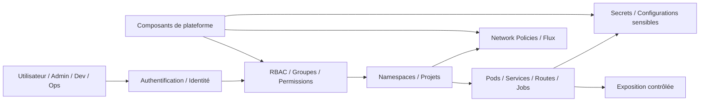

# Security Reference Architecture

## 1. Objectif du document

Ce document décrit l’**architecture de référence sécurité** du dépôt `openshift-platform-blueprints`.

Son rôle est de préciser comment la sécurité est pensée dans la plateforme cible, en particulier autour de :

- la gestion des accès ;
- la séparation des responsabilités ;
- la segmentation réseau ;
- la gestion des secrets ;
- l’exposition contrôlée des services ;
- l’intégration progressive de mécanismes d’authentification et de gouvernance.

Ce document ne remplace pas une politique de sécurité exhaustive.
Il fournit un **cadre d’architecture sécurité cohérent, réaliste et exploitable** pour le dépôt.

---

## 2. Positionnement de la sécurité dans le dépôt

Dans `openshift-platform-blueprints`, la sécurité n’est pas considérée comme un bloc périphérique ajouté après coup.

Elle est pensée comme une **dimension transversale** qui doit apparaître dès la structure de la plateforme, à travers :

- l’organisation des namespaces ;
- le modèle RBAC ;
- les policies réseau ;
- la gestion des secrets ;
- les principes GitOps ;
- les schémas d’exposition ;
- l’authentification et l’identité.

L’objectif n’est pas de simuler une conformité complète à grande échelle, mais de montrer une **démarche sécurité crédible** dès le niveau architecture.

---

## 3. Principes directeurs

### 3.1. Sécurité par structuration
Une grande partie de la sécurité d’une plateforme vient de la manière dont elle est structurée :

- séparation des espaces ;
- clarté des responsabilités ;
- réduction des privilèges ;
- contrôle des flux ;
- limitation des écarts manuels.

### 3.2. Moindre privilège
Les permissions doivent être accordées au niveau nécessaire, sans élargissement injustifié.

### 3.3. Séparation plateforme / applicatif
Les rôles et accès relatifs à la plateforme doivent être distincts de ceux accordés aux workloads applicatifs ou aux espaces de démonstration.

### 3.4. Déclaratif autant que possible
Les éléments de sécurité réutilisables gagnent à être décrits de manière déclarative, versionnés et relus.

### 3.5. Progressivité
La sécurité du dépôt doit pouvoir grandir par étapes, sans prétendre dès le départ à une couverture exhaustive de tous les sujets entreprise.

---

## 4. Domaines couverts

L’architecture de référence sécurité du dépôt couvre principalement :

- RBAC et séparation des rôles ;
- segmentation logique et réseau ;
- gestion des secrets ;
- exposition et publication des services ;
- intégration OIDC / SSO à moyen terme ;
- quelques principes de gouvernance de configuration.

Elle ne couvre pas en détail :

- tous les mécanismes bas niveau du cluster ;
- la sécurité complète de l’infrastructure sous-jacente ;
- les processus SOC ;
- l’ensemble des exigences réglementaires ou conformité avancée.

---

## 5. Vue de haut niveau

Cette vue exprime une logique simple : la sécurité ne repose pas sur un seul composant, mais sur l’articulation cohérente entre identité, accès, isolation, flux et secrets.

---

## 6. Modèle RBAC cible

### 6.1. Objectif du RBAC
Le RBAC doit permettre de distinguer clairement les rôles selon le besoin réel de chaque acteur.

Le dépôt cherche à montrer une approche simple et défendable, sans multiplication excessive des profils.

### 6.2. Profils types
Une base de travail raisonnable peut s’articuler autour de profils tels que :

- **admin plateforme** : gestion des composants structurants et des zones transverses ;
- **ops / exploitation** : visibilité et interventions contrôlées sur les workloads et les espaces de supervision ;
- **dev / contributeur applicatif** : déploiement et gestion dans des espaces dédiés, sans privilèges plateforme étendus ;
- **lecture / audit** : consultation sans capacité de modification.

### 6.3. Séparation des responsabilités
Le dépôt doit éviter les anti-patterns suivants :

- donner trop tôt des droits de cluster-admin ;
- mélanger rôles plateforme et rôles applicatifs ;
- rendre indistincts les rôles d’exploitation, développement et administration.

### 6.4. Groupes et standardisation
Lorsque cela devient pertinent, les bindings doivent s’appuyer sur des groupes ou conventions de nommage stables, plutôt que sur des affectations dispersées utilisateur par utilisateur.

---

## 7. Segmentation logique par namespaces

La sécurité commence aussi par la structuration des espaces.

### 7.1. Espaces plateforme
Ils hébergent les composants transverses et doivent être plus contrôlés.

### 7.2. Espaces applicatifs
Ils servent à isoler les workloads, les démonstrateurs et les cas d’usage.

### 7.3. Espaces de sandbox
Ils autorisent plus d’expérimentation, mais doivent rester identifiés comme des zones moins structurées.

Cette séparation ne remplace pas les autres mécanismes de sécurité, mais elle crée une base saine pour appliquer des politiques cohérentes.

---

## 8. Segmentation réseau

### 8.1. Principes
La politique réseau cible repose sur une logique simple :

- réduction des communications inutiles ;
- contrôle des flux entrants et sortants ;
- limitation de la surface d’exposition ;
- capacité à documenter clairement les échanges autorisés.

### 8.2. Patterns de base
Les patterns les plus utiles à mettre en avant dans le dépôt sont :

- **deny by default** ;
- **allow intra-namespace** lorsqu’approprié ;
- **allow egress contrôlé** pour DNS, HTTP/HTTPS ou autres besoins explicités ;
- règles spécifiques à certains composants quand un use case l’exige.

### 8.3. Objectif pédagogique et architectural
L’intérêt du dépôt n’est pas seulement de montrer qu’une `NetworkPolicy` existe, mais de montrer :

- pourquoi elle existe ;
- quel flux elle contrôle ;
- à quel niveau elle s’applique ;
- comment elle s’insère dans une logique d’architecture lisible.

---

## 9. Gestion des secrets

### 9.1. Rôle des secrets
La plateforme doit intégrer une logique explicite de gestion des informations sensibles, notamment :

- identifiants ;
- tokens ;
- mots de passe ;
- certificats ;
- paramètres sensibles applicatifs ou techniques.

### 9.2. Principes retenus
Le dépôt doit porter quelques règles simples :

- ne pas exposer les secrets en clair dans les manifests ou la documentation ;
- séparer configurations ordinaires et données sensibles ;
- versionner les conventions de gestion, pas les secrets bruts ;
- préparer, lorsque pertinent, l’usage de mécanismes tels que Sealed Secrets ou coffre-fort externe.

### 9.3. Progressivité
À court terme, il suffit que le dépôt montre une approche cohérente.
À moyen terme, il peut monter en maturité sur :

- gestion chiffrée ;
- rotation ;
- intégration à des mécanismes externes.

---

## 10. Exposition des services

### 10.1. Principe général
Tous les workloads n’ont pas vocation à être exposés de la même manière.

L’architecture sécurité doit distinguer :

- les composants internes uniquement ;
- les services exposés à des utilisateurs ou intégrations ;
- les interfaces d’administration ;
- les services nécessitant une authentification renforcée.

### 10.2. Contrôle de l’exposition
L’exposition doit être pensée avec :

- un niveau d’ouverture justifié ;
- des conventions de routage lisibles ;
- une authentification quand nécessaire ;
- une limitation des surfaces inutiles.

### 10.3. Cas d’usage cibles
Cette logique est particulièrement importante pour les cas d’usage du dépôt impliquant :

- Keycloak / OIDC ;
- consoles ou interfaces d’administration ;
- services API ;
- workloads exposés via Routes ou autres mécanismes de publication.

---

## 11. Identité, OIDC et SSO

### 11.1. Place du sujet dans le dépôt
L’authentification et l’identité font partie des thèmes structurants du dépôt.

Même si toutes les implémentations ne sont pas finalisées, l’architecture doit rester compatible avec :

- intégration d’un fournisseur d’identité ;
- gestion de groupes ;
- SSO via OIDC ;
- séparation entre identité et autorisation.

### 11.2. Logique cible
La logique recherchée est la suivante :

- authentifier via un IdP reconnu ;
- récupérer ou mapper des groupes ;
- appliquer les rôles RBAC côté OpenShift ou côté workloads selon le cas ;
- éviter les comptes locaux dispersés lorsque la centralisation devient possible.

Ce sujet est particulièrement pertinent dans les cas d’usage OpenShift + Keycloak + workloads sécurisés.

---

## 12. Sécurité des workloads

### 12.1. Principe
Les workloads ne doivent pas être considérés comme de simples pods anonymes déposés sur un cluster.

Ils doivent être analysés selon :

- leur niveau d’exposition ;
- leur besoin en secrets ;
- leur réseau ;
- leur rôle dans l’architecture ;
- leur interaction avec la plateforme.

### 12.2. Points d’attention
Le dépôt peut progressivement mettre en avant :

- comptes de service dédiés ;
- permissions minimales ;
- contrôles réseau ;
- conventions de déploiement plus sûres ;
- bonnes pratiques autour de l’exécution des conteneurs.

---

## 13. Lien avec GitOps

GitOps renforce la sécurité lorsqu’il permet de :

- standardiser les permissions ;
- versionner les policies ;
- relire les changements ;
- limiter les dérives manuelles ;
- documenter l’intention de sécurité dans Git.

L’architecture sécurité du dépôt doit donc être pensée en cohérence avec l’architecture GitOps, et non séparément.

---

## 14. Lien avec l’observabilité

La sécurité bénéficie également d’une bonne observabilité, car celle-ci améliore :

- la visibilité sur les composants ;
- la compréhension des comportements anormaux ;
- la capacité à diagnostiquer des erreurs d’accès, de réseau ou de configuration.

Même si le dépôt ne vise pas encore une chaîne de sécurité complète, cette articulation doit rester visible.

---

## 15. Limites et honnêteté architecturale

Le dépôt doit rester honnête sur son niveau de maturité.

Ce document décrit une cible d’architecture sécurité crédible, mais cela ne signifie pas que chaque brique de sécurité avancée est déjà implémentée ni que l’ensemble couvre un référentiel entreprise complet.

La valeur du document est de montrer :

- une vraie conscience des enjeux ;
- des choix structurants ;
- une progression logique ;
- une séparation claire des responsabilités.

---

## 16. Trajectoire cible

### Étape 1 — Base saine
- séparation des namespaces ;
- modèle RBAC simple ;
- premières NetworkPolicies ;
- gestion propre des secrets.

### Étape 2 — Normalisation
- conventions de rôles et groupes ;
- exposition mieux contrôlée ;
- meilleure intégration avec GitOps.

### Étape 3 — Montée en maturité
- OIDC / SSO mieux intégré ;
- use cases sécurité visibles ;
- meilleure articulation observabilité / sécurité.

### Étape 4 — Projection avancée
- politiques plus fines ;
- gouvernance renforcée ;
- intégration éventuelle d’outils de policy et validation.

---

## 17. Conclusion

L’architecture sécurité décrite dans ce document doit être comprise comme un **cadre de référence pragmatique** pour `openshift-platform-blueprints`.

Elle cherche à montrer qu’une plateforme OpenShift crédible ne repose pas uniquement sur le déploiement de workloads, mais aussi sur :

- une gestion claire des rôles ;
- une structuration saine des espaces ;
- un contrôle des flux ;
- une gestion propre des secrets ;
- une trajectoire réaliste vers des mécanismes d’identité et de gouvernance plus avancés.

C’est cette cohérence qui rend la sécurité lisible, défendable et utile dans le dépôt.

---

## Auteur

**Zidane Djamal**  
Architecte technique / plateforme / cloud-native  
OpenShift | Kubernetes | GitOps | Sécurité | Observabilité | Architecture

