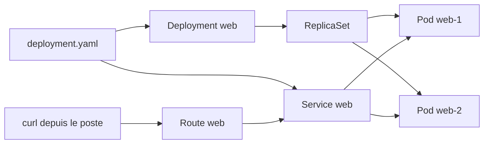
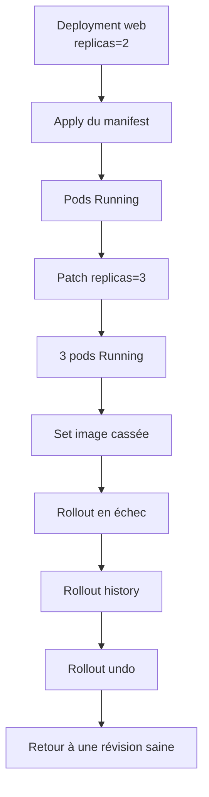
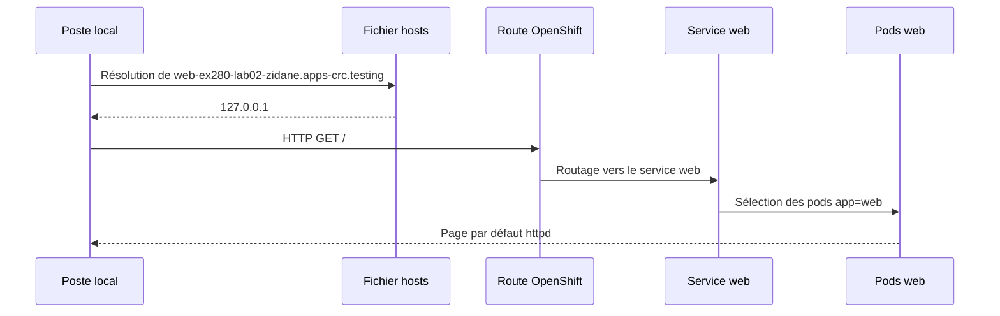

# Lab 02 corrigé — EX280 sur CRC
**Déploiement déclaratif, Service, Route, Rollout et Rollback**

## Objectif du lab
Pratiquer les bases opérationnelles d’OpenShift en mode déclaratif :
- créer un `Deployment` et un `Service` en YAML ;
- appliquer un manifest avec `oc apply` ;
- exposer une application avec une `Route` ;
- faire évoluer un déploiement avec un patch ;
- casser volontairement un rollout ;
- revenir à une version saine avec un rollback.

---

## Contexte du lab
Environnement utilisé :
- **poste** : Windows 11
- **terminal** : Git Bash
- **cluster** : CRC / OpenShift Local
- **namespace du lab** : `ex280-lab02-zidane`
- **répertoire de travail** : `certifications/ex280/work/lab02`

Point d’attention sur cet environnement :
- la variable `KUBECONFIG` peut devoir être réexportée ;
- la résolution DNS locale des routes `*.apps-crc.testing` peut nécessiter une entrée dans le fichier `hosts`.

---

## Notions et concepts abordés

### 1. Déploiement déclaratif
On décrit l’état voulu dans un fichier YAML, puis on l’applique avec :

```bash
oc apply -f deployment.yaml
```

Cela permet de :
- versionner la configuration ;
- relire facilement l’intention ;
- rejouer le déploiement de manière reproductible.

### 2. Deployment
Un `Deployment` gère :
- le nombre de replicas ;
- le template de pod ;
- les mises à jour progressives ;
- l’historique des révisions.

Dans ce lab, le `Deployment` s’appelle `web`.

### 3. ReplicaSet
Le `Deployment` crée et pilote un `ReplicaSet`, qui lui-même maintient le bon nombre de pods.

### 4. Pod
Les pods sont les instances réellement exécutées. Ici, ils portent le label :

```yaml
app: web
```

### 5. Service
Le `Service` fournit un point d’accès stable vers les pods du déploiement.

Ici :
- nom : `web`
- port : `8080`
- sélection via `app: web`

### 6. Route
La `Route` OpenShift expose le `Service` vers l’extérieur via un nom DNS.

Ici :
- `oc expose svc/web`
- hôte généré : `web-ex280-lab02-zidane.apps-crc.testing`

### 7. Rollout
Le rollout est le mécanisme de déploiement progressif d’une nouvelle version.

Commandes clés :
- `oc rollout status deploy/web`
- `oc rollout history deploy/web`
- `oc rollout undo deploy/web`

### 8. Scale / patch
Le nombre de replicas peut être modifié dynamiquement avec :

```bash
oc patch deploy/web -p '{"spec":{"replicas":3}}'
```

### 9. Rollback
Si une mise à jour casse l’application, on revient à la révision précédente avec :

```bash
oc rollout undo deploy/web
```

### 10. DNS local CRC
La route existait côté cluster, mais le poste local ne résolvait pas d’abord le nom `web-ex280-lab02-zidane.apps-crc.testing`.

Une correction locale a été faite dans le fichier `hosts` :

```text
127.0.0.1 web-ex280-lab02-zidane.apps-crc.testing
```

Après cette correction, le `curl` a bien atteint l’application.

---

## Architecture logique du lab



---

## Cycle de vie du rollout



---

## Schéma Service / Route / DNS local



---

## Manifest YAML utilisé

```yaml
apiVersion: apps/v1
kind: Deployment
metadata:
  name: web
spec:
  replicas: 2
  selector:
    matchLabels:
      app: web
  template:
    metadata:
      labels:
        app: web
    spec:
      containers:
      - name: web
        image: registry.access.redhat.com/ubi9/httpd-24
        ports:
        - containerPort: 8080
---
apiVersion: v1
kind: Service
metadata:
  name: web
spec:
  selector:
    app: web
  ports:
  - name: http
    port: 8080
    targetPort: 8080
```

---

## Déroulé corrigé du lab

### Étape 1 — Préparer le contexte
- définir `LAB=02`
- définir `NS=ex280-lab02-zidane`
- vérifier l’utilisateur courant
- vérifier / sélectionner le projet du lab

### Étape 2 — Préparer un répertoire de travail propre
Création d’un dossier dédié :

```text
certifications/ex280/work/lab02
```

Cela évite de mélanger :
- les supports dans `track/labs`
- les fichiers générés du lab

### Étape 3 — Créer le manifest déclaratif
Création du fichier `deployment.yaml` contenant :
- un `Deployment` nommé `web`
- un `Service` nommé `web`

### Étape 4 — Appliquer le manifest

```bash
oc apply -f deployment.yaml
```

Résultat observé :
- `deployment.apps/web created`
- `service/web created`

### Étape 5 — Vérifier le rollout

```bash
oc rollout status deploy/web
```

Résultat observé :
- `deployment "web" successfully rolled out`

### Étape 6 — Vérifier les pods

```bash
oc get pods -l app=web -o wide
```

Résultat observé :
- 2 pods `Running`
- nœud `crc`

### Étape 7 — Vérifier le service

```bash
oc get svc web
```

Résultat observé :
- service `ClusterIP`
- port `8080/TCP`

### Étape 8 — Exposer une route

```bash
oc expose svc/web
oc get route web
HOST=$(oc get route web -o jsonpath='{.spec.host}')
echo "$HOST"
```

### Étape 9 — Tester la route
Premier test :

```bash
curl -k "http://$HOST" || true
```

Premier résultat :
- échec DNS local : `Could not resolve host`

Correction locale :
- ajout d’une entrée `hosts`

Deuxième test :
- `curl` retourne la page par défaut Red Hat HTTP Server

### Étape 10 — Changer le nombre de replicas

```bash
oc patch deploy/web -p '{"spec":{"replicas":3}}'
oc rollout status deploy/web
oc get rs -l app=web
```

Résultat observé :
- déploiement patché
- rollout réussi
- 3 replicas prêts

### Étape 11 — Casser volontairement l’image

```bash
oc set image deploy/web web=registry.access.redhat.com/ubi9/httpd-24:does-not-exist
oc rollout status deploy/web || true
```

Résultat observé :
- `deployment.apps/web image updated`
- échec du rollout avec :

```text
error: deployment "web" exceeded its progress deadline
```

### Étape 12 — Lire l’historique puis rollback

```bash
oc rollout history deploy/web
oc rollout undo deploy/web
oc rollout status deploy/web
```

Résultat observé :
- historique avec 2 révisions
- rollback exécuté
- déploiement revenu à un état sain

### Étape 13 — Vérification finale

```bash
oc get pods -l app=web -o wide
```

Résultat observé :
- 3 pods `Running`
- rollback réussi

---

## Erreurs, causes racines et correctifs

| Situation | Symptôme | Cause racine | Correctif |
|---|---|---|---|
| Route créée mais `curl` KO | `Could not resolve host` | Résolution DNS locale absente sur le poste | ajout d’une entrée dans `hosts` |
| Rollout cassé | `deployment "web" exceeded its progress deadline` | image inexistante | `oc rollout undo deploy/web` |
| Doute sur le manifest | prompt visuellement trompeur lors du here-doc | ambiguïté d’affichage terminal | vérification avec `cat -n deployment.yaml` |

---

## Commandes réellement utilisées pendant le lab 02

### Journal ordonné

```bash
export LAB=02
export NS=ex280-lab${LAB}-zidane
echo "$LAB"
echo "$NS"
oc whoami

export KUBECONFIG="$HOME/.kube/crc-kubeconfig"
oc get project "$NS" || oc new-project "$NS"

export KUBECONFIG="$HOME/.kube/crc-kubeconfig"
oc get project "$NS" || oc new-project "$NS"

export KUBECONFIG="$HOME/.kube/crc-kubeconfig"
oc project "$NS"

mkdir -p certifications/ex280/work/lab02
cd certifications/ex280/work/lab02
pwd

cat <<'YAML' > deployment.yaml
apiVersion: apps/v1
kind: Deployment
metadata:
  name: web
spec:
  replicas: 2
  selector:
    matchLabels:
      app: web
  template:
    metadata:
      labels:
        app: web
    spec:
      containers:
      - name: web
        image: registry.access.redhat.com/ubi9/httpd-24
        ports:
        - containerPort: 8080
---
apiVersion: v1
kind: Service
metadata:
  name: web
spec:
  selector:
    app: web
  ports:
  - name: http
    port: 8080
    targetPort: 8080
YAML

ls
cat -n deployment.yaml

export KUBECONFIG="$HOME/.kube/crc-kubeconfig"
oc apply -f deployment.yaml

export KUBECONFIG="$HOME/.kube/crc-kubeconfig"
oc rollout status deploy/web

export KUBECONFIG="$HOME/.kube/crc-kubeconfig"
oc get pods -l app=web -o wide

export KUBECONFIG="$HOME/.kube/crc-kubeconfig"
oc get pods -l app=web -o wide
oc get svc web
oc get svc web
oc expose svc/web
oc get route web
HOST=$(oc get route web -o jsonpath='{.spec.host}')
echo "$HOST"
curl -k "http://$HOST" || true

oc patch deploy/web -p '{"spec":{"replicas":3}}'
oc rollout status deploy/web
oc get rs -l app=web

oc set image deploy/web web=registry.access.redhat.com/ubi9/httpd-24:does-not-exist
oc rollout status deploy/web || true
oc rollout history deploy/web
oc rollout undo deploy/web
oc rollout status deploy/web

export KUBECONFIG="$HOME/.kube/crc-kubeconfig"
oc get pods -l app=web -o wide
```

### Action système réalisée hors terminal `oc`
Ajout dans le fichier `hosts` local :

```text
127.0.0.1 web-ex280-lab02-zidane.apps-crc.testing
```

---

## Commandes essentielles à mémoriser pour EX280

```bash
oc apply -f deployment.yaml
oc rollout status deploy/web
oc get pods -l app=web -o wide
oc get svc web
oc expose svc/web
oc get route web
oc patch deploy/web -p '{"spec":{"replicas":3}}'
oc get rs -l app=web
oc set image deploy/web web=<nouvelle-image>
oc rollout history deploy/web
oc rollout undo deploy/web
```

---

## Vérifications finales du lab
Le lab est réussi si :
- le `Deployment web` existe ;
- le `Service web` existe ;
- la `Route web` existe ;
- l’accès HTTP fonctionne ;
- le scale à 3 replicas fonctionne ;
- le rollback ramène le déploiement à un état sain.

---

## Ce qu’il faut retenir pour la suite
- savoir créer un manifest propre ;
- savoir appliquer et vérifier un rollout ;
- savoir distinguer un problème cluster d’un problème DNS local ;
- savoir casser un déploiement puis revenir rapidement en arrière ;
- savoir lire les objets clés : `Deployment`, `ReplicaSet`, `Pod`, `Service`, `Route`.
