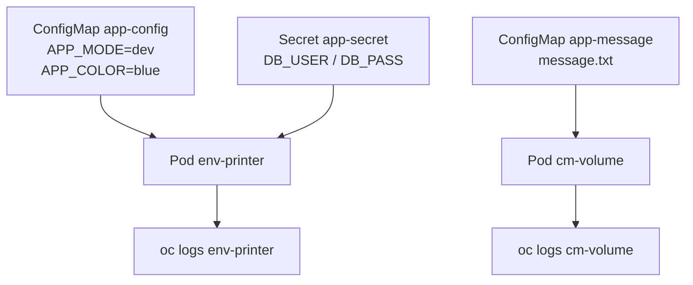
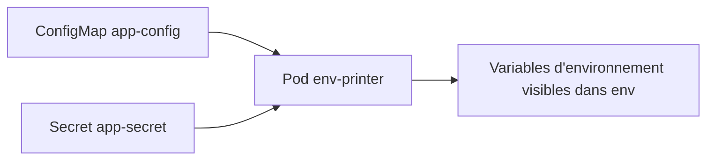
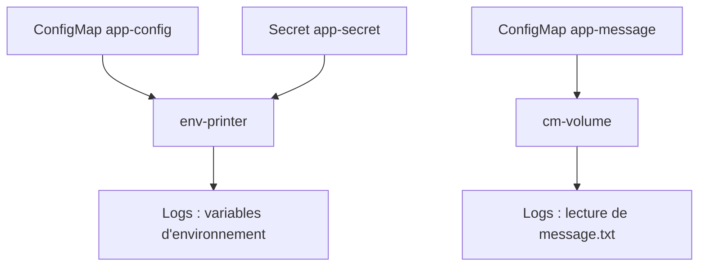

# Lab 03 corrigé — EX280 sur CRC
**ConfigMaps, Secrets, injection d'environnement et montage en volume**

## 1. Objectif du lab

Ce lab a pour but de pratiquer, en environnement CRC / OpenShift Local :

- la création d'une **ConfigMap** depuis des literals ;
- la création d'une **ConfigMap** depuis un fichier ;
- la création d'un **Secret générique** ;
- l'injection de données dans un conteneur via **`envFrom`** ;
- le montage d'une **ConfigMap** en volume ;
- la vérification du résultat avec `oc logs`, `oc get` et `oc wait`.

Le contenu du lab est cohérent avec le support `lab03-configmaps-secrets.md`. 

---

## 2. Concepts abordés

### 2.1 ConfigMap

Une **ConfigMap** sert à stocker des données de configuration non sensibles.

Exemples typiques :
- variables d'environnement applicatives ;
- fichiers de configuration ;
- paramètres de runtime.

Dans ce lab, deux approches ont été utilisées :
- **depuis des literals** (`APP_MODE=dev`, `APP_COLOR=blue`) ;
- **depuis un fichier** (`message.txt`).

### 2.2 Secret

Un **Secret** sert à stocker des données sensibles.

Dans OpenShift/Kubernetes :
- les valeurs sont visibles en base64 dans le YAML ;
- cela **n'est pas un chiffrement fort**, mais un encodage ;
- la sécurité réelle dépend surtout du RBAC, des politiques d'accès et de la protection de l'API/etcd.

Dans ce lab :
- `DB_USER=odmuser`
- `DB_PASS=devsecops`

### 2.3 Injection via `envFrom`

`envFrom` permet de charger toutes les clés d'une ConfigMap ou d'un Secret comme variables d'environnement.

Avantage :
- rapide à configurer ;
- pratique pour de petits paramètres applicatifs.

Limite :
- toutes les clés sont injectées ;
- moins précis qu'un mapping champ par champ avec `env`.

### 2.4 Montage en volume

Une ConfigMap peut aussi être montée comme un **volume**.

Cela permet :
- d'exposer un fichier de configuration dans le conteneur ;
- de conserver une logique plus proche d'une application lisant des fichiers.

Dans ce lab, `message.txt` a été monté sous :
- `/etc/config/message.txt`

### 2.5 Vérification avec `oc logs`

Les pods de démonstration affichent les valeurs utiles au démarrage, puis restent vivants avec `sleep 3600`.

Cela permet de vérifier facilement :
- que les variables d'environnement ont bien été injectées ;
- que le contenu du fichier monté est bien lisible.

### 2.6 PodSecurity warnings

Sur CRC, les créations de pods ont affiché des warnings `PodSecurity "restricted:latest"`.

Dans ce lab, ces warnings étaient **non bloquants** :
- les pods ont été créés ;
- ils sont passés en `Ready` ;
- les logs attendus étaient bien présents.

Il faut donc distinguer :
- **warning non bloquant** ;
- **erreur bloquante** empêchant la création ou le démarrage.

---

## 3. Vue d'ensemble du lab



---

## 4. Déroulé fonctionnel

### 4.1 Préparation du namespace du lab

Variables utilisées :

```bash
export LAB=03
export NS=ex280-lab${LAB}-zidane
```

Puis bascule sur le projet :

```bash
oc project "$NS"
```

Résultat observé :
- projet courant : `ex280-lab03-zidane`

---

### 4.2 Création d'une ConfigMap depuis des literals

Commande :

```bash
oc create configmap app-config \
  --from-literal=APP_MODE=dev \
  --from-literal=APP_COLOR=blue
```

Vérification :

```bash
oc get cm app-config -o yaml | sed -n '1,120p'
```

Résultat observé :
- `APP_MODE: dev`
- `APP_COLOR: blue`

---

### 4.3 Création d'une ConfigMap depuis un fichier

Création du fichier :

```bash
echo "Bonjour EX280" > message.txt
```

Création de la ConfigMap :

```bash
oc create configmap app-message --from-file=message.txt
```

Vérification :

```bash
oc get cm app-message -o yaml | sed -n '1,120p'
```

Résultat observé :
- clé : `message.txt`
- contenu : `Bonjour EX280`

---

### 4.4 Création du Secret

Commande :

```bash
oc create secret generic app-secret \
  --from-literal=DB_USER=odmuser \
  --from-literal=DB_PASS='devsecops'
```

Vérification :

```bash
oc get secret app-secret -o yaml | sed -n '1,80p'
```

Résultat observé :
- `DB_USER: b2RtdXNlcg==`
- `DB_PASS: ZGV2c2Vjb3Bz`

Interprétation :
- les données apparaissent encodées en base64 dans le YAML.

---

### 4.5 Pod `env-printer` avec `envFrom`

Manifest appliqué :

```yaml
apiVersion: v1
kind: Pod
metadata:
  name: env-printer
spec:
  containers:
  - name: env-printer
    image: registry.access.redhat.com/ubi9/ubi-minimal
    command: ["/bin/sh","-c"]
    args:
      - |
        env | sort
        sleep 3600
    envFrom:
      - configMapRef:
          name: app-config
      - secretRef:
          name: app-secret
```

Schéma :



Commandes utilisées :

```bash
cat <<'YAML' | oc apply -f -
apiVersion: v1
kind: Pod
metadata:
  name: env-printer
spec:
  containers:
  - name: env-printer
    image: registry.access.redhat.com/ubi9/ubi-minimal
    command: ["/bin/sh","-c"]
    args:
      - |
        env | sort
        sleep 3600
    envFrom:
      - configMapRef:
          name: app-config
      - secretRef:
          name: app-secret
YAML

oc wait --for=condition=Ready pod/env-printer --timeout=120s
oc logs env-printer | head -n 60
```

Valeurs observées dans les logs :

```text
APP_COLOR=blue
APP_MODE=dev
DB_PASS=devsecops
DB_USER=odmuser
```

Conclusion :
- la ConfigMap et le Secret ont bien été injectés comme variables d'environnement.

---

### 4.6 Pod `cm-volume` avec ConfigMap montée en volume

Manifest appliqué :

```yaml
apiVersion: v1
kind: Pod
metadata:
  name: cm-volume
spec:
  containers:
  - name: cm-volume
    image: registry.access.redhat.com/ubi9/ubi-minimal
    command: ["/bin/sh","-c"]
    args:
      - |
        cat /etc/config/message.txt
        sleep 3600
    volumeMounts:
      - name: cfg
        mountPath: /etc/config
  volumes:
    - name: cfg
      configMap:
        name: app-message
```

Schéma :

```mermaid
flowchart LR
    CMF[ConfigMap app-message<br/>message.txt] --> VOL[/etc/config/message.txt]
    VOL --> P2[Pod cm-volume]
    P2 --> LOG[oc logs cm-volume]
```

Commandes utilisées :

```bash
cat <<'YAML' | oc apply -f -
apiVersion: v1
kind: Pod
metadata:
  name: cm-volume
spec:
  containers:
  - name: cm-volume
    image: registry.access.redhat.com/ubi9/ubi-minimal
    command: ["/bin/sh","-c"]
    args:
      - |
        cat /etc/config/message.txt
        sleep 3600
    volumeMounts:
      - name: cfg
        mountPath: /etc/config
  volumes:
    - name: cfg
      configMap:
        name: app-message
YAML

oc wait --for=condition=Ready pod/cm-volume --timeout=120s
oc logs cm-volume
```

Résultat observé :

```text
Bonjour EX280
```

Conclusion :
- la ConfigMap a bien été montée comme volume ;
- le fichier `message.txt` est bien lisible depuis le conteneur.

---

## 5. Vérification finale du lab

Commande utilisée :

```bash
export KUBECONFIG="$HOME/.kube/crc-kubeconfig"
oc get pods env-printer cm-volume -o wide
```

Résultat observé :
- `env-printer` : `Running`
- `cm-volume` : `Running`
- nœud : `crc`

Conclusion :
- les deux pods sont opérationnels ;
- le lab 03 est validé.

---

## 6. Erreurs et écarts rencontrés pendant la séance

### 6.1 Erreur de navigation Git Bash

Commande tentée :

```bash
cd..
```

Résultat :

```text
bash: cd..: command not found
```

Cause :
- en Git Bash, il faut écrire `cd ..` avec un espace.

Correctif :

```bash
cd ..
```

### 6.2 Création du mauvais répertoire

Commande utilisée :

```bash
mkdir labs03
```

Puis tentative :

```bash
cd lab03
```

Résultat :

```text
bash: cd: lab03: No such file or directory
```

Cause :
- le dossier créé s'appelait `labs03` et non `lab03`.

Correctif appliqué :

```bash
ls
mv labs03/ lab03
cd lab03
```

### 6.3 Warnings PodSecurity

Warnings observés lors des `oc apply` sur les pods :
- `allowPrivilegeEscalation != false`
- `capabilities.drop=["ALL"]` non défini
- `runAsNonRoot != true`
- `seccompProfile.type` non défini

Interprétation :
- warnings non bloquants dans ce lab ;
- pods créés avec succès et passés en `Ready`.

---

## 7. Ce qu’il faut retenir pour EX280

### À savoir faire rapidement
- créer une ConfigMap depuis des literals ;
- créer une ConfigMap depuis un fichier ;
- créer un Secret générique ;
- lire un objet YAML avec `oc get ... -o yaml` ;
- injecter ConfigMap + Secret via `envFrom` ;
- monter une ConfigMap en volume ;
- vérifier avec `oc wait`, `oc logs` et `oc get pods -o wide`.

### Réflexes utiles
- distinguer donnée sensible et donnée non sensible ;
- ne pas confondre base64 et chiffrement ;
- vérifier le namespace courant avant d'appliquer un manifest ;
- utiliser des pods de test simples pour valider une mécanique rapidement.

---

## 8. Schéma récapitulatif global



---

## 9. Journal ordonné des commandes réellement utilisées pendant le lab 03

> Liste construite à partir des commandes réellement tapées pendant la séance, dans l'ordre observé.

```bash
export LAB=03
export NS=ex280-lab${LAB}-zidane
oc project "$NS"

oc create configmap app-config \
  --from-literal=APP_MODE=dev \
  --from-literal=APP_COLOR=blue
oc get cm app-config -o yaml | sed -n '1,120p'

echo "Bonjour EX280" > message.txt
oc create configmap app-message --from-file=message.txt
oc get cm app-message -o yaml | sed -n '1,120p'

oc create secret generic app-secret \
  --from-literal=DB_USER=odmuser \
  --from-literal=DB_PASS='devsecops'
oc get secret app-secret -o yaml | sed -n '1,80p'

cd..
cd ..
mkdir labs03
cd lab03
ls
mv labs03/ lab03
cd lab03

cat <<'YAML' | oc apply -f -
apiVersion: v1
kind: Pod
metadata:
  name: env-printer
spec:
  containers:
  - name: env-printer
    image: registry.access.redhat.com/ubi9/ubi-minimal
    command: ["/bin/sh","-c"]
    args:
      - |
        env | sort
        sleep 3600
    envFrom:
      - configMapRef:
          name: app-config
      - secretRef:
          name: app-secret
YAML
oc wait --for=condition=Ready pod/env-printer --timeout=120s
oc logs env-printer | head -n 60

cat <<'YAML' | oc apply -f -
apiVersion: v1
kind: Pod
metadata:
  name: cm-volume
spec:
  containers:
  - name: cm-volume
    image: registry.access.redhat.com/ubi9/ubi-minimal
    command: ["/bin/sh","-c"]
    args:
      - |
        cat /etc/config/message.txt
        sleep 3600
    volumeMounts:
      - name: cfg
        mountPath: /etc/config
  volumes:
    - name: cfg
      configMap:
        name: app-message
YAML
oc wait --for=condition=Ready pod/cm-volume --timeout=120s
oc logs cm-volume

export KUBECONFIG="$HOME/.kube/crc-kubeconfig"
oc get pods env-printer cm-volume -o wide
```

---

## 10. Commandes essentielles à mémoriser

```bash
# ConfigMap depuis literals
oc create configmap app-config \
  --from-literal=APP_MODE=dev \
  --from-literal=APP_COLOR=blue

# ConfigMap depuis fichier
oc create configmap app-message --from-file=message.txt

# Secret générique
oc create secret generic app-secret \
  --from-literal=DB_USER=odmuser \
  --from-literal=DB_PASS='devsecops'

# Vérification YAML
oc get cm app-config -o yaml
oc get secret app-secret -o yaml

# Vérification d'un pod
oc wait --for=condition=Ready pod/env-printer --timeout=120s
oc logs env-printer
oc get pods -o wide
```

---

## 11. Conclusion

Ce lab 03 est un excellent socle pour EX280 parce qu’il combine :
- objets de configuration OpenShift ;
- lecture du YAML ;
- déploiement rapide d’un pod de test ;
- validation par observation concrète.

Il entraîne à raisonner vite sur :
- où est stockée la configuration ;
- comment elle entre dans le conteneur ;
- comment la vérifier proprement avec le CLI.
