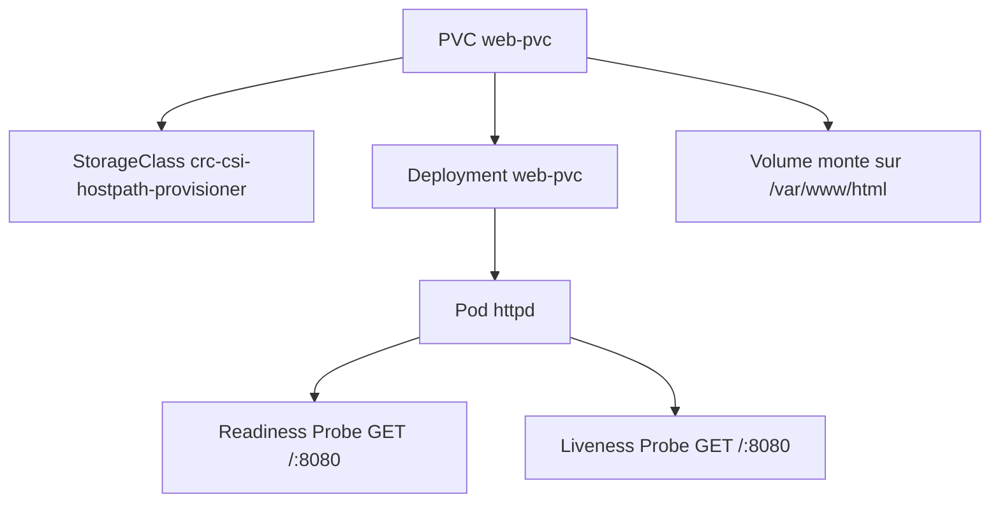
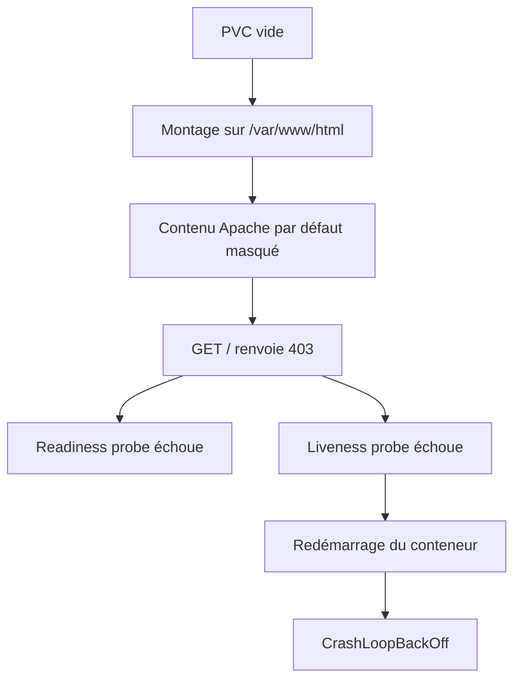
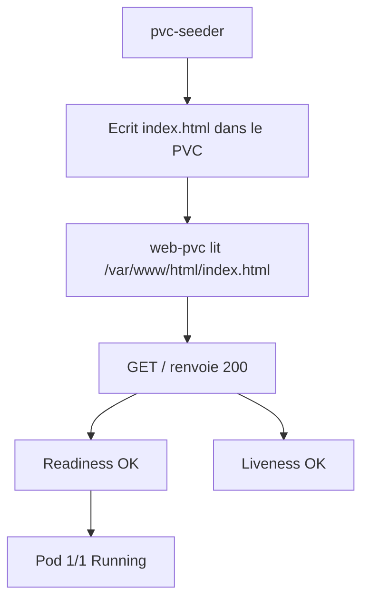
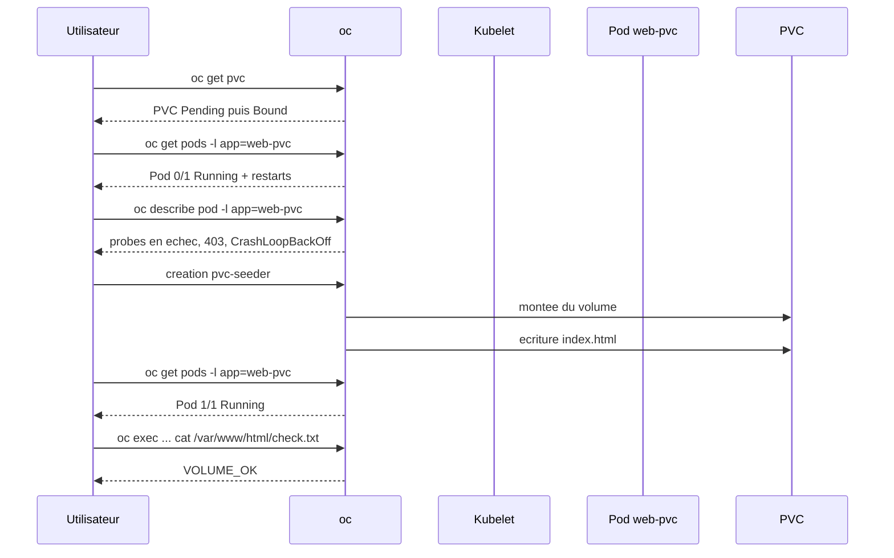

# Lab 04 corrigé — EX280 sur CRC
**PVC, Probes, Resources — support complet, corrigé et commenté**

## 1. Objectif du lab

Ce lab sert à pratiquer en conditions proches de l’examen EX280 :

- la création d’un **PersistentVolumeClaim (PVC)** ;
- le montage du volume dans un **Deployment** ;
- l’usage des **requests / limits** ;
- la lecture et l’analyse des **liveness/readiness probes** ;
- la compréhension du **binding** d’un PVC ;
- le diagnostic d’un pod qui redémarre ;
- la validation fonctionnelle du stockage avec `oc exec`.

---

## 2. Contexte du lab

Environnement utilisé pendant la séance :

- **Plateforme** : CRC / OpenShift Local
- **Terminal** : Git Bash sous Windows 11
- **Namespace** : `ex280-lab04-zidane`
- **Dossier de travail** : `certifications/ex280/work/lab04`

---

## 3. Notions et concepts abordés

### 3.1 PersistentVolumeClaim (PVC)

Un **PVC** est une demande de stockage formulée par une application.

Dans ce lab :

- le PVC s’appelle `web-pvc`
- il demande `1Gi`
- il est utilisé ensuite par un `Deployment`

Concept clé :

- le **PVC** est la demande ;
- le **PV** est le volume réel fourni par la plateforme.

### 3.2 StorageClass et binding

Le cluster a utilisé la StorageClass :

- `crc-csi-hostpath-provisioner`

Au début, le PVC est resté en :

- `Pending`

avec le message :

- `WaitForFirstConsumer`

Cela veut dire :

- le volume n’est **pas créé immédiatement** ;
- le binding attend qu’un **pod consommateur** soit créé ;
- une fois le pod planifié, le provisionnement peut se faire.

C’est un comportement normal.

### 3.3 Deployment avec volume

Le `Deployment` monte le PVC ici :

- `/var/www/html`

Cela signifie que :

- le contenu du volume devient visible à cet emplacement ;
- le contenu par défaut présent dans l’image à ce chemin peut être **masqué**.

C’est précisément ce qui a causé le problème du lab.

### 3.4 Requests / Limits

Le conteneur `httpd` a été déployé avec :

- requests :
  - `cpu: 100m`
  - `memory: 128Mi`
- limits :
  - `cpu: 200m`
  - `memory: 256Mi`

Rôle :

- les **requests** servent au scheduler ;
- les **limits** bornent la consommation maximale.

### 3.5 Liveness probe vs Readiness probe

Dans ce lab, les deux probes testent :

- `GET /`
- sur le port `8080`

Différence :

- **readinessProbe** :
  - dit si le pod peut recevoir du trafic
- **livenessProbe** :
  - dit si le conteneur doit être considéré vivant
  - si elle échoue trop souvent, kubelet redémarre le conteneur

### 3.6 CrashLoopBackOff

Le pod a fini en :

- `CrashLoopBackOff`

Cause trouvée :

- le volume vide monté sur `/var/www/html` a masqué le contenu par défaut d’Apache ;
- la racine `/` a alors répondu `403` ;
- la liveness probe a échoué ;
- kubelet a redémarré le conteneur plusieurs fois.

Important :

- le stockage était bon ;
- le vrai problème était le **contenu du volume** + la **probe HTTP**.

### 3.7 Seeder pod

Pour corriger, on a créé un pod annexe :

- `pvc-seeder`

Son rôle :

- écrire un `index.html` dans le volume partagé ;
- rendre `/var/www/html/index.html` disponible pour le conteneur `httpd`.

Résultat :

- `/` a cessé de répondre `403`
- le pod `web-pvc` est redevenu `1/1 Running`

---

## 4. Schémas Mermaid

### 4.1 Vue d’ensemble



### 4.2 Cause du problème



### 4.3 Correction appliquée



### 4.4 Séquence de diagnostic



---

## 5. Déroulé corrigé du lab

## 5.1 Préparation du lab

```bash
export LAB=04
export NS=ex280-lab${LAB}-zidane
oc get project "$NS" || oc new-project "$NS"
oc project "$NS"
```

### Commentaire
- prépare les variables ;
- crée le projet si nécessaire ;
- positionne le contexte `oc`.

## 5.2 Création du PVC

```bash
cat <<'YAML' | oc apply -f -
apiVersion: v1
kind: PersistentVolumeClaim
metadata:
  name: web-pvc
spec:
  accessModes:
    - ReadWriteOnce
  resources:
    requests:
      storage: 1Gi
YAML
```

### Commentaire
- crée un PVC `web-pvc` ;
- demande `1Gi` de stockage ;
- mode d’accès : `ReadWriteOnce`.

### Vérification

```bash
oc get pvc
oc describe pvc web-pvc
```

### Ce qu’on a observé
Au début :

- `STATUS=Pending`
- message :
  - `waiting for first consumer to be created before binding`

C’est normal avec `WaitForFirstConsumer`.

## 5.3 Création du Deployment avec volume, probes et resources

```bash
cat <<'YAML' | oc apply -f -
apiVersion: apps/v1
kind: Deployment
metadata:
  name: web-pvc
spec:
  replicas: 1
  selector:
    matchLabels:
      app: web-pvc
  template:
    metadata:
      labels:
        app: web-pvc
    spec:
      containers:
      - name: httpd
        image: registry.access.redhat.com/ubi8/httpd-24
        ports:
        - containerPort: 8080
        resources:
          requests:
            cpu: "100m"
            memory: "128Mi"
          limits:
            cpu: "200m"
            memory: "256Mi"
        livenessProbe:
          httpGet:
            path: /
            port: 8080
          initialDelaySeconds: 10
          periodSeconds: 10
        readinessProbe:
          httpGet:
            path: /
            port: 8080
          initialDelaySeconds: 5
          periodSeconds: 5
        volumeMounts:
        - name: web-data
          mountPath: /var/www/html
      volumes:
      - name: web-data
        persistentVolumeClaim:
          claimName: web-pvc
YAML
```

### Commentaire
- déploie Apache httpd ;
- monte le PVC dans `/var/www/html` ;
- définit resources, livenessProbe et readinessProbe.

### Vérifications utiles

```bash
oc get pods -l app=web-pvc -o wide
oc describe pod -l app=web-pvc | sed -n '1,220p'
oc get deploy web-pvc -o yaml | sed -n '1,220p'
```

## 5.4 Premier test volume — échec trop tôt

```bash
POD=$(oc get pod -l app=web-pvc -o jsonpath='{.items[0].metadata.name}')
oc exec "$POD" -- sh -c 'echo VOLUME_OK > /var/www/html/check.txt && cat /var/www/html/check.txt'
```

### Résultat observé
```text
error: unable to upgrade connection: container not found ("httpd")
```

### Explication
Le conteneur n’était pas encore prêt.  
Il ne fallait pas conclure trop vite sur le volume.

## 5.5 Diagnostic réel

### Vérification du PVC et du pod

```bash
oc get pvc web-pvc
oc get pods -l app=web-pvc -o wide
```

### Observations
- PVC : `Bound`
- Pod : `0/1 Running` avec plusieurs restarts

### Diagnostic détaillé

```bash
oc describe pod -l app=web-pvc | sed -n '1,220p'
```

### Ce qu’on a lu
- `Readiness probe failed`
- `Liveness probe failed`
- `HTTP probe failed with statuscode: 403`
- `CrashLoopBackOff`

### Cause racine
Le volume monté sur `/var/www/html` a masqué la page par défaut d’Apache.  
Comme la racine était vide :

- `/` renvoyait `403`
- la liveness probe redémarrait le conteneur

## 5.6 Correction avec un seeder pod

```bash
cat <<'YAML' | oc apply -f -
apiVersion: v1
kind: Pod
metadata:
  name: pvc-seeder
spec:
  restartPolicy: Never
  containers:
  - name: seeder
    image: registry.access.redhat.com/ubi9/ubi-minimal
    command: ["/bin/sh","-c"]
    args:
      - |
        echo '<html><body>OK</body></html>' > /data/index.html
        cat /data/index.html
        sleep 3600
    volumeMounts:
    - name: web-data
      mountPath: /data
  volumes:
  - name: web-data
    persistentVolumeClaim:
      claimName: web-pvc
YAML
```

### Vérification

```bash
oc wait --for=condition=Ready pod/pvc-seeder --timeout=120s
oc logs pvc-seeder
```

### Résultat observé
```html
<html><body>OK</body></html>
```

### Commentaire
Le volume contient maintenant un `index.html`.  
Apache peut donc servir `/` avec un `200`.

## 5.7 Vérification de la guérison du pod applicatif

```bash
oc get pods -l app=web-pvc -o wide
```

### Résultat observé
- pod `1/1 Running`

## 5.8 Vérification finale du stockage

```bash
export KUBECONFIG="$HOME/.kube/crc-kubeconfig"
POD=$(oc get pod -l app=web-pvc -o jsonpath='{.items[0].metadata.name}')
oc exec "$POD" -- sh -c 'echo VOLUME_OK > /var/www/html/check.txt && cat /var/www/html/check.txt'
```

### Résultat observé
```text
VOLUME_OK
```

### Conclusion
- volume monté ;
- volume accessible ;
- écriture et lecture OK ;
- pod sain ;
- lab validé.

---

## 6. Points d’attention EX280

1. Un PVC `Pending` n’est pas toujours anormal.
2. `WaitForFirstConsumer` peut être attendu.
3. Un `PVC Bound` ne suffit pas : il faut vérifier le pod.
4. Un volume monté peut modifier le comportement applicatif.
5. Une probe qui tape `/` suppose qu’un contenu ou une réponse HTTP correcte existe.
6. `oc describe pod` est la commande clé pour lire :
   - probes
   - restarts
   - `Last State`
   - `Events`
7. `CrashLoopBackOff` n’indique pas toujours un problème d’image ; cela peut venir d’une probe.
8. `oc exec` doit être lancé seulement quand le conteneur est prêt.

---

## 7. Routine de diagnostic à mémoriser

```bash
oc project
oc get pvc
oc get pods -o wide
oc describe pvc <nom>
oc describe pod <nom>
oc get deploy <nom> -o yaml | sed -n '1,220p'
oc logs <pod>
oc exec <pod> -- sh
```

---

## 8. Journal des commandes réellement exécutées pendant ce lab

### 8.1 Commandes de préparation et navigation

```bash
# Définit le numéro du lab
export LAB=04

# Définit le namespace cible
export NS=ex280-lab${LAB}-zidane

# Vérifie l’existence du projet ou le crée
oc get project "$NS" || oc new-project "$NS"

# Commande interrompue à cause d’un guillemet non fermé
oc project "$NS

# Interruption clavier pour reprendre la main
^C

# Bascule correctement sur le projet
oc project "$NS"

# Remonte d’un niveau dans l’arborescence locale
cd ..

# Crée le répertoire de travail du lab
mkdir lab04

# Entre dans le répertoire du lab
cd lab04
```

### 8.2 Création et contrôle du PVC

```bash
# Applique le manifest du PVC
cat <<'YAML' | oc apply -f -
apiVersion: v1
kind: PersistentVolumeClaim
metadata:
  name: web-pvc
spec:
  accessModes:
    - ReadWriteOnce
  resources:
    requests:
      storage: 1Gi
YAML

# Liste les PVC du namespace
oc get pvc

# Décrit en détail le PVC web-pvc
oc describe pvc web-pvc
```

### 8.3 Création du Deployment

```bash
# Applique le Deployment avec volume, probes et resources
cat <<'YAML' | oc apply -f -
apiVersion: apps/v1
kind: Deployment
metadata:
  name: web-pvc
spec:
  replicas: 1
  selector:
    matchLabels:
      app: web-pvc
  template:
    metadata:
      labels:
        app: web-pvc
    spec:
      containers:
      - name: httpd
        image: registry.access.redhat.com/ubi8/httpd-24
        ports:
        - containerPort: 8080
        resources:
          requests:
            cpu: "100m"
            memory: "128Mi"
          limits:
            cpu: "200m"
            memory: "256Mi"
        livenessProbe:
          httpGet:
            path: /
            port: 8080
          initialDelaySeconds: 10
          periodSeconds: 10
        readinessProbe:
          httpGet:
            path: /
            port: 8080
          initialDelaySeconds: 5
          periodSeconds: 5
        volumeMounts:
        - name: web-data
          mountPath: /var/www/html
      volumes:
      - name: web-data
        persistentVolumeClaim:
          claimName: web-pvc
YAML
```

> Remarque : dans la saisie terminal observée, le bloc here-doc a été visuellement tronqué à un moment. Le manifest ci-dessus est la version cohérente effectivement appliquée, confirmée par le `Deployment` lu ensuite via `oc get deploy web-pvc -o yaml`.

### 8.4 Premier diagnostic et échec d’exec

```bash
# Récupère le nom du pod applicatif
POD=$(oc get pod -l app=web-pvc -o jsonpath='{.items[0].metadata.name}')

# Tente d’écrire dans le volume depuis le conteneur
oc exec "$POD" -- sh -c 'echo VOLUME_OK > /var/www/html/check.txt && cat /var/www/html/check.txt'
```

### Résultat observé
```text
error: unable to upgrade connection: container not found ("httpd")
```

### 8.5 Vérifications répétées et diagnostic détaillé

```bash
# Réexporte explicitement le kubeconfig
export KUBECONFIG="$HOME/.kube/crc-kubeconfig"

# Vérifie l’état du PVC
oc get pvc web-pvc

# Vérifie l’état du pod applicatif
oc get pods -l app=web-pvc -o wide

# Même vérification relancée une seconde fois pendant la séance
export KUBECONFIG="$HOME/.kube/crc-kubeconfig"
oc get pvc web-pvc
oc get pods -l app=web-pvc -o wide

# Diagnostic détaillé du pod
export KUBECONFIG="$HOME/.kube/crc-kubeconfig"
oc describe pod -l app=web-pvc | sed -n '1,220p'

# Lecture du manifest réellement déployé
export KUBECONFIG="$HOME/.kube/crc-kubeconfig"
oc get deploy web-pvc -o yaml | sed -n '1,220p'
```

### 8.6 Correction avec le seeder pod

```bash
# Crée un pod temporaire pour injecter un index.html dans le PVC
export KUBECONFIG="$HOME/.kube/crc-kubeconfig"
cat <<'YAML' | oc apply -f -
apiVersion: v1
kind: Pod
metadata:
  name: pvc-seeder
spec:
  restartPolicy: Never
  containers:
  - name: seeder
    image: registry.access.redhat.com/ubi9/ubi-minimal
    command: ["/bin/sh","-c"]
    args:
      - |
        echo '<html><body>OK</body></html>' > /data/index.html
        cat /data/index.html
        sleep 3600
    volumeMounts:
    - name: web-data
      mountPath: /data
  volumes:
  - name: web-data
    persistentVolumeClaim:
      claimName: web-pvc
YAML

# Attend que le seeder soit prêt
export KUBECONFIG="$HOME/.kube/crc-kubeconfig"
oc wait --for=condition=Ready pod/pvc-seeder --timeout=120s

# Vérifie le contenu écrit dans le volume
oc logs pvc-seeder
```

### 8.7 Vérifications finales

```bash
# Vérifie que le pod web-pvc est redevenu sain
export KUBECONFIG="$HOME/.kube/crc-kubeconfig"
oc get pods -l app=web-pvc -o wide

# Récupère le nom du pod applicatif
export KUBECONFIG="$HOME/.kube/crc-kubeconfig"
POD=$(oc get pod -l app=web-pvc -o jsonpath='{.items[0].metadata.name}')

# Test final d’écriture/lecture dans le volume
oc exec "$POD" -- sh -c 'echo VOLUME_OK > /var/www/html/check.txt && cat /var/www/html/check.txt'
```

---

## 9. Résumé très court

Dans ce lab, on a appris que :

- un PVC peut être `Pending` puis `Bound` plus tard ;
- le binding dépend parfois du premier pod consommateur ;
- monter un volume peut changer le comportement HTTP de l’application ;
- une probe mal alignée avec le contenu réel peut provoquer un `CrashLoopBackOff` ;
- `oc describe pod` est central pour diagnostiquer ;
- un seeder pod peut débloquer proprement un volume vide ;
- la validation finale doit toujours passer par un test fonctionnel réel.
