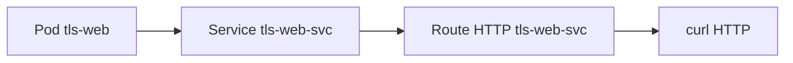
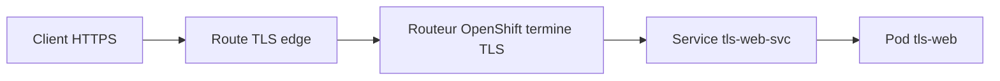
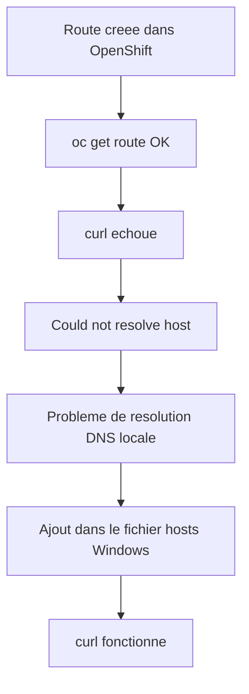
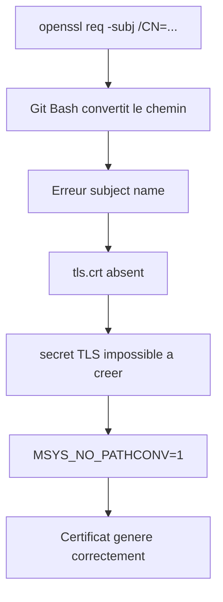

# Lab 05 corrigé — EX280 sur CRC
**Routes HTTP, TLS edge, certificat auto-signé — support complet, corrigé et commenté**

## 1. Objectif du lab

Ce lab sert à pratiquer, dans un environnement CRC/OpenShift Local :

- la création d’une **application HTTP simple** ;
- l’exposition via un **Service** ;
- la création d’une **Route HTTP** ;
- la génération d’un **certificat auto-signé** ;
- la création d’une **Route TLS edge** ;
- le test d’accès avec `curl -k` ;
- le diagnostic des problèmes DNS locaux sous Windows / Git Bash.

---

## 2. Contexte du lab

Environnement utilisé pendant la séance :

- **Plateforme** : CRC / OpenShift Local
- **Terminal** : Git Bash sous Windows 11
- **Namespace** : `ex280-lab05-zidane`
- **Répertoire de travail lab** : `certifications/ex280/work/lab05`
- **Répertoire de certificats** : `/tmp/ex280-certs`

---

## 3. Notions et concepts abordés

### 3.1 Service et Route dans OpenShift

Le **Service** expose un ou plusieurs pods à l’intérieur du cluster.

La **Route** expose ce Service à l’extérieur via le routeur OpenShift.

Chaîne logique :

- Pod
- Service
- Route
- Client (`curl`, navigateur)

---

### 3.2 Route HTTP simple

Une route HTTP simple permet d’atteindre une application sans chiffrement TLS.

Exemple de flux :

- client → route HTTP → service → pod

---

### 3.3 Certificat auto-signé

Un certificat auto-signé est un certificat TLS généré localement, sans autorité de certification reconnue.

Dans ce lab, il sert à :

- activer une route HTTPS ;
- tester rapidement un flux TLS ;
- comprendre la différence entre HTTP et HTTPS.

Comme il est auto-signé :

- le certificat n’est pas approuvé par défaut ;
- `curl` doit être lancé avec `-k`.

---

### 3.4 Route TLS edge

Une **route edge** termine TLS au niveau du routeur OpenShift.

Cela veut dire :

- le client parle en **HTTPS** avec le routeur ;
- le routeur déchiffre ;
- puis le trafic repart vers le service backend selon la configuration interne.

Concept clé :

- le chiffrement TLS est terminé **à l’entrée** du cluster, sur le routeur.

---

### 3.5 Secret TLS

Le couple :

- `tls.crt`
- `tls.key`

peut être stocké dans OpenShift dans un **Secret de type TLS**.

Même si dans ce lab la route edge a été créée directement avec `--cert` et `--key`, la création du secret reste une pratique importante à maîtriser.

---

### 3.6 DNS local et CRC

Sur CRC, les routes créées dans le cluster sont valides côté OpenShift, mais le poste local peut ne pas résoudre automatiquement :

- `*.apps-crc.testing`

Dans ce cas :

- la route existe ;
- `oc get route` est correct ;
- mais `curl` échoue avec :
  - `Could not resolve host`

Le problème est alors **local au poste**, pas forcément au cluster.

---

### 3.7 Piège Git Bash avec OpenSSL

Sous Git Bash, l’argument :

```bash
-subj "/CN=tls-web.apps-crc.testing"
```

peut être transformé de façon incorrecte en chemin Windows.

Symptôme observé :

- `subject name is expected ...`
- présence de `C:/Program Files/Git/...`

Correctif :

```bash
MSYS_NO_PATHCONV=1 openssl ...
```

C’est un point très utile à retenir.

---

## 4. Schémas Mermaid

### 4.1 Vue d’ensemble HTTP



### 4.2 Vue d’ensemble TLS edge



### 4.3 Problème rencontré sur le poste local



### 4.4 Piège Git Bash sur OpenSSL



---

## 5. Déroulé corrigé du lab

## 5.1 Préparation du namespace

```bash
export LAB=05
export NS=ex280-lab${LAB}-zidane
oc get project "$NS" || oc new-project "$NS"
oc project "$NS"
```

### Commentaire
- prépare le namespace du lab ;
- crée le projet si nécessaire ;
- positionne le contexte `oc`.

### Incident observé
Une première commande a été interrompue à cause d’un guillemet non fermé :

```bash
oc project "$NS
```

Puis reprise avec `Ctrl+C`.

---

## 5.2 Création de l’application et du service

```bash
oc create deployment tls-web --image=registry.access.redhat.com/ubi8/httpd-24 --port=8080
oc expose deployment/tls-web --name=tls-web-svc
```

### Commentaire
- crée un `Deployment` nommé `tls-web` ;
- expose ce déploiement via un `Service` nommé `tls-web-svc`.

---

## 5.3 Création de la route HTTP

```bash
oc expose svc/tls-web-svc
oc get route
ROUTE_HTTP="http://$(oc get route tls-web-svc -o jsonpath='{.spec.host}')"
curl -k "$ROUTE_HTTP" || true
```

### Commentaire
- crée une route HTTP standard ;
- récupère le host de la route ;
- teste l’accès via `curl`.

### Problème rencontré
Premier résultat :

```text
curl: (6) Could not resolve host: tls-web-svc-ex280-lab05-zidane.apps-crc.testing
```

### Explication
La route existe bien, mais le poste Windows ne résout pas encore le nom.

---

## 5.4 Préparation du répertoire de certificats

```bash
cd ..
mkdir lab05
cd lab05

mkdir -p /tmp/ex280-certs
cd /tmp/ex280-certs
```

### Commentaire
- crée un espace de travail pour le lab ;
- crée un espace temporaire pour les fichiers TLS.

---

## 5.5 Première tentative de génération du certificat — échec

```bash
openssl req -x509 -newkey rsa:2048 -keyout tls.key -out tls.crt -days 365 -nodes \
  -subj "/CN=tls-web.apps-crc.testing"
```

### Problème observé
Erreur :

```text
req: subject name is expected to be in the format ...
This name is not in that format: 'C:/Program Files/Git/CN=tls-web.apps-crc.testing'
```

### Cause racine
Git Bash a converti l’argument `-subj` comme s’il s’agissait d’un chemin Windows.

Conséquence :

- `tls.key` a été créé ;
- `tls.crt` n’a pas été créé ;
- la création du secret TLS a donc échoué.

---

## 5.6 Échec logique de création du secret TLS

```bash
oc project "$NS"
oc create secret tls tls-web-secret --cert=tls.crt --key=tls.key
```

### Résultat observé
```text
error: Cannot read file tls.crt, open tls.crt: Le fichier spécifié est introuvable.
```

### Explication
Le certificat n’existait pas, à cause de l’échec OpenSSL précédent.

---

## 5.7 Correction de la génération du certificat

```bash
rm -f tls.key tls.crt
MSYS_NO_PATHCONV=1 openssl req -x509 -newkey rsa:2048 -keyout tls.key -out tls.crt -days 365 -nodes -subj "/CN=tls-web.apps-crc.testing"
ls -l tls.key tls.crt
```

### Commentaire
- supprime les fichiers incomplets ;
- désactive la conversion Git Bash avec `MSYS_NO_PATHCONV=1` ;
- régénère correctement la clé et le certificat ;
- vérifie leur présence.

### Résultat observé
Les deux fichiers sont présents :

- `tls.crt`
- `tls.key`

---

## 5.8 Création correcte du secret TLS

```bash
export KUBECONFIG="$HOME/.kube/crc-kubeconfig"
oc project "$NS"
oc create secret tls tls-web-secret --cert=tls.crt --key=tls.key
```

### Commentaire
- crée un secret TLS OpenShift dans le namespace du lab.

### Résultat observé
```text
secret/tls-web-secret created
```

---

## 5.9 Création de la route TLS edge

```bash
export KUBECONFIG="$HOME/.kube/crc-kubeconfig"
oc create route edge tls-web-tls --service=tls-web-svc --cert=tls.crt --key=tls.key
oc get route
```

### Commentaire
- crée une route HTTPS nommée `tls-web-tls`
- configure la terminaison TLS en `edge`

### Résultat attendu
Dans `oc get route`, on voit :

- `tls-web-tls`
- `TERMINATION=edge`

---

## 5.10 Test HTTPS

```bash
ROUTE_HTTPS="https://$(oc get route tls-web-tls -o jsonpath='{.spec.host}')"
echo "$ROUTE_HTTPS"
curl -k "$ROUTE_HTTPS" || true
```

### Premier résultat observé
Encore un échec DNS local :

```text
curl: (6) Could not resolve host: tls-web-tls-ex280-lab05-zidane.apps-crc.testing
```

### Action appliquée
Ajout du host dans le fichier hosts Windows.

### Second test
```bash
curl -k "$ROUTE_HTTPS" || true
```

### Résultat final observé
La page par défaut HTTPD est retournée correctement en HTTPS.

### Conclusion
- la route TLS fonctionne ;
- le certificat auto-signé est bien pris en compte ;
- `curl -k` permet de tester la route malgré l’auto-signature.

---

## 6. Points à retenir pour EX280

1. Une route peut être correcte côté cluster mais échouer en local à cause du DNS.
2. `oc get route` permet de valider immédiatement l’objet côté OpenShift.
3. `curl -k` est indispensable avec un certificat auto-signé.
4. Une route `edge` termine TLS au niveau du routeur.
5. Sous Git Bash, `openssl -subj "/CN=..."` peut casser à cause de la conversion automatique.
6. Le correctif Git Bash à retenir est :

```bash
MSYS_NO_PATHCONV=1
```

7. Un secret TLS exige **deux fichiers valides** :
   - certificat
   - clé privée

---

## 7. Routine de diagnostic à mémoriser

```bash
oc project
oc get deploy
oc get svc
oc get route
oc get route <nom> -o yaml
curl -k <url>
ls -l tls.crt tls.key
```

Pour un problème Git Bash sur OpenSSL :

```bash
MSYS_NO_PATHCONV=1 openssl ...
```

---

## 8. Journal des commandes réellement exécutées pendant le lab

### 8.1 Préparation du namespace

```bash
# Première tentative
export LAB=05
export NS=ex280-lab${LAB}-zidane
oc get project "$NS" || oc new-project "$NS"
oc project "$NS

# Interruption de la commande incomplète
^C

# Deuxième tentative correcte
export LAB=05
export NS=ex280-lab${LAB}-zidane
oc get project "$NS" || oc new-project "$NS"
oc project "$NS"
```

### 8.2 Application et service

```bash
# Cree le deployment HTTPD
oc create deployment tls-web --image=registry.access.redhat.com/ubi8/httpd-24 --port=8080

# Expose le deployment via un service
oc expose deployment/tls-web --name=tls-web-svc
```

### 8.3 Route HTTP

```bash
# Cree une route HTTP
oc expose svc/tls-web-svc

# Liste les routes
oc get route

# Construit l’URL HTTP
ROUTE_HTTP="http://$(oc get route tls-web-svc -o jsonpath='{.spec.host}')"

# Teste la route
curl -k "$ROUTE_HTTP" || true
```

### 8.4 Préparation du répertoire de travail

```bash
# Remonte dans le dossier parent
cd ..

# Cree un dossier de lab
mkdir lab05

# Entre dans le dossier du lab
cd lab05

# Prepare le dossier temporaire des certificats
mkdir -p /tmp/ex280-certs
cd /tmp/ex280-certs
```

### 8.5 Première tentative OpenSSL — en échec

```bash
# Tente de generer le certificat et la cle
openssl req -x509 -newkey rsa:2048 -keyout tls.key -out tls.crt -days 365 -nodes \
  -subj "/CN=tls-web.apps-crc.testing"
```

### 8.6 Tentative de secret avec certificat absent

```bash
# Revient sur le bon projet
oc project "$NS"

# Tente de creer le secret TLS
oc create secret tls tls-web-secret --cert=tls.crt --key=tls.key

# Verifie le contenu du dossier
ls
```

### 8.7 Régénération correcte du certificat

```bash
# Supprime les fichiers incomplets
rm -f tls.key tls.crt

# Regénère le certificat en désactivant la conversion de chemin Git Bash
MSYS_NO_PATHCONV=1 openssl req -x509 -newkey rsa:2048 -keyout tls.key -out tls.crt -days 365 -nodes -subj "/CN=tls-web.apps-crc.testing"

# Vérifie les deux fichiers
ls -l tls.key tls.crt
```

### 8.8 Création du secret TLS

```bash
# Réexporte explicitement le kubeconfig
export KUBECONFIG="$HOME/.kube/crc-kubeconfig"

# Vérifie le namespace courant
oc project "$NS"

# Crée le secret TLS
oc create secret tls tls-web-secret --cert=tls.crt --key=tls.key
```

### 8.9 Route TLS edge

```bash
# Crée une route edge avec certificat et clé
export KUBECONFIG="$HOME/.kube/crc-kubeconfig"
oc create route edge tls-web-tls --service=tls-web-svc --cert=tls.crt --key=tls.key

# Liste les routes pour vérifier termination=edge
oc get route
```

### 8.10 Test HTTPS

```bash
# Construit l’URL HTTPS
ROUTE_HTTPS="https://$(oc get route tls-web-tls -o jsonpath='{.spec.host}')"

# Affiche l’URL
echo "$ROUTE_HTTPS"

# Premier test, encore en échec DNS
curl -k "$ROUTE_HTTPS" || true

# Deuxième test après correction du fichier hosts Windows
curl -k "$ROUTE_HTTPS" || true
```

---

## 9. Résumé très court

Dans ce lab, on a appris à :

1. créer une app HTTP simple ;
2. l’exposer via Service et Route ;
3. générer un certificat auto-signé ;
4. créer une route TLS edge ;
5. diagnostiquer un problème Git Bash sur OpenSSL ;
6. diagnostiquer un problème DNS local ;
7. valider une route HTTPS avec `curl -k`.
