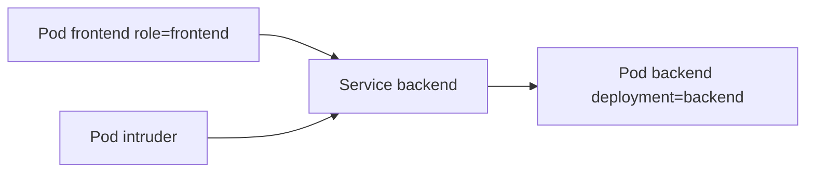
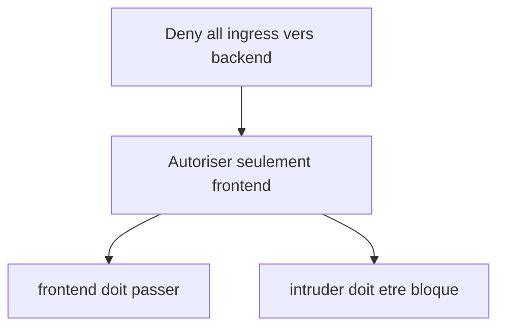
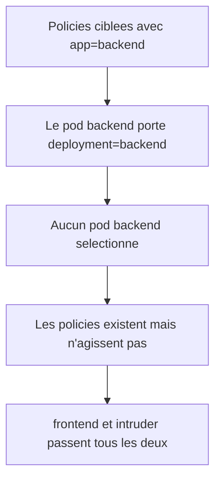
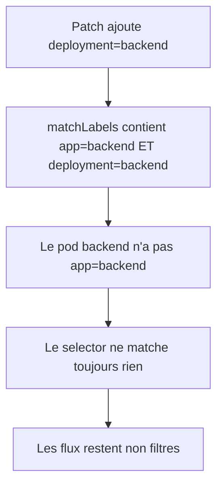
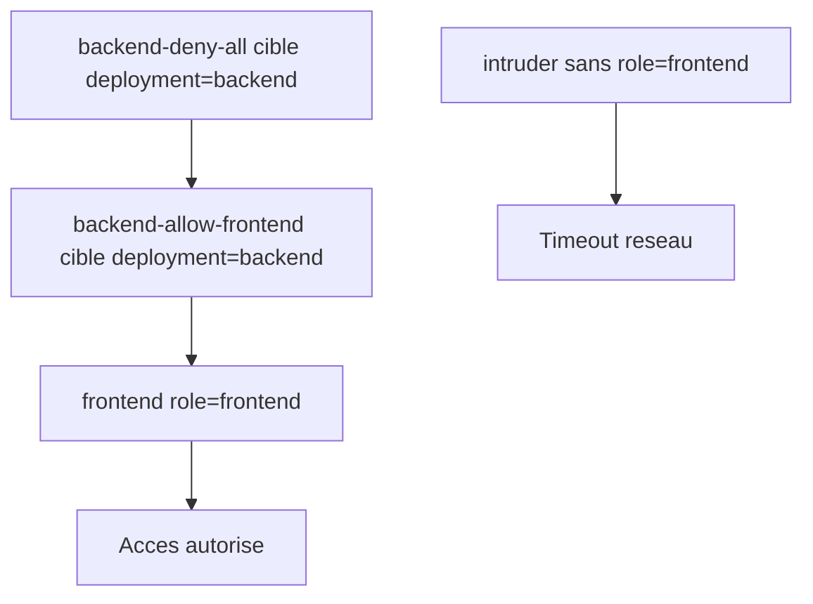

# Lab 06 corrigé — EX280 sur CRC
**NetworkPolicies — support complet, corrigé et commenté**

## 1. Objectif du lab

Ce lab sert à pratiquer :

- l’isolation réseau avec `NetworkPolicy`
- la mise en place d’un **deny-all ingress** sur un backend
- l’autorisation ciblée d’un seul client (`frontend`)
- le blocage d’un client non autorisé (`intruder`)
- le diagnostic d’une policy qui ne produit pas l’effet attendu
- la lecture des labels et des selectors réels

---

## 2. Contexte du lab

Environnement utilisé pendant la séance :

- **Plateforme** : CRC / OpenShift Local
- **Terminal** : Git Bash sous Windows 11
- **Namespace** : `ex280-lab06-zidane`
- **Répertoire de travail** : `certifications/ex280/work/lab06`

---

## 3. Notions et concepts abordés

### 3.1 NetworkPolicy

Une `NetworkPolicy` permet de contrôler les flux réseau entre pods.

Dans ce lab, on a travaillé uniquement sur :

- `policyTypes: Ingress`

Donc on contrôle :

- **qui peut entrer vers le backend**

et non :

- ce que le backend peut émettre vers l’extérieur.

### 3.2 Deny-all ingress

Une policy de type :

```yaml
policyTypes:
- Ingress
```

sans règle `ingress:` explicite signifie :

- pour les pods ciblés, **tout l’ingress est refusé**

à moins qu’une autre policy vienne autoriser un trafic précis.

### 3.3 Allow ciblé

Une deuxième policy peut rouvrir un accès très précis, par exemple :

- uniquement depuis les pods portant `role=frontend`

Cela donne un modèle classique :

- deny-all
- puis allow ciblé

### 3.4 Importance du `podSelector`

Une `NetworkPolicy` ne s’applique qu’aux pods sélectionnés par :

```yaml
spec.podSelector.matchLabels
```

Si le selector ne correspond pas aux labels réels du pod backend :

- la policy existe ;
- mais elle ne protège rien.

C’est exactement le problème rencontré dans ce lab.

### 3.5 Différence entre refus réseau et refus HTTP applicatif

Au début des tests, on voyait :

- `OK`
- puis plus tard `403`

Cela ne voulait pas dire que la policy marchait.

Un `403` signifie :

- le backend répond ;
- donc la communication réseau existe ;
- le refus vient de l’application HTTP.

Pour prouver qu’une policy bloque vraiment, il faut observer :

- timeout
- ou échec de connexion

C’est ce qui a finalement été obtenu avec `intruder`.

### 3.6 Pods de test éphémères

`frontend` et `intruder` ont été lancés avec :

```bash
sleep 3600
```

Après 1 heure, ces pods passent en :

- `Succeeded`

À ce stade, `oc exec` ne fonctionne plus.

Il faut alors :

- les supprimer ;
- les recréer ;
- réappliquer le label si nécessaire.

---

## 4. Schémas Mermaid

### 4.1 Architecture logique du lab



### 4.2 Objectif de sécurité



### 4.3 Cause racine rencontrée



### 4.4 Deuxième cause racine après patch



### 4.5 État final correct



---

## 5. Déroulé corrigé du lab

## 5.1 Préparation du namespace

```bash
export LAB=06
export NS=ex280-lab${LAB}-zidane
oc get project "$NS" || oc new-project "$NS"
oc project "$NS"
```

### Commentaire
- prépare le namespace de travail
- crée le projet si nécessaire
- positionne le contexte `oc`

## 5.2 Déploiement du backend et des pods de test

```bash
oc new-app --name=backend --image=registry.access.redhat.com/ubi9/httpd-24
oc rollout status deploy/backend
oc expose svc/backend --port=8080 --target-port=8080 --name=backen

oc run frontend --image=registry.access.redhat.com/ubi9/ubi-minimal --restart=Never -- sleep 3600
oc run intruder --image=registry.access.redhat.com/ubi9/ubi-minimal --restart=Never -- sleep 3600
oc wait --for=condition=Ready pod/frontend --timeout=120s
oc wait --for=condition=Ready pod/intruder --timeout=120s
```

### Commentaire
- `oc new-app` crée backend + service
- `frontend` et `intruder` servent de clients de test
- `oc expose svc/backend ... --name=backen` a été saisi avec une faute dans le nom, mais cela n’a pas bloqué les tests internes faits sur `http://backend:8080/`

## 5.3 Vérification avant policy

```bash
oc exec frontend -- sh -c "curl -sS -m 2 http://backend:8080/ >/dev/null && echo OK || echo FAIL"
oc exec intruder -- sh -c "curl -sS -m 2 http://backend:8080/ >/dev/null && echo OK || echo FAIL"
```

### Résultat observé
- `frontend` : `OK`
- `intruder` : `OK`

C’est normal avant toute policy.

## 5.4 Première version des policies

### Deny-all

```bash
cat <<'YAML' | oc apply -f -
apiVersion: networking.k8s.io/v1
kind: NetworkPolicy
metadata:
  name: backend-deny-all
spec:
  podSelector:
    matchLabels:
      app: backend
  policyTypes:
  - Ingress
YAML
```

### Autorisation de frontend

```bash
oc label pod frontend role=frontend --overwrite

cat <<'YAML' | oc apply -f -
apiVersion: networking.k8s.io/v1
kind: NetworkPolicy
metadata:
  name: backend-allow-frontend
spec:
  podSelector:
    matchLabels:
      app: backend
  policyTypes:
  - Ingress
  ingress:
  - from:
    - podSelector:
        matchLabels:
          role: frontend
YAML
```

### Premier test après policy

```bash
oc exec frontend -- sh -c "curl -sS -m 2 http://backend:8080/ >/dev/null && echo OK || echo FAIL"
oc exec intruder -- sh -c "curl -sS -m 2 http://backend:8080/ >/dev/null && echo OK || echo FAIL"
oc get networkpolicy
oc describe networkpolicy backend-allow-frontend | sed -n '1,200p'
```

### Résultat observé
- `frontend` : `OK`
- `intruder` : `OK`

Cela prouve que la policy n’agit pas encore.

## 5.5 Diagnostic des labels réels

```bash
export KUBECONFIG="$HOME/.kube/crc-kubeconfig"
oc get pods --show-labels
```

### Ce qu’on a trouvé

Le pod backend portait :

- `deployment=backend`

et non :

- `app=backend`

Donc les deux policies ne sélectionnaient **aucun pod backend**.

## 5.6 Confirmation via le Deployment

```bash
export KUBECONFIG="$HOME/.kube/crc-kubeconfig"
oc get deploy backend -o yaml | sed -n '1,200p'
```

### Ce qu’on a lu

```yaml
spec:
  selector:
    matchLabels:
      deployment: backend
...
template:
  metadata:
    labels:
      deployment: backend
```

Conclusion :

- le selector correct pour les policies devait être :
  - `deployment: backend`

## 5.7 Première correction par patch — insuffisante

```bash
export KUBECONFIG="$HOME/.kube/crc-kubeconfig"
oc patch networkpolicy backend-deny-all --type=merge -p '{"spec":{"podSelector":{"matchLabels":{"deployment":"backend"}}}}'
oc patch networkpolicy backend-allow-frontend --type=merge -p '{"spec":{"podSelector":{"matchLabels":{"deployment":"backend"}}}}'
```

### Problème
Le patch n’a pas remplacé `app=backend`, il a ajouté `deployment=backend`.

On s’est donc retrouvé avec :

```yaml
matchLabels:
  app: backend
  deployment: backend
```

Comme le pod backend ne portait pas `app=backend`, le selector ne matchait toujours rien.

## 5.8 Validation intermédiaire avec codes HTTP

```bash
export KUBECONFIG="$HOME/.kube/crc-kubeconfig"
oc exec frontend -- sh -c 'curl -s -o /dev/null -w "%{http_code}
" http://backend:8080/'
oc exec intruder -- sh -c 'curl -s -o /dev/null -w "%{http_code}
" http://backend:8080/'
```

### Résultat observé
- `frontend` : `403`
- `intruder` : `403`

### Interprétation
Les deux pods atteignaient toujours le backend.

Donc :

- la policy n’était toujours pas appliquée au vrai pod backend.

## 5.9 Lecture des policies pour confirmer le problème

```bash
export KUBECONFIG="$HOME/.kube/crc-kubeconfig"
oc get networkpolicy -o yaml | sed -n '1,220p'
```

### Ce qu’on a vu
Les policies contenaient :

```yaml
matchLabels:
  app: backend
  deployment: backend
```

Donc elles étaient encore incorrectes.

## 5.10 Suppression et recréation propre

### Suppression

```bash
export KUBECONFIG="$HOME/.kube/crc-kubeconfig"
oc delete networkpolicy backend-deny-all backend-allow-frontend
```

### Recréation deny-all correcte

```bash
export KUBECONFIG="$HOME/.kube/crc-kubeconfig"
cat <<'YAML' | oc apply -f -
apiVersion: networking.k8s.io/v1
kind: NetworkPolicy
metadata:
  name: backend-deny-all
spec:
  podSelector:
    matchLabels:
      deployment: backend
  policyTypes:
  - Ingress
YAML
```

### Recréation allow-frontend correcte

```bash
export KUBECONFIG="$HOME/.kube/crc-kubeconfig"
cat <<'YAML' | oc apply -f -
apiVersion: networking.k8s.io/v1
kind: NetworkPolicy
metadata:
  name: backend-allow-frontend
spec:
  podSelector:
    matchLabels:
      deployment: backend
  policyTypes:
  - Ingress
  ingress:
  - from:
    - podSelector:
        matchLabels:
          role: frontend
YAML
```

## 5.11 Problème secondaire : pods de test terminés

Quand on a voulu rejouer les tests, on a obtenu :

```text
error: cannot exec into a container in a completed pod; current phase is Succeeded
```

### Cause
`frontend` et `intruder` avaient fini leur `sleep 3600`.

### Correctif
Il a fallu les recréer.

```bash
export KUBECONFIG="$HOME/.kube/crc-kubeconfig"
oc delete pod frontend intruder --ignore-not-found
oc run frontend --image=registry.access.redhat.com/ubi9/ubi-minimal --restart=Never -- sleep 3600
oc run intruder --image=registry.access.redhat.com/ubi9/ubi-minimal --restart=Never -- sleep 3600
oc label pod frontend role=frontend --overwrite
oc wait --for=condition=Ready pod/frontend --timeout=120s
oc wait --for=condition=Ready pod/intruder --timeout=120s
```

## 5.12 Test final

```bash
export KUBECONFIG="$HOME/.kube/crc-kubeconfig"
oc exec frontend -- sh -c "curl -sS -m 2 http://backend:8080/ >/dev/null && echo OK || echo FAIL"
oc exec intruder -- sh -c "curl -sS -m 2 http://backend:8080/ >/dev/null && echo OK || echo FAIL"
```

### Résultat final observé
- `frontend` : `OK`
- `intruder` :
  - `curl: (28) Connection timed out after 2008 milliseconds`
  - `FAIL`

### Conclusion
Le comportement attendu du lab est enfin obtenu :

- `frontend` est autorisé
- `intruder` est bloqué

Le **lab 06 est réussi**.

---

## 6. Points à retenir pour EX280

1. Toujours vérifier les **labels réels** des pods avant d’écrire une `NetworkPolicy`.
2. Une policy qui ne matche aucun pod existe… mais ne protège rien.
3. `oc get pods --show-labels` est souvent la première commande de diagnostic utile.
4. `oc get deploy -o yaml` permet de retrouver le vrai selector du backend.
5. Un `403` HTTP ne prouve pas un blocage réseau.
6. Pour prouver un blocage réseau, on cherche plutôt :
   - timeout
   - erreur de connexion
7. Avec `oc patch`, attention :
   - on peut ajouter des clés
   - sans supprimer les anciennes
8. Quand un pod de test est en `Succeeded`, il faut le recréer avant `oc exec`.

---

## 7. Routine de diagnostic à mémoriser

```bash
oc get pods --show-labels
oc get deploy <nom> -o yaml | sed -n '1,200p'
oc get networkpolicy -o yaml
oc describe networkpolicy <nom>
oc exec <pod> -- curl ...
```

Pour différencier réseau vs HTTP :

```bash
oc exec <pod> -- sh -c 'curl -s -o /dev/null -w "%{http_code}
" http://service:port/'
```

---

## 8. Journal des commandes réellement exécutées pendant le lab

### 8.1 Préparation du namespace et du backend

```bash
export LAB=06
export NS=ex280-lab${LAB}-zidane
oc get project "$NS" || oc new-project "$NS"
oc project "$NS"

oc new-app --name=backend --image=registry.access.redhat.com/ubi9/httpd-24
oc rollout status deploy/backend
oc expose svc/backend --port=8080 --target-port=8080 --name=backen
```

### 8.2 Création des pods de test

```bash
oc run frontend --image=registry.access.redhat.com/ubi9/ubi-minimal --restart=Never -- sleep 3600
oc run intruder --image=registry.access.redhat.com/ubi9/ubi-minimal --restart=Never -- sleep 3600
oc wait --for=condition=Ready pod/frontend --timeout=120s
oc wait --for=condition=Ready pod/intruder --timeout=120s
```

### 8.3 Test avant policy

```bash
oc exec frontend -- sh -c "curl -sS -m 2 http://backend:8080/ >/dev/null && echo OK || echo FAIL"
oc exec intruder -- sh -c "curl -sS -m 2 http://backend:8080/ >/dev/null && echo OK || echo FAIL"
```

### 8.4 Répertoire de travail

```bash
cd /c/workspaces/openshift2026/rh-openshift-architect-lab/certifications/ex280/work
mkdir lab06
cd lab06
```

### 8.5 Première version des policies

```bash
cat <<'YAML' | oc apply -f -
apiVersion: networking.k8s.io/v1
kind: NetworkPolicy
metadata:
  name: backend-deny-all
spec:
  podSelector:
    matchLabels:
      app: backend
  policyTypes:
  - Ingress
YAML

oc label pod frontend role=frontend --overwrite

cat <<'YAML' | oc apply -f -
apiVersion: networking.k8s.io/v1
kind: NetworkPolicy
metadata:
  name: backend-allow-frontend
spec:
  podSelector:
    matchLabels:
      app: backend
  policyTypes:
  - Ingress
  ingress:
  - from:
    - podSelector:
        matchLabels:
          role: frontend
YAML
```

### 8.6 Premier test après policy

```bash
oc exec frontend -- sh -c "curl -sS -m 2 http://backend:8080/ >/dev/null && echo OK || echo FAIL"
oc exec intruder -- sh -c "curl -sS -m 2 http://backend:8080/ >/dev/null && echo OK || echo FAIL"
oc get networkpolicy
oc describe networkpolicy backend-allow-frontend | sed -n '1,200p'
```

### 8.7 Diagnostic labels / selectors

```bash
export KUBECONFIG="$HOME/.kube/crc-kubeconfig"
oc get pods --show-labels

export KUBECONFIG="$HOME/.kube/crc-kubeconfig"
oc get pods --show-labels

export KUBECONFIG="$HOME/.kube/crc-kubeconfig"
oc get deploy backend -o yaml | sed -n '1,200p'
```

### 8.8 Patch insuffisant

```bash
export KUBECONFIG="$HOME/.kube/crc-kubeconfig"
oc patch networkpolicy backend-deny-all --type=merge -p '{"spec":{"podSelector":{"matchLabels":{"deployment":"backend"}}}}'
oc patch networkpolicy backend-allow-frontend --type=merge -p '{"spec":{"podSelector":{"matchLabels":{"deployment":"backend"}}}}'
```

### 8.9 Nouveau test et validation intermédiaire

```bash
export KUBECONFIG="$HOME/.kube/crc-kubeconfig"
oc exec frontend -- sh -c "curl -sS -m 2 http://backend:8080/ >/dev/null && echo OK || echo FAIL"
oc exec intruder -- sh -c "curl -sS -m 2 http://backend:8080/ >/dev/null && echo OK || echo FAIL"

export KUBECONFIG="$HOME/.kube/crc-kubeconfig"
oc exec frontend -- sh -c 'curl -s -o /dev/null -w "%{http_code}
" http://backend:8080/'
oc exec intruder -- sh -c 'curl -s -o /dev/null -w "%{http_code}
" http://backend:8080/'
```

### 8.10 Lecture des policies

```bash
export KUBECONFIG="$HOME/.kube/crc-kubeconfig"
oc get networkpolicy -o yaml | sed -n '1,220p'
```

### 8.11 Recréation propre des policies

```bash
export KUBECONFIG="$HOME/.kube/crc-kubeconfig"
oc delete networkpolicy backend-deny-all backend-allow-frontend

export KUBECONFIG="$HOME/.kube/crc-kubeconfig"
cat <<'YAML' | oc apply -f -
apiVersion: networking.k8s.io/v1
kind: NetworkPolicy
metadata:
  name: backend-deny-all
spec:
  podSelector:
    matchLabels:
      deployment: backend
  policyTypes:
  - Ingress
YAML

export KUBECONFIG="$HOME/.kube/crc-kubeconfig"
cat <<'YAML' | oc apply -f -
apiVersion: networking.k8s.io/v1
kind: NetworkPolicy
metadata:
  name: backend-allow-frontend
spec:
  podSelector:
    matchLabels:
      deployment: backend
  policyTypes:
  - Ingress
  ingress:
  - from:
    - podSelector:
        matchLabels:
          role: frontend
YAML
```

### 8.12 Pods de test expirés puis recréés

```bash
export KUBECONFIG="$HOME/.kube/crc-kubeconfig"
oc exec frontend -- sh -c "curl -sS -m 2 http://backend:8080/ >/dev/null && echo OK || echo FAIL"
oc exec intruder -- sh -c "curl -sS -m 2 http://backend:8080/ >/dev/null && echo OK || echo FAIL"

export KUBECONFIG="$HOME/.kube/crc-kubeconfig"
oc delete pod frontend intruder --ignore-not-found
oc run frontend --image=registry.access.redhat.com/ubi9/ubi-minimal --restart=Never -- sleep 3600
oc run intruder --image=registry.access.redhat.com/ubi9/ubi-minimal --restart=Never -- sleep 3600
oc label pod frontend role=frontend --overwrite
oc wait --for=condition=Ready pod/frontend --timeout=120s
oc wait --for=condition=Ready pod/intruder --timeout=120s
```

### 8.13 Test final réussi

```bash
export KUBECONFIG="$HOME/.kube/crc-kubeconfig"
oc exec frontend -- sh -c "curl -sS -m 2 http://backend:8080/ >/dev/null && echo OK || echo FAIL"
oc exec intruder -- sh -c "curl -sS -m 2 http://backend:8080/ >/dev/null && echo OK || echo FAIL"
```

---

## 9. Résumé très court

Dans ce lab, on a appris à :

1. déployer un backend et deux clients de test ;
2. créer un deny-all ingress ;
3. autoriser uniquement `frontend` ;
4. diagnostiquer une policy qui ne matche aucun pod ;
5. corriger les selectors ;
6. différencier un refus HTTP d’un blocage réseau ;
7. valider un blocage réel via timeout.
