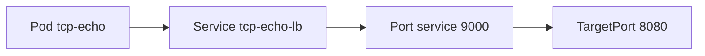
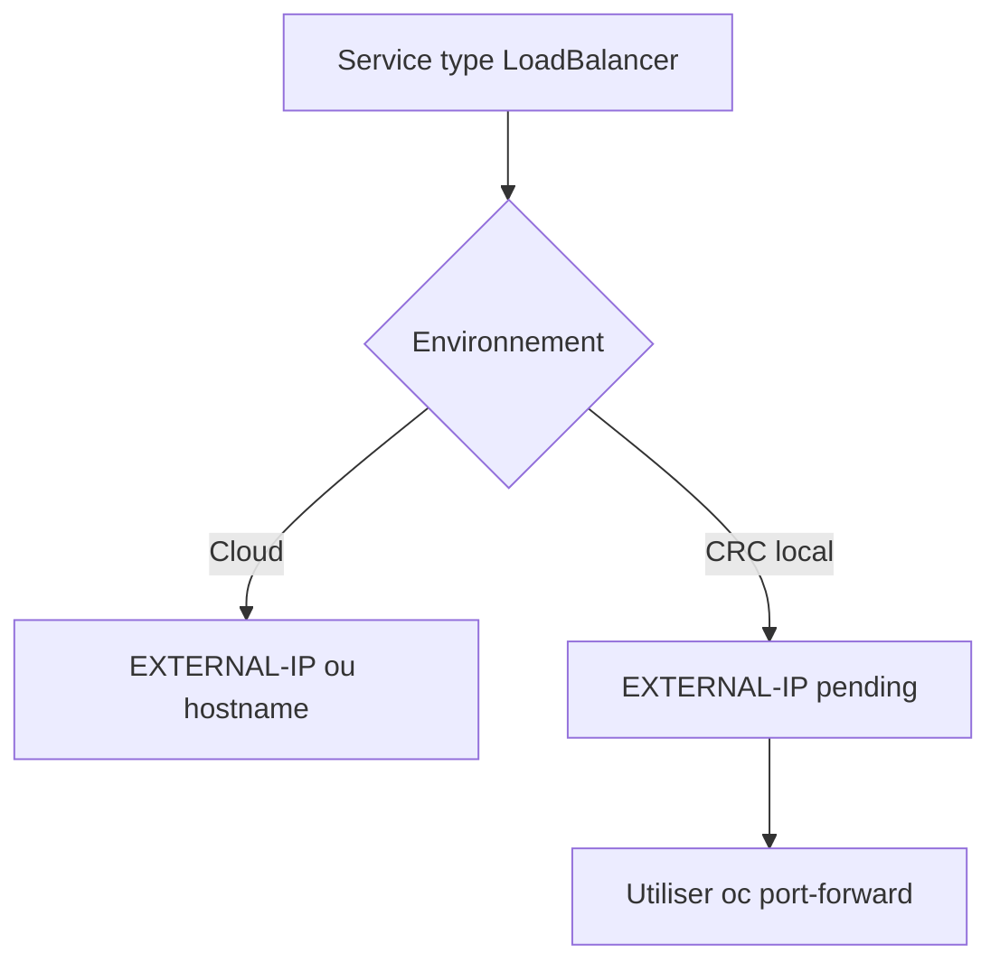
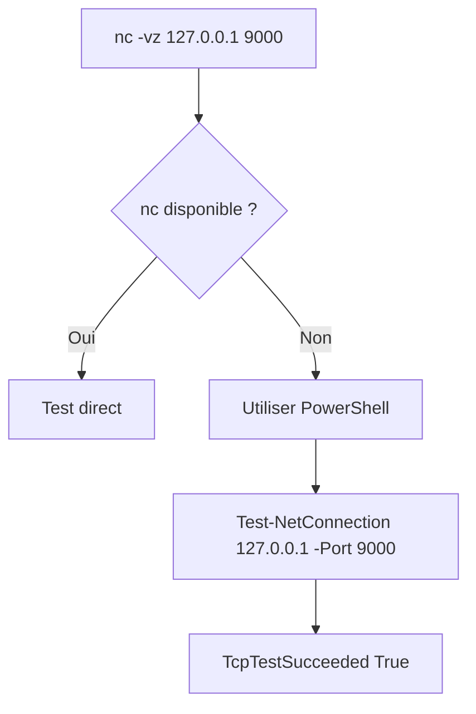

# Lab 07 corrigé — EX280 sur CRC
**Service non-HTTP / LoadBalancer — support complet, corrigé et commenté**

## 1. Objectif du lab

Ce lab sert à pratiquer :

- l’exposition d’un service **non-HTTP**
- l’usage d’un **Service de type LoadBalancer**
- la lecture de `EXTERNAL-IP` / `ingress`
- le cas particulier de **CRC / OpenShift Local**
- la validation réseau via **port-forward**
- les alternatives de test selon l’outillage disponible sur le poste

---

## 2. Contexte du lab

Environnement utilisé pendant la séance :

- **Plateforme** : CRC / OpenShift Local
- **Terminal principal** : Git Bash sous Windows 11
- **Namespace** : `ex280-lab07-zidane`
- **Répertoire de travail** : `certifications/ex280/work/lab07`
- **Terminal secondaire** : PowerShell Windows pour le test TCP

---

## 3. Notions et concepts abordés

### 3.1 Service non-HTTP

Ici, on ne publie pas une application HTTP classique avec une Route OpenShift.

On expose :

- un service TCP simple
- via un `Service`
- de type `LoadBalancer`

Le protocole ciblé n’est pas HTTP mais TCP brut.

### 3.2 Service de type LoadBalancer

Un `Service` de type `LoadBalancer` demande à la plateforme :

- de créer une IP ou un endpoint externe
- qui pointe vers le service interne Kubernetes/OpenShift

Dans un vrai cluster cloud :

- on peut obtenir une IP publique ou privée
- visible dans `.status.loadBalancer.ingress`

Dans CRC/local :

- il n’y a généralement **pas** de vrai Load Balancer cloud
- `EXTERNAL-IP` reste souvent :
  - `<pending>`

C’est normal.

### 3.3 Branches de test du lab

Le lab prévoit deux branches :

#### Branche A — cluster avec vrai LB
On lit :

- l’IP
- ou le hostname externe

#### Branche B — CRC / local
On utilise :

- `oc port-forward`

C’est la branche correcte dans cet environnement.

### 3.4 Port-forward

`oc port-forward` ouvre un tunnel local entre :

- un port local sur le poste
- et le port d’un service ou d’un pod dans le cluster

Dans ce lab :

- local : `127.0.0.1:9000`
- cluster : service `tcp-echo-lb`
- backend réel : port `8080` du pod

### 3.5 Différence NodePort / LoadBalancer

Dans le `Service`, on a vu :

- `port: 9000`
- `targetPort: 8080`
- `nodePort: 30257`

Cela signifie :

- **port** : port logique du service
- **targetPort** : port réellement exposé par le conteneur
- **nodePort** : port haut sur le nœud, utilisé par Kubernetes/OpenShift
- **LoadBalancer** : couche externe demandée au-dessus du service

### 3.6 Outils de test réseau

Le lab proposait :

```bash
nc -vz 127.0.0.1 9000
```

Mais sur ce poste :

- `nc` n’était pas installé dans Git Bash

On a donc utilisé à la place :

```powershell
Test-NetConnection 127.0.0.1 -Port 9000
```

Résultat :

- `TcpTestSucceeded : True`

Ce qui valide le test réseau demandé.

---

## 4. Schémas Mermaid

### 4.1 Architecture logique du lab



### 4.2 Cas cloud vs cas CRC



### 4.3 Port-forward local


### 4.4 Test sur le poste



---

## 5. Déroulé corrigé du lab

## 5.1 Préparation du namespace

```bash
export LAB=07
export NS=ex280-lab${LAB}-zidane
oc get project "$NS" || oc new-project "$NS"
oc project "$NS"
```

### Incident observé
Une première commande a été interrompue à cause d’un guillemet non fermé :

```bash
oc project "$NS
```

Puis reprise avec `Ctrl+C`.

### Commentaire
- le projet a bien été créé ;
- le contexte a ensuite été positionné sur `ex280-lab07-zidane`.

## 5.2 Préparation du répertoire de travail

```bash
cd ..
ls
mkdir lab07
cd lab07
```

### Commentaire
- création d’un dossier dédié pour ne pas mélanger les fichiers avec les autres labs.

## 5.3 Déploiement du serveur TCP simple

```bash
cat <<'YAML' | oc apply -f -
apiVersion: apps/v1
kind: Deployment
metadata:
  name: tcp-echo
spec:
  replicas: 1
  selector:
    matchLabels:
      app: tcp-echo
  template:
    metadata:
      labels:
        app: tcp-echo
    spec:
      containers:
      - name: tcp-echo
        image: registry.access.redhat.com/ubi9/ubi-minimal
        command: ["/bin/sh","-c"]
        args:
          - |
            while true; do nc -lk -p 8080 -e /bin/cat; done
YAML
```

### Commentaire
- déploie un conteneur minimal qui écoute sur le port `8080`
- le serveur TCP renvoie ce qu’il reçoit

### Point utile du lab
Le support indique que si `nc -e` n’est pas disponible dans l’image, il faut adapter l’image ou la commande.  
Ici, le déploiement a bien été créé et le rollout a réussi. fileciteturn9file0

### Vérification du rollout

```bash
oc rollout status deploy/tcp-echo || true
```

### Résultat observé
- `deployment "tcp-echo" successfully rolled out`

## 5.4 Création du Service LoadBalancer

```bash
cat <<'YAML' | oc apply -f -
apiVersion: v1
kind: Service
metadata:
  name: tcp-echo-lb
spec:
  type: LoadBalancer
  selector:
    app: tcp-echo
  ports:
  - name: tcp
    port: 9000
    targetPort: 8080
YAML
```

### Vérifications

```bash
oc get svc tcp-echo-lb -o wide
oc describe svc tcp-echo-lb | sed -n '1,200p'
```

### Résultat observé
- `TYPE=LoadBalancer`
- `EXTERNAL-IP=<pending>`
- `NodePort=30257`
- `Endpoints=10.217.1.60:8080`

### Interprétation
Le service est correct.

Le `LoadBalancer` est bien demandé, mais sur CRC :

- aucun LB externe réel n’est fourni
- d’où `EXTERNAL-IP=<pending>`

C’est attendu.

## 5.5 Test de la branche LB externe

```bash
oc get svc tcp-echo-lb -o jsonpath='{.status.loadBalancer.ingress[0].ip}{"\n"}{.status.loadBalancer.ingress[0].hostname}{"\n"}'
```

### Résultat observé
Sortie vide.

### Interprétation
Toujours cohérent avec CRC/local :

- pas d’IP
- pas de hostname externe

Le lab bascule donc naturellement sur la branche :

- `port-forward` fileciteturn9file0

## 5.6 Port-forward

```bash
oc port-forward svc/tcp-echo-lb 9000:9000
```

### Résultat observé
```text
Forwarding from 127.0.0.1:9000 -> 8080
Forwarding from [::1]:9000 -> 8080
```

### Commentaire
Le tunnel local est ouvert.

Le test doit alors se faire depuis un second terminal.

## 5.7 Première tentative de test avec netcat

Dans un second terminal Git Bash :

```bash
nc -vz 127.0.0.1 9000
```

### Résultat observé
```text
bash: nc: command not found
```

### Interprétation
`nc` n’est pas installé sur le poste Windows/Git Bash.

Ce n’est pas bloquant.

## 5.8 Test alternatif avec PowerShell

Dans PowerShell :

```powershell
powershell -Command "Test-NetConnection 127.0.0.1 -Port 9000"
```

### Résultat observé
```text
TcpTestSucceeded : True
```

### Conclusion
Le tunnel local fonctionne bien.

Le test réseau du lab est validé.

---

## 6. Points à retenir pour EX280

1. Un `Service` en `type: LoadBalancer` peut rester avec `EXTERNAL-IP=<pending>` sur CRC.
2. Ce n’est pas forcément une erreur de manifeste.
3. Il faut alors basculer sur la **branche locale** du lab.
4. `oc port-forward` est une méthode simple et très utile en environnement local.
5. `oc get svc -o wide` et `oc describe svc` permettent de vérifier :
   - type
   - selector
   - ports
   - endpoints
   - nodePort
6. Si `nc` n’est pas installé, il faut utiliser un autre outil de test.
7. Sous Windows, `Test-NetConnection` remplit correctement ce rôle.

---

## 7. Routine de diagnostic à mémoriser

```bash
oc get deploy
oc rollout status deploy/<nom>
oc get svc <nom> -o wide
oc describe svc <nom>
oc get svc <nom> -o jsonpath='...'
oc port-forward svc/<nom> <local>:<service>
```

Pour Windows :

```powershell
Test-NetConnection 127.0.0.1 -Port <port>
```

---

## 8. Journal des commandes réellement exécutées pendant le lab

### 8.1 Namespace

```bash
export LAB=07
export NS=ex280-lab${LAB}-zidane
oc get project "$NS" || oc new-project "$NS"
oc project "$NS
^C
^C
oc project "$NS"
```

### 8.2 Répertoire de travail

```bash
cd ..
ls
mkdir lab07
cd lab07
```

### 8.3 Déploiement tcp-echo

```bash
cat <<'YAML' | oc apply -f -
apiVersion: apps/v1
kind: Deployment
metadata:
  name: tcp-echo
spec:
  replicas: 1
  selector:
    matchLabels:
      app: tcp-echo
  template:
    metadata:
      labels:
        app: tcp-echo
    spec:
      containers:
      - name: tcp-echo
        image: registry.access.redhat.com/ubi9/ubi-minimal
        command: ["/bin/sh","-c"]
        args:
          - |
            while true; do nc -lk -p 8080 -e /bin/cat; done
YAML

oc rollout status deploy/tcp-echo || true
```

### 8.4 Service LoadBalancer

```bash
cat <<'YAML' | oc apply -f -
apiVersion: v1
kind: Service
metadata:
  name: tcp-echo-lb
spec:
  type: LoadBalancer
  selector:
    app: tcp-echo
  ports:
  - name: tcp
    port: 9000
    targetPort: 8080
YAML

oc get svc tcp-echo-lb -o wide
oc describe svc tcp-echo-lb | sed -n '1,200p'
```

### 8.5 Test LB externe

```bash
oc get svc tcp-echo-lb -o jsonpath='{.status.loadBalancer.ingress[0].ip}{"\n"}{.status.loadBalancer.ingress[0].hostname}{"\n"}'
```

### 8.6 Port-forward

```bash
oc port-forward svc/tcp-echo-lb 9000:9000
```

### 8.7 Test dans le second terminal Git Bash

```bash
nc -vz 127.0.0.1 9000
```

### 8.8 Test de remplacement dans PowerShell

```powershell
powershell -Command "Test-NetConnection 127.0.0.1 -Port 9000"
```

---

## 9. Résumé très court

Dans ce lab, on a appris à :

1. déployer un petit service TCP ;
2. l’exposer via un `Service` de type `LoadBalancer` ;
3. constater le comportement normal de CRC avec `EXTERNAL-IP=<pending>` ;
4. utiliser `oc port-forward` comme branche locale ;
5. valider le port local avec un test réseau Windows.
