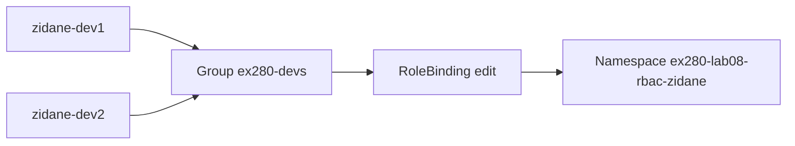
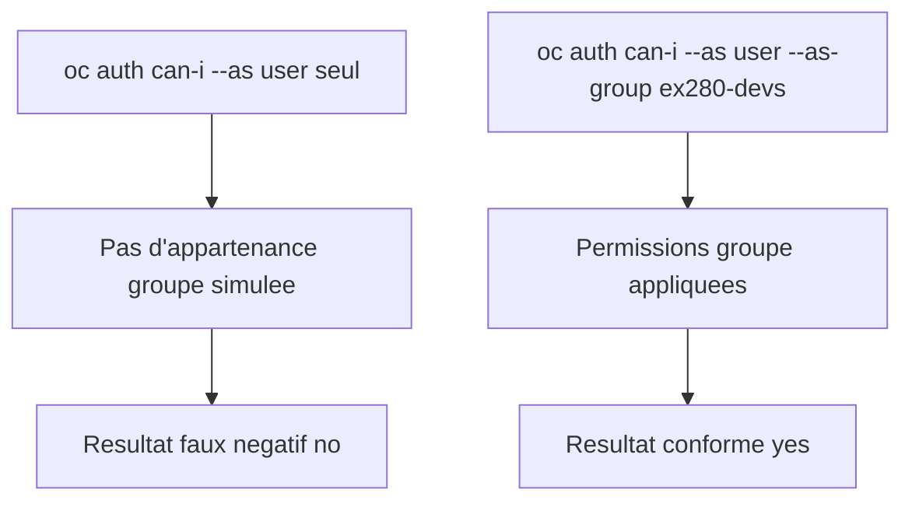
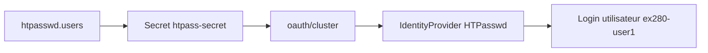
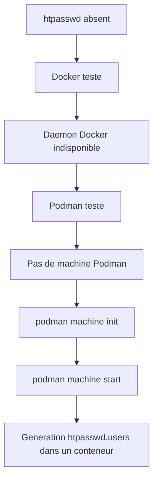

# Lab 08 corrigé — EX280 sur CRC
**HTPasswd, Users, Groups & RBAC — support complet, corrigé et commenté**

## 1. Objectif du lab

Ce lab sert à pratiquer :

- la création d’un **groupe logique OpenShift**
- le binding RBAC d’un rôle de projet à un groupe
- la vérification des permissions avec `oc auth can-i`
- la génération d’un fichier **HTPasswd**
- la création ou réutilisation d’un **Secret** dans `openshift-config`
- la vérification de la configuration **OAuth / HTPasswd**
- le test de connexion d’un utilisateur HTPasswd

---

## 2. Contexte du lab

Environnement utilisé pendant la séance :

- **Plateforme** : CRC / OpenShift Local
- **Terminal** : Git Bash sous Windows 11
- **Namespace RBAC** : `ex280-lab08-rbac-zidane`
- **Répertoire de travail** : `certifications/ex280/work/lab08`

Contexte important rencontré :

- `htpasswd` n’était **pas installé localement**
- `docker` était installé mais le daemon n’était pas joignable
- `podman` était installé mais aucune machine n’était initialisée au départ

---

## 3. Notions et concepts abordés

### 3.1 Groupe logique OpenShift

Avec :

```bash
oc adm groups new ...
```

on crée un **groupe logique** dans OpenShift.

Ce groupe :

- n’est pas forcément lié à un fournisseur d’identité externe
- sert à regrouper des utilisateurs
- permet d’appliquer plus facilement des droits RBAC

Exemple du lab :

- groupe : `ex280-devs`
- membres :
  - `zidane-dev1`
  - `zidane-dev2`

### 3.2 RBAC de projet

Le rôle `edit` a été attribué au groupe sur un namespace précis :

```bash
oc policy add-role-to-group edit ex280-devs -n "$NS"
```

Cela donne aux membres du groupe des droits projet typiques :

- lire les ressources
- créer/modifier des déploiements
- travailler dans le namespace

Mais cela ne donne pas des droits cluster-admin, par exemple :

- supprimer un projet cluster-wide

### 3.3 Impersonation et groupes

Premier piège rencontré :

```bash
oc auth can-i ... --as=zidane-dev1
```

retournait `no`.

Pourquoi ?

Parce qu’on simulait uniquement **l’utilisateur**, pas son appartenance au groupe.

Le test correct est :

```bash
oc auth can-i ... --as=zidane-dev1 --as-group=ex280-devs
```

C’est un point très important pour EX280.

### 3.4 HTPasswd

HTPasswd est une méthode simple pour créer un fichier d’authentification local :

- nom d’utilisateur
- mot de passe hashé

Ce fichier peut ensuite être injecté dans OpenShift via :

- un `Secret`
- référencé par `oauth/cluster`

### 3.5 Secret dans `openshift-config`

Le secret attendu dans ce lab est créé dans :

- `openshift-config`

Il contient :

- un fichier `htpasswd.users`
- référencé ensuite par la config OAuth

### 3.6 OAuth / Identity Provider

L’objet :

- `oauth/cluster`

décrit les fournisseurs d’identité du cluster.

Dans ce lab, on a découvert que le provider HTPasswd existait déjà :

- `type: HTPasswd`
- `name: developer`
- `fileData.name: htpass-secret`

Donc il n’était pas nécessaire de réappliquer la ressource `OAuth` complète.

### 3.7 Gestion des prérequis outils

Le lab demandait :

- `htpasswd`
- droits cluster-admin
- environnement CRC recommandé

Pré-requis non satisfaits au départ :

- pas de binaire `htpasswd` local
- `docker` inutilisable car daemon non connecté
- `podman` installé mais sans machine

Correctif retenu :

- initialiser puis démarrer une machine Podman
- utiliser un conteneur `httpd:2.4-alpine` pour produire `htpasswd.users`

### 3.8 Kubeconfig dédié de test

Pour vérifier qu’un utilisateur HTPasswd peut vraiment se connecter sans casser la session admin en cours, on a utilisé :

- un kubeconfig séparé :
  - `/tmp/ex280-user1.kubeconfig`

C’est une bonne pratique très utile.

---

## 4. Schémas Mermaid

### 4.1 RBAC de projet



### 4.2 Vérification `can-i`



### 4.3 Partie HTPasswd



### 4.4 Blocage outils et correction



---

## 5. Déroulé corrigé du lab

## 5.1 Préparation du namespace RBAC

```bash
export LAB=08
export NS=ex280-lab${LAB}-rbac-zidane
oc get project "$NS" || oc new-project "$NS"
oc project "$NS"
```

### Commentaire
- crée le namespace de travail
- positionne le contexte projet

## 5.2 Création du groupe logique

```bash
oc adm groups new ex280-devs zidane-dev1 zidane-dev2 || true
oc get groups
oc describe group ex280-devs
```

### Résultat observé
- groupe `ex280-devs` créé
- membres :
  - `zidane-dev1`
  - `zidane-dev2`

### Commentaire
Le `|| true` permet de ne pas casser le lab si le groupe existe déjà.

## 5.3 Binding du rôle `edit`

```bash
oc policy add-role-to-group edit ex280-devs -n "$NS"
oc get rolebindings -n "$NS"
```

### Commentaire
On attribue le rôle `edit` au groupe sur **ce namespace uniquement**.

## 5.4 Premier test RBAC — insuffisant

```bash
oc auth can-i get pods --as=zidane-dev1 -n "$NS" || true
oc auth can-i create deployment --as=zidane-dev1 -n "$NS" || true
oc auth can-i delete project --as=zidane-dev1 -n "$NS" || true
```

### Résultat observé
- `no`
- `no`
- `no`

### Explication
Le test était incomplet :

- l’utilisateur était impersonné
- mais pas le groupe `ex280-devs`

## 5.5 Test RBAC correct avec impersonation de groupe

```bash
export KUBECONFIG="$HOME/.kube/crc-kubeconfig"
oc auth can-i get pods --as=zidane-dev1 --as-group=ex280-devs -n "$NS" || true
oc auth can-i create deployment --as=zidane-dev1 --as-group=ex280-devs -n "$NS" || true
oc auth can-i delete project --as=zidane-dev1 --as-group=ex280-devs || true
```

### Résultat observé
- `get pods` → `yes`
- `create deployment` → `yes`
- `delete project` → `no`

### Conclusion
La **partie A RBAC** est validée.

## 5.6 Partie B HTPasswd — premier blocage

Commande prévue dans le lab :

```bash
htpasswd -c -B -b htpasswd.users ex280-user1 Passw0rd!
htpasswd -B -b htpasswd.users ex280-user2 Passw0rd!
```

### Résultat observé
```text
bash: htpasswd: command not found
```

### Explication
Le prérequis `htpasswd` n’était pas satisfait localement.

## 5.7 Vérification des runtimes conteneur

```bash
docker --version
podman --version
```

### Résultat observé
- Docker présent
- Podman présent

On a donc tenté une stratégie de contournement via conteneur.

## 5.8 Tentative Docker — échec

```bash
MSYS_NO_PATHCONV=1 docker run --rm -v "$(pwd):/work" -w /work httpd:2.4-alpine htpasswd -c -B -b htpasswd.users ex280-user1 Passw0rd!
```

### Résultat observé
Erreur de connexion au daemon Docker Desktop.

### Explication
Docker était installé mais le moteur n’était pas joignable.

## 5.9 Tentative Podman — échec initial

```bash
MSYS_NO_PATHCONV=1 podman run --rm -v "$(pwd):/work" -w /work docker.io/httpd:2.4-alpine htpasswd -c -B -b htpasswd.users ex280-user1 Passw0rd!
```

### Résultat observé
Erreur de socket / pas de machine Podman active.

### Vérification
```bash
podman machine list
```

### Résultat observé
Aucune machine.

## 5.10 Initialisation et démarrage de Podman

```bash
podman machine init
podman machine start
```

### Résultat observé
- machine créée
- machine démarrée avec succès

## 5.11 Génération du fichier HTPasswd via Podman

### Premier utilisateur

```bash
MSYS_NO_PATHCONV=1 podman run --rm -v "$(pwd):/work" -w /work docker.io/httpd:2.4-alpine htpasswd -c -B -b htpasswd.users ex280-user1 Passw0rd!
```

### Résultat observé
```text
Adding password for user ex280-user1
```

### Deuxième utilisateur

```bash
MSYS_NO_PATHCONV=1 podman run --rm -v "$(pwd):/work" -w /work docker.io/httpd:2.4-alpine htpasswd -B -b htpasswd.users ex280-user2 Passw0rd!
```

### Résultat observé
```text
Adding password for user ex280-user2
```

## 5.12 Création / mise à jour du secret HTPasswd

```bash
export KUBECONFIG="$HOME/.kube/crc-kubeconfig"
oc create secret generic htpass-secret   --from-file=htpasswd=htpasswd.users   -n openshift-config --dry-run=client -o yaml | oc apply -f -
```

### Résultat observé
- `secret/htpass-secret configured`

### Point important
Le secret existait déjà.

Vérification :

```bash
oc get secret htpass-secret -n openshift-config
```

### Résultat observé
- âge ancien (`275d`)

Donc on a **reconfiguré** un secret existant, on ne l’a pas créé de zéro.

## 5.13 Lecture de `oauth/cluster`

```bash
export KUBECONFIG="$HOME/.kube/crc-kubeconfig"
oc get oauth cluster -o yaml | sed -n '1,220p'
```

### Résultat observé
Le provider HTPasswd existait déjà :

- `type: HTPasswd`
- `name: developer`
- `fileData.name: htpass-secret`

### Conclusion
Il n’était **pas nécessaire** de réappliquer la ressource `OAuth`.

## 5.14 Test réel de connexion HTPasswd

```bash
oc login -u ex280-user1 -p 'Passw0rd!' https://api.crc.testing:6443 --kubeconfig /tmp/ex280-user1.kubeconfig
```

### Résultat observé
- login réussi
- prompt certificat inconnu accepté manuellement
- message :
  - `Login successful.`

### Vérification finale

```bash
oc whoami --kubeconfig /tmp/ex280-user1.kubeconfig
```

### Résultat observé
```text
ex280-user1
```

### Conclusion
La **partie B HTPasswd** est fonctionnelle.

---

## 6. Points à retenir pour EX280

1. Toujours distinguer :
   - impersonation utilisateur seule
   - impersonation utilisateur + groupe
2. `oc auth can-i --as-group=...` est souvent indispensable pour tester correctement le RBAC de groupe.
3. Une partie “HTPasswd” peut être bloquée par un simple prérequis outil.
4. Si `htpasswd` n’est pas présent localement, un conteneur peut servir de contournement.
5. Sous Windows/Git Bash, `MSYS_NO_PATHCONV=1` est utile pour les montages `-v "$(pwd):..."`.
6. Avant d’écrire `oauth/cluster`, il faut **toujours** lire l’existant.
7. Utiliser un kubeconfig séparé est une bonne pratique pour tester un nouvel utilisateur sans casser la session admin.

---

## 7. Routine de diagnostic à mémoriser

```bash
oc get groups
oc describe group <nom>
oc get rolebindings -n <ns>
oc auth can-i <verbe> <ressource> --as=<user> --as-group=<group> -n <ns>
oc get secret <nom> -n openshift-config
oc get oauth cluster -o yaml
oc whoami --kubeconfig <fichier>
```

Pour la partie HTPasswd en environnement Windows sans binaire local :

```bash
podman machine init
podman machine start
MSYS_NO_PATHCONV=1 podman run ...
```

---

## 8. Journal des commandes réellement exécutées pendant le lab

### 8.1 Préparation et RBAC

```bash
export LAB=08
export NS=ex280-lab${LAB}-rbac-zidane
oc get project "$NS" || oc new-project "$NS"
oc project "$NS"

oc adm groups new ex280-devs zidane-dev1 zidane-dev2 || true
oc get groups
oc describe group ex280-devs

oc policy add-role-to-group edit ex280-devs -n "$NS"
oc get rolebindings -n "$NS"
```

### 8.2 Premier test RBAC incomplet

```bash
oc auth can-i get pods --as=zidane-dev1 -n "$NS" || true
oc auth can-i create deployment --as=zidane-dev1 -n "$NS" || true
oc auth can-i delete project --as=zidane-dev1 -n "$NS" || true
```

### 8.3 Tentative HTPasswd locale

```bash
htpasswd -c -B -b htpasswd.users ex280-user1 Passw0rd!
htpasswd -B -b htpasswd.users ex280-user2 Passw0rd!
```

### 8.4 Test RBAC correct avec groupe

```bash
export KUBECONFIG="$HOME/.kube/crc-kubeconfig"
oc auth can-i get pods --as=zidane-dev1 --as-group=ex280-devs -n "$NS" || true
oc auth can-i create deployment --as=zidane-dev1 --as-group=ex280-devs -n "$NS" || true
oc auth can-i delete project --as=zidane-dev1 --as-group=ex280-devs || true
```

### 8.5 Vérification Docker / Podman

```bash
docker --version
podman --version
```

### 8.6 Tentative Docker

```bash
MSYS_NO_PATHCONV=1 docker run --rm -v "$(pwd):/work" -w /work httpd:2.4-alpine htpasswd -c -B -b htpasswd.users ex280-user1 Passw0rd!
```

### 8.7 Erreur de collage observée pendant la séance

```bash
export KUBECONFIG="$HOME/.kube/crc-kubeconfig"
oc auth can-i get pods --as=zidane-dev1 --as-group=ex280-devs -n "$NS" || true
oc auth can-i create deployment --as=zidane-dev1 --as-group=ex280-devs -n "$NS" || true
oc auth can-i delete project --as=zidane-dev1 --as-group=ex280-devs || trueexport KUBECONFIG="$HOME/.kube/crc-kubeconfig"
```

### Résultat observé
```text
bash: trueexport: command not found
```

### 8.8 Tentative Podman avant initialisation

```bash
MSYS_NO_PATHCONV=1 podman run --rm -v "$(pwd):/work" -w /work docker.io/httpd:2.4-alpine htpasswd -c -B -b htpasswd.users ex280-user1 Passw0rd!
podman machine list
```

### 8.9 Initialisation de Podman

```bash
podman machine init
podman machine start
```

### 8.10 Génération du fichier HTPasswd

```bash
MSYS_NO_PATHCONV=1 podman run --rm -v "$(pwd):/work" -w /work docker.io/httpd:2.4-alpine htpasswd -c -B -b htpasswd.users ex280-user1 Passw0rd!
MSYS_NO_PATHCONV=1 podman run --rm -v "$(pwd):/work" -w /work docker.io/httpd:2.4-alpine htpasswd -B -b htpasswd.users ex280-user2 Passw0rd!
```

### 8.11 Secret et OAuth

```bash
export KUBECONFIG="$HOME/.kube/crc-kubeconfig"
oc create secret generic htpass-secret   --from-file=htpasswd=htpasswd.users   -n openshift-config --dry-run=client -o yaml | oc apply -f -

export KUBECONFIG="$HOME/.kube/crc-kubeconfig"
oc get secret htpass-secret -n openshift-config

export KUBECONFIG="$HOME/.kube/crc-kubeconfig"
oc get oauth cluster -o yaml | sed -n '1,220p'
```

### 8.12 Login de validation

```bash
oc login -u ex280-user1 -p 'Passw0rd!' https://api.crc.testing:6443 --kubeconfig /tmp/ex280-user1.kubeconfig
oc whoami --kubeconfig /tmp/ex280-user1.kubeconfig
```

---

## 9. Résumé très court

Dans ce lab, on a appris à :

1. créer un groupe logique OpenShift ;
2. lier un rôle `edit` à ce groupe ;
3. tester correctement le RBAC avec `--as-group` ;
4. contourner l’absence de `htpasswd` local ;
5. utiliser Podman pour générer un fichier HTPasswd ;
6. vérifier l’existant dans `oauth/cluster` avant modification ;
7. valider une vraie connexion utilisateur HTPasswd.
