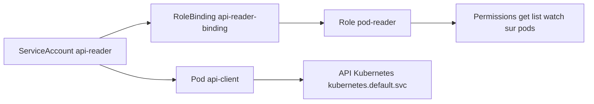
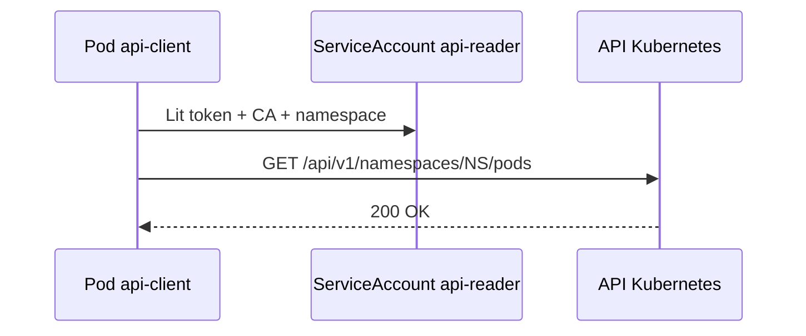
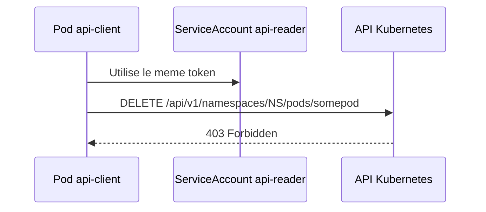
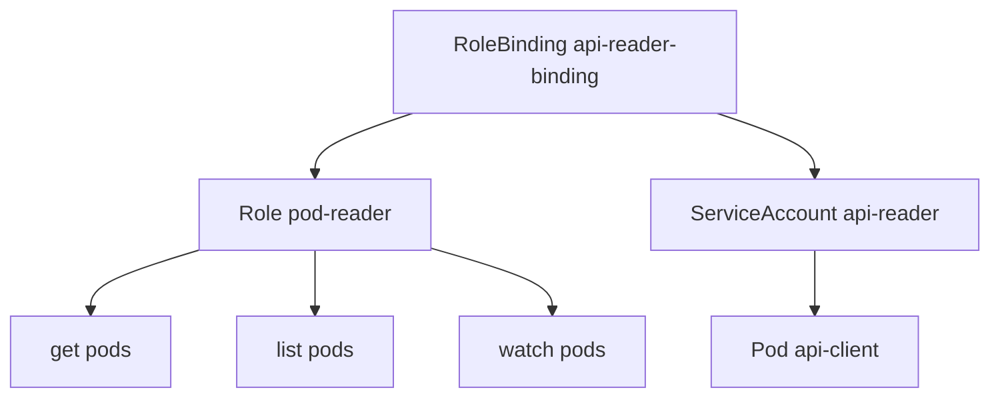

# Lab 09 corrigé — EX280 sur CRC
**ServiceAccounts, RBAC & API Access — support complet, corrigé et commenté**

## 1. Objectif du lab

Ce lab sert à pratiquer :

- la création d’une **ServiceAccount**
- la création d’un **Role** namespace-scoped
- l’association via **RoleBinding**
- l’accès à l’API Kubernetes depuis un pod
- la distinction entre :
  - **lecture autorisée**
  - **action interdite**
- l’interprétation d’un code HTTP **200** puis **403**

---

## 2. Contexte du lab

Environnement utilisé pendant la séance :

- **Plateforme** : CRC / OpenShift Local
- **Terminal** : Git Bash sous Windows 11
- **Namespace** : `ex280-lab09-zidane`
- **Répertoire de travail** : `certifications/ex280/work/lab09`

---

## 3. Notions et concepts abordés

### 3.1 ServiceAccount

Une **ServiceAccount** représente une identité technique utilisée par les pods.

Dans ce lab :

- nom : `api-reader`

Le pod `api-client` l’utilise explicitement avec :

```yaml
serviceAccountName: api-reader
```

Cela permet au pod :

- d’obtenir un token projeté
- d’appeler l’API Kubernetes avec cette identité

### 3.2 Role namespace-scoped

Le `Role` créé est :

- `pod-reader`

Il autorise uniquement :

- `get`
- `list`
- `watch`

sur la ressource :

- `pods`

Ce rôle est limité au **namespace courant**.

### 3.3 RoleBinding

Le `RoleBinding` associe :

- le `Role` `pod-reader`
- à la `ServiceAccount` `api-reader`

Donc :

- le pod qui tourne sous cette SA peut lire les pods du namespace
- mais il ne peut pas supprimer des pods

### 3.4 Accès API depuis un pod

Le pod client lit trois éléments injectés automatiquement :

- le token :
  - `/var/run/secrets/kubernetes.io/serviceaccount/token`
- le certificat CA :
  - `/var/run/secrets/kubernetes.io/serviceaccount/ca.crt`
- le namespace :
  - `/var/run/secrets/kubernetes.io/serviceaccount/namespace`

Puis il appelle :

- `https://kubernetes.default.svc`

C’est le point d’entrée interne de l’API Kubernetes dans le cluster.

### 3.5 Lecture autorisée vs action interdite

Le lab démontre deux cas :

#### Cas 1 — lecture
Requête `GET` sur :

- `/api/v1/namespaces/$NS/pods`

Résultat final observé :

- `200`

Cela prouve que le `Role` fonctionne.

#### Cas 2 — suppression interdite
Requête `DELETE` vers :

- `/api/v1/namespaces/$NS/pods/somepod`

Résultat observé :

- `403`

Cela prouve que la `ServiceAccount` n’a pas les droits d’écriture / suppression.

### 3.6 Code HTTP 200

`200` signifie :

- l’appel à l’API a réussi
- l’authentification est valide
- l’autorisation RBAC permet l’action

### 3.7 Code HTTP 403

`403` signifie :

- l’identité est connue
- l’appel atteint bien l’API
- mais l’action est refusée par les droits RBAC

C’est exactement le comportement attendu ici.

---

## 4. Schémas Mermaid

### 4.1 Vue d’ensemble du lab



### 4.2 Flux d’appel API autorisé



### 4.3 Flux d’appel API interdit



### 4.4 Relation RBAC



---

## 5. Déroulé corrigé du lab

## 5.1 Préparation du namespace

```bash
export LAB=09
export NS=ex280-lab${LAB}-zidane
oc get project "$NS" || oc new-project "$NS"
oc project "$NS"
```

### Commentaire
- crée le namespace si nécessaire
- positionne le contexte `oc`

## 5.2 Création de la ServiceAccount

```bash
oc create sa api-reader
```

### Commentaire
- crée l’identité technique qui sera utilisée par le pod client API

## 5.3 Préparation du répertoire de travail

```bash
cd ..
mkdir lab09
cd lab09
```

### Commentaire
- création d’un dossier dédié au lab 09

## 5.4 Création du Role

```bash
cat <<'YAML' | oc apply -f -
apiVersion: rbac.authorization.k8s.io/v1
kind: Role
metadata:
  name: pod-reader
rules:
- apiGroups: [""]
  resources: ["pods"]
  verbs: ["get","list","watch"]
YAML
```

### Commentaire
- donne des droits de lecture uniquement sur les pods
- pas de `create`
- pas de `delete`

## 5.5 Création du RoleBinding

```bash
oc create rolebinding api-reader-binding --role=pod-reader --serviceaccount="$NS":api-reader
oc get rolebinding api-reader-binding -o yaml | sed -n '1,200p'
```

### Commentaire
- lie le `Role` `pod-reader` à la `ServiceAccount` `api-reader`
- la lecture du YAML permet de vérifier :
  - `roleRef`
  - `subjects`
  - namespace correct

## 5.6 Déploiement du pod client API

```bash
cat <<'YAML' | oc apply -f -
apiVersion: v1
kind: Pod
metadata:
  name: api-client
spec:
  serviceAccountName: api-reader
  containers:
  - name: api-client
    image: registry.access.redhat.com/ubi9/ubi-minimal
    command: ["/bin/sh","-c"]
    args:
      - |
        TOKEN=$(cat /var/run/secrets/kubernetes.io/serviceaccount/token)
        CACERT=/var/run/secrets/kubernetes.io/serviceaccount/ca.crt
        NS=$(cat /var/run/secrets/kubernetes.io/serviceaccount/namespace)
        curl -sS --cacert "$CACERT" -H "Authorization: Bearer $TOKEN"           "https://kubernetes.default.svc/api/v1/namespaces/$NS/pods" | head -c 400
        echo
        sleep 3600
YAML
oc wait --for=condition=Ready pod/api-client --timeout=120s
oc logs api-client | head -n 30
```

### Commentaire
- le pod utilise bien la `ServiceAccount` `api-reader`
- il appelle l’API du cluster avec son token
- puis il reste vivant avec `sleep 3600`

### Point observé
Un warning PodSecurity est apparu, mais il était **non bloquant**.

## 5.7 Test de l’action interdite

```bash
oc exec api-client -- sh -c '
TOKEN=$(cat /var/run/secrets/kubernetes.io/serviceaccount/token)
CACERT=/var/run/secrets/kubernetes.io/serviceaccount/ca.crt
NS=$(cat /var/run/secrets/kubernetes.io/serviceaccount/namespace)
curl -sS -o /dev/null -w "%{http_code}\n" --cacert "$CACERT" -H "Authorization: Bearer $TOKEN"   -X DELETE "https://kubernetes.default.svc/api/v1/namespaces/$NS/pods/somepod"
'
```

### Résultat observé
```text
403
```

### Interprétation
- l’API est joignable
- le token fonctionne
- mais l’action `DELETE` n’est pas autorisée

C’est attendu.

## 5.8 Vérification explicite de la lecture autorisée

```bash
export KUBECONFIG="$HOME/.kube/crc-kubeconfig"
oc exec api-client -- sh -c '
TOKEN=$(cat /var/run/secrets/kubernetes.io/serviceaccount/token)
CACERT=/var/run/secrets/kubernetes.io/serviceaccount/ca.crt
NS=$(cat /var/run/secrets/kubernetes.io/serviceaccount/namespace)
curl -sS -o /dev/null -w "%{http_code}\n" --cacert "$CACERT" -H "Authorization: Bearer $TOKEN"   "https://kubernetes.default.svc/api/v1/namespaces/$NS/pods"
'
```

### Résultat observé
```text
200
```

### Conclusion
Le lab 09 est validé :

- lecture autorisée : `200`
- suppression refusée : `403`

---

## 6. Points à retenir pour EX280

1. Une `ServiceAccount` est une identité de pod.
2. `Role` + `RoleBinding` permettent de donner des droits très ciblés dans un namespace.
3. Pour tester proprement un droit RBAC :
   - utiliser un vrai pod avec la bonne `ServiceAccount`
   - puis appeler l’API du cluster
4. `200` = action autorisée
5. `403` = identité valide mais autorisation refusée
6. Les chemins utiles projetés dans les pods sont :
   - token
   - ca.crt
   - namespace
7. `kubernetes.default.svc` est le point d’accès interne standard à l’API.

---

## 7. Routine de diagnostic à mémoriser

```bash
oc get sa
oc get role
oc get rolebinding -o yaml
oc get pod <nom> -o yaml
oc logs <pod>
oc exec <pod> -- sh
```

Pour tester un accès API :

```bash
curl --cacert "$CACERT" -H "Authorization: Bearer $TOKEN" ...
```

---

## 8. Journal des commandes réellement exécutées pendant le lab

### 8.1 Préparation

```bash
export LAB=09
export NS=ex280-lab${LAB}-zidane
oc get project "$NS" || oc new-project "$NS"
oc project "$NS"
```

### 8.2 ServiceAccount

```bash
oc create sa api-reader
```

### 8.3 Répertoire de travail

```bash
cd ..
mkdir lab09
cd lab09
```

### 8.4 Role

```bash
cat <<'YAML' | oc apply -f -
apiVersion: rbac.authorization.k8s.io/v1
kind: Role
metadata:
  name: pod-reader
rules:
- apiGroups: [""]
  resources: ["pods"]
  verbs: ["get","list","watch"]
YAML
```

### 8.5 RoleBinding

```bash
oc create rolebinding api-reader-binding --role=pod-reader --serviceaccount="$NS":api-reader
oc get rolebinding api-reader-binding -o yaml | sed -n '1,200p'
```

### 8.6 Pod client API

```bash
cat <<'YAML' | oc apply -f -
apiVersion: v1
kind: Pod
metadata:
  name: api-client
spec:
  serviceAccountName: api-reader
  containers:
  - name: api-client
    image: registry.access.redhat.com/ubi9/ubi-minimal
    command: ["/bin/sh","-c"]
    args:
      - |
        TOKEN=$(cat /var/run/secrets/kubernetes.io/serviceaccount/token)
        CACERT=/var/run/secrets/kubernetes.io/serviceaccount/ca.crt
        NS=$(cat /var/run/secrets/kubernetes.io/serviceaccount/namespace)
        curl -sS --cacert "$CACERT" -H "Authorization: Bearer $TOKEN"           "https://kubernetes.default.svc/api/v1/namespaces/$NS/pods" | head -c 400
        echo
        sleep 3600
YAML
oc wait --for=condition=Ready pod/api-client --timeout=120s
oc logs api-client | head -n 30
```

### 8.7 Action interdite

```bash
oc exec api-client -- sh -c '
TOKEN=$(cat /var/run/secrets/kubernetes.io/serviceaccount/token)
CACERT=/var/run/secrets/kubernetes.io/serviceaccount/ca.crt
NS=$(cat /var/run/secrets/kubernetes.io/serviceaccount/namespace)
curl -sS -o /dev/null -w "%{http_code}\n" --cacert "$CACERT" -H "Authorization: Bearer $TOKEN"   -X DELETE "https://kubernetes.default.svc/api/v1/namespaces/$NS/pods/somepod"
'
```

### 8.8 Lecture autorisée

```bash
export KUBECONFIG="$HOME/.kube/crc-kubeconfig"
oc exec api-client -- sh -c '
TOKEN=$(cat /var/run/secrets/kubernetes.io/serviceaccount/token)
CACERT=/var/run/secrets/kubernetes.io/serviceaccount/ca.crt
NS=$(cat /var/run/secrets/kubernetes.io/serviceaccount/namespace)
curl -sS -o /dev/null -w "%{http_code}\n" --cacert "$CACERT" -H "Authorization: Bearer $TOKEN"   "https://kubernetes.default.svc/api/v1/namespaces/$NS/pods"
'
```

---

## 9. Résumé très court

Dans ce lab, on a appris à :

1. créer une `ServiceAccount`
2. lui donner un rôle de lecture sur les pods
3. l’utiliser dans un pod client
4. appeler l’API Kubernetes avec le token projeté
5. vérifier :
   - `GET` → `200`
   - `DELETE` → `403`
