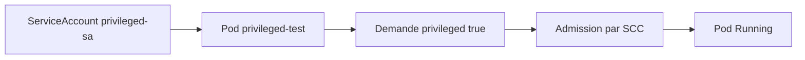
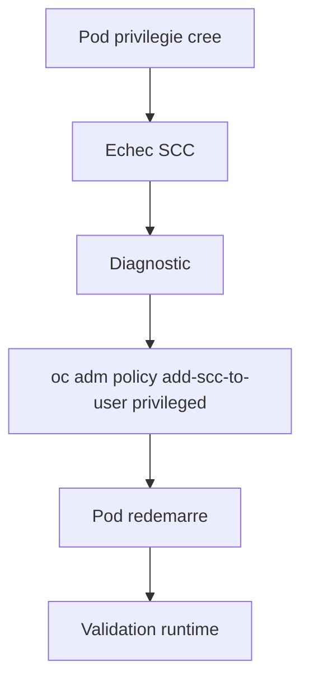
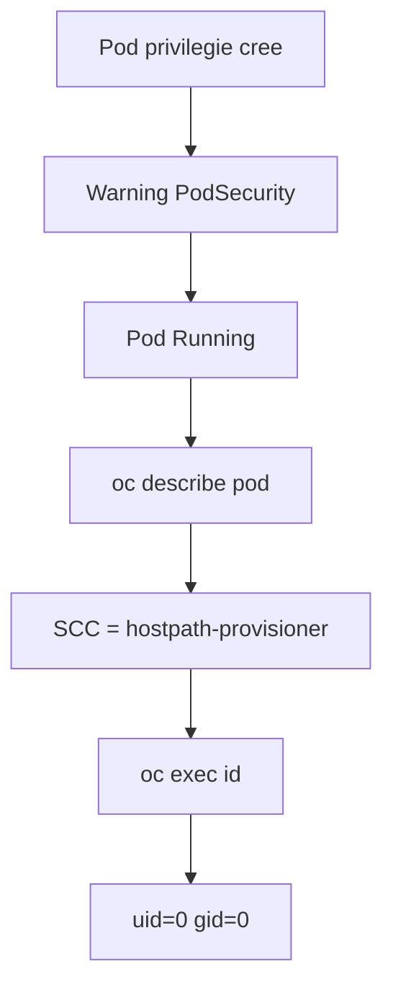
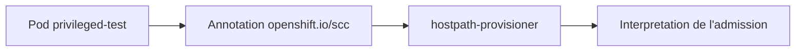

# Lab 10 corrigé — EX280 sur CRC
**SCC, Privileged & Runtime Security — support complet, corrigé et commenté**

## 1. Objectif du lab

Ce lab sert à pratiquer :

- la création d’une **ServiceAccount dédiée**
- le lancement d’un **pod privilégié**
- le diagnostic d’admission via **SCC**
- la lecture de l’annotation `openshift.io/scc`
- la vérification du runtime effectif dans le conteneur

Le scénario “classique” du lab prévoit souvent :

- échec initial
- puis ajout explicite de la SCC `privileged`
- puis redémarrage réussi

Sur ton CRC, le comportement observé a été différent.

---

## 2. Contexte du lab

Environnement utilisé pendant la séance :

- **Plateforme** : CRC / OpenShift Local
- **Terminal** : Git Bash sous Windows 11
- **Namespace** : `ex280-lab10-zidane`
- **Répertoire de travail** : `certifications/ex280/work/lab10`

Point clé du lab sur cet environnement :

- le pod privilégié a démarré **sans** étape explicite `oc adm policy add-scc-to-user privileged ...`

---

## 3. Notions et concepts abordés

### 3.1 SCC dans OpenShift

Une **Security Context Constraint (SCC)** est un mécanisme propre à OpenShift qui encadre la sécurité d’exécution des pods.

Elle contrôle notamment :

- l’usage du mode `privileged`
- l’exécution en `root`
- certains types de volumes
- des capacités Linux
- les stratégies UID/GID
- les règles d’admission sécurité

### 3.2 Pod privilégié

Dans ce lab, le pod demande explicitement :

```yaml
securityContext:
  privileged: true
```

Cela signifie que le conteneur veut un niveau d’exécution très élevé, généralement refusé dans un contexte restreint.

### 3.3 PodSecurity warning vs admission réelle

Au moment de la création, OpenShift a affiché un warning lié à :

- `PodSecurity "restricted:latest"`

Mais ce warning n’a **pas empêché** la création ni le démarrage.

Important :

- un **warning PodSecurity** ne signifie pas automatiquement que le pod sera bloqué
- l’admission réelle dépend ici de la **SCC effectivement utilisée**

### 3.4 ServiceAccount dédiée

Le pod s’exécute avec :

- `serviceAccountName: privileged-sa`

Dans ce type de lab, la ServiceAccount sert à contrôler quelle SCC peut être utilisée à l’admission.

### 3.5 SCC réellement appliquée

Le point central du diagnostic :

le pod n’a pas utilisé la SCC `privileged`, mais :

- `hostpath-provisioner`

C’est cette SCC qui a admis le pod sur ton CRC.

C’est un comportement spécifique d’environnement, pas une erreur de manipulation.

### 3.6 Vérification runtime

Une fois le pod démarré, la commande :

```bash
oc exec privileged-test -- id
```

a retourné :

```text
uid=0(root) gid=0(root) groups=0(root)
```

Cela montre que le conteneur tourne effectivement en **root**.

---

## 4. Schémas Mermaid

### 4.1 Vue d’ensemble logique



### 4.2 Scénario théorique du lab



### 4.3 Scénario réellement observé sur ton CRC



### 4.4 Lecture de la SCC effective



---

## 5. Déroulé corrigé du lab

## 5.1 Pod privilégié

Le pod appliqué pendant la séance :

```bash
cat <<'YAML' | oc apply -f -
apiVersion: v1
kind: Pod
metadata:
  name: privileged-test
spec:
  serviceAccountName: privileged-sa
  containers:
  - name: privileged-test
    image: registry.access.redhat.com/ubi9/ubi-minimal
    securityContext:
      privileged: true
    command: ["/bin/sh","-c"]
    args:
      - |
        id
        sleep 3600
YAML
```

### Commentaire
- le pod demande explicitement `privileged: true`
- il utilise la ServiceAccount `privileged-sa`

## 5.2 Observation du démarrage

```bash
oc get pod privileged-test -w
```

### Résultat observé
Le pod est passé de :

- `ContainerCreating`

à :

- `Running`

### Interprétation
Le scénario “échec immédiat SCC” ne s’est pas produit sur ce cluster.

## 5.3 Diagnostic via `describe`

```bash
export KUBECONFIG="$HOME/.kube/crc-kubeconfig"
oc describe pod privileged-test | sed -n '1,220p'
```

### Éléments utiles observés
- `Service Account: privileged-sa`
- `Status: Running`
- annotation :
  - `openshift.io/scc: hostpath-provisioner`
- conteneur lancé avec :
  - image `ubi9/ubi-minimal`
  - `securityContext.privileged: true`

### Conclusion
Le pod a bien été admis, mais par une SCC différente de `privileged`.

## 5.4 Vérification explicite de la SCC

```bash
export KUBECONFIG="$HOME/.kube/crc-kubeconfig"
oc get pod privileged-test -o jsonpath='{.metadata.annotations.openshift\.io/scc}{"\n"}'
```

### Résultat observé
```text
hostpath-provisioner
```

### Interprétation
La SCC utilisée est confirmée.

## 5.5 Vérification runtime dans le pod

```bash
export KUBECONFIG="$HOME/.kube/crc-kubeconfig"
oc exec privileged-test -- id
```

### Résultat observé
```text
uid=0(root) gid=0(root) groups=0(root)
```

### Conclusion
Le conteneur tourne en **root**.

Le lab 10 est donc validé, avec un scénario différent du support standard.

---

## 6. Points à retenir pour EX280

1. Un warning PodSecurity ne signifie pas nécessairement un échec d’admission.
2. Sur OpenShift, il faut vérifier la **SCC réellement utilisée**, pas seulement lire le manifest.
3. La commande la plus utile pour confirmer la SCC effective est :

```bash
oc get pod <nom> -o jsonpath='{.metadata.annotations.openshift\.io/scc}{"\n"}'
```

4. `oc describe pod` est essentiel pour :
   - voir la ServiceAccount
   - lire les événements
   - identifier la SCC appliquée
5. `oc exec ... -- id` permet de confirmer l’identité runtime réelle.
6. Le comportement peut varier d’un cluster OpenShift à un autre selon les SCC déjà disponibles ou liées.

---

## 7. Routine de diagnostic à mémoriser

```bash
oc get pod <nom> -w
oc describe pod <nom> | sed -n '1,220p'
oc get pod <nom> -o jsonpath='{.metadata.annotations.openshift\.io/scc}{"\n"}'
oc exec <nom> -- id
```

Si le pod ne démarre pas dans un autre environnement :

```bash
oc adm policy add-scc-to-user privileged -z <serviceaccount> -n <namespace>
```

---

## 8. Journal des commandes réellement exécutées pendant le lab

### 8.1 Création du pod privilégié

```bash
cat <<'YAML' | oc apply -f -
apiVersion: v1
kind: Pod
metadata:
  name: privileged-test
spec:
  serviceAccountName: privileged-sa
  containers:
  - name: privileged-test
    image: registry.access.redhat.com/ubi9/ubi-minimal
    securityContext:
      privileged: true
    command: ["/bin/sh","-c"]
    args:
      - |
        id
        sleep 3600
YAML
```

### 8.2 Suivi du démarrage

```bash
oc get pod privileged-test -w
```

### 8.3 Diagnostic

```bash
export KUBECONFIG="$HOME/.kube/crc-kubeconfig"
oc describe pod privileged-test | sed -n '1,220p'
```

### 8.4 Vérification de la SCC effective

```bash
export KUBECONFIG="$HOME/.kube/crc-kubeconfig"
oc get pod privileged-test -o jsonpath='{.metadata.annotations.openshift\.io/scc}{"\n"}'
```

### 8.5 Vérification runtime

```bash
export KUBECONFIG="$HOME/.kube/crc-kubeconfig"
oc exec privileged-test -- id
```

---

## 9. Résumé très court

Dans ce lab, on a appris à :

1. lancer un pod privilégié
2. observer qu’il démarre malgré un warning PodSecurity
3. identifier la SCC réellement utilisée
4. confirmer que le conteneur tourne en root
5. comprendre qu’un cluster OpenShift peut se comporter différemment du scénario théorique du lab
