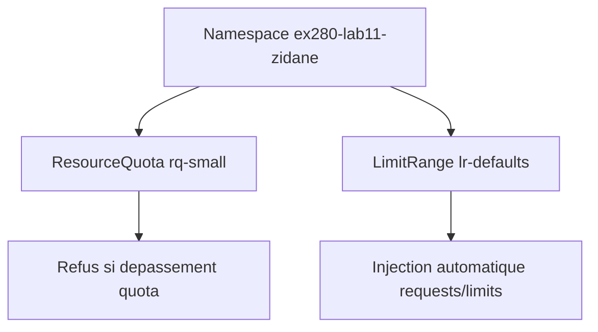
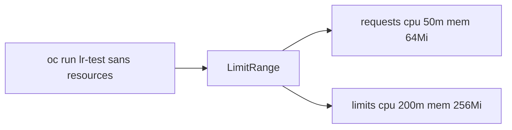
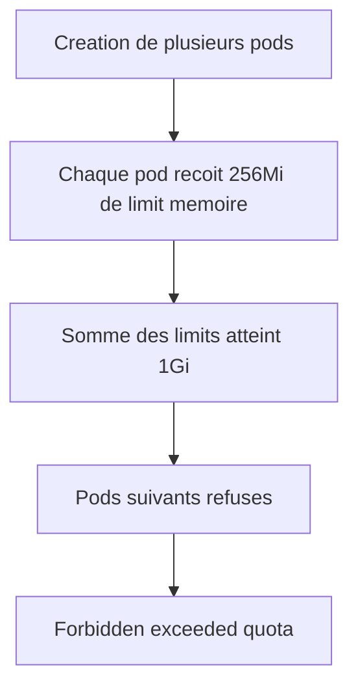
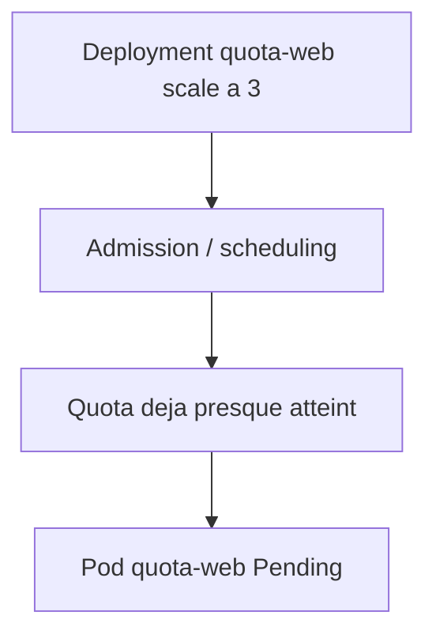
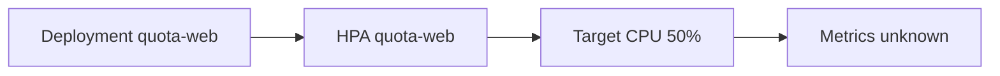

# Lab 11 corrigé — EX280 sur CRC
**Quotas, LimitRange, ProjectTemplate & Scaling — support complet, corrigé et commenté**

## 1. Objectif du lab

Ce lab sert à pratiquer :

- la création d’une **ResourceQuota**
- la création d’une **LimitRange**
- l’injection automatique des **resources par défaut**
- l’observation d’un **dépassement de quota**
- l’impact du quota sur un **Deployment**
- la création d’un **HPA**
- l’interprétation d’un HPA avec métriques indisponibles

---

## 2. Contexte du lab

Environnement utilisé pendant la séance :

- **Plateforme** : CRC / OpenShift Local
- **Terminal** : Git Bash sous Windows 11
- **Namespace** : `ex280-lab11-zidane`
- **Répertoire de travail** : `certifications/ex280/work/lab11`

Point important observé :

- le quota mémoire a été atteint avant le quota en nombre de pods
- le `Deployment` de test est donc resté en `Pending`
- le HPA a été créé, mais les métriques CPU sont restées `unknown`

---

## 3. Notions et concepts abordés

### 3.1 ResourceQuota

Une **ResourceQuota** limite la consommation globale d’un namespace.

Dans ce lab :

- `pods: 5`
- `requests.cpu: 500m`
- `requests.memory: 512Mi`
- `limits.cpu: 1`
- `limits.memory: 1Gi`

Cela veut dire que l’ensemble des pods du namespace ne doit pas dépasser ces bornes.

### 3.2 LimitRange

Une **LimitRange** injecte des valeurs par défaut et impose certaines bornes à l’échelle d’un conteneur.

Dans ce lab :

- `defaultRequest.cpu: 50m`
- `defaultRequest.memory: 64Mi`
- `default.cpu: 200m`
- `default.memory: 256Mi`
- `max.cpu: 500m`
- `max.memory: 512Mi`

Conséquence directe :

- si un pod est créé **sans resources explicites**, OpenShift lui injecte automatiquement ces valeurs.

### 3.3 Différence entre request et limit

- **request** : quantité minimale réservée / utilisée par le scheduler
- **limit** : plafond maximum autorisé pour le conteneur

Dans ce lab, c’est surtout la somme des **limits memory** qui a provoqué le blocage.

### 3.4 Injection automatique des defaults

Le pod `lr-test` a été lancé sans `resources:` dans la commande `oc run`.

Pourtant, on a observé ensuite :

```json
{"limits":{"cpu":"200m","memory":"256Mi"},"requests":{"cpu":"50m","memory":"64Mi"}}
```

Cela prouve que la `LimitRange` a bien injecté les valeurs par défaut.

### 3.5 Dépassement de quota

Le quota n’a pas bloqué au hasard.

Le message d’erreur observé était explicite :

- `exceeded quota: rq-small`
- `requested: limits.memory=256Mi`
- `used: limits.memory=1Gi`
- `limited: limits.memory=1Gi`

Donc, même si la quota autorisait jusqu’à 5 pods, la mémoire limite totale a été atteinte avant ce seuil.

### 3.6 InternalError sur évaluation de quota

Le premier pod de la boucle (`p1`) a retourné :

- `Internal error occurred: resource quota evaluation timed out`

C’est un comportement possible en environnement local / chargé.

Ce point n’invalide pas le lab, car ensuite le dépassement de quota a été observé clairement et de façon répétée.

### 3.7 Effet du quota sur un Deployment

Le `Deployment` `quota-web` a été créé puis scalé à 3 replicas.

Mais un seul pod est apparu et il est resté :

- `Pending`

Pourquoi ?

Parce que le namespace était déjà proche ou au plafond de quota.

Donc le scheduler / admission n’a pas pu satisfaire les ressources nécessaires.

### 3.8 HPA avec métriques indisponibles

Le HPA a été créé :

- `min=1`
- `max=5`
- `cpu-percent=50`

Mais la cible observée était :

- `cpu: <unknown>/50%`

Cela signifie :

- le HPA existe
- mais les métriques CPU ne sont pas exploitables à ce moment sur cet environnement

Le lab dit bien :

- HPA **si métriques disponibles**

Donc ici, la présence de l’objet HPA suffit pour la partie optionnelle.

---

## 4. Schémas Mermaid

### 4.1 Vue d’ensemble quota + limitrange



### 4.2 Injection automatique des defaults



### 4.3 Dépassement de quota



### 4.4 Effet sur le Deployment



### 4.5 HPA



---

## 5. Déroulé corrigé du lab

## 5.1 Préparation du namespace

```bash
export LAB=11
export NS=ex280-lab${LAB}-zidane
oc get project "$NS" || oc new-project "$NS"
oc project "$NS"
```

### Commentaire
- crée le namespace si nécessaire
- positionne le contexte `oc`

## 5.2 Création de la ResourceQuota

```bash
cat <<'YAML' | oc apply -f -
apiVersion: v1
kind: ResourceQuota
metadata:
  name: rq-small
spec:
  hard:
    pods: "5"
    requests.cpu: "500m"
    requests.memory: 512Mi
    limits.cpu: "1"
    limits.memory: 1Gi
YAML
oc describe quota rq-small
```

### Résultat observé
Quota vide au départ :

- `Used = 0`
- `Hard` défini comme attendu

### Commentaire
La quota s’applique au namespace entier.

## 5.3 Création de la LimitRange

```bash
cat <<'YAML' | oc apply -f -
apiVersion: v1
kind: LimitRange
metadata:
  name: lr-defaults
spec:
  limits:
  - type: Container
    default:
      cpu: "200m"
      memory: "256Mi"
    defaultRequest:
      cpu: "50m"
      memory: "64Mi"
    max:
      cpu: "500m"
      memory: "512Mi"
YAML
oc describe limitrange lr-defaults
```

### Commentaire
Cette LimitRange fixe :

- les defaults injectés
- les maximums autorisés par conteneur

## 5.4 Pod sans resources explicites

```bash
oc run lr-test --image=registry.access.redhat.com/ubi9/ubi-minimal --restart=Never -- sleep 3600
oc wait --for=condition=Ready pod/lr-test --timeout=120s
oc get pod lr-test -o jsonpath='{.spec.containers[0].resources}{"\n"}'
```

### Résultat observé
```json
{"limits":{"cpu":"200m","memory":"256Mi"},"requests":{"cpu":"50m","memory":"64Mi"}}
```

### Conclusion
La LimitRange a bien injecté les defaults.

## 5.5 Dépassement de quota par boucle de pods

```bash
for i in $(seq 1 10); do oc run p$i --image=registry.access.redhat.com/ubi9/ubi-minimal --restart=Never -- sleep 3600 || true; done
oc get pods
oc describe quota rq-small | sed -n '1,180p'
```

### Résultats observés

- `p1` : `resource quota evaluation timed out`
- `p2` : créé
- `p3` : créé
- `p4` à `p10` : refusés

Erreur explicite :

```text
exceeded quota: rq-small, requested: limits.memory=256Mi, used: limits.memory=1Gi, limited: limits.memory=1Gi
```

### État final de la quota observé

- `limits.cpu: 800m / 1`
- `limits.memory: 1Gi / 1Gi`
- `pods: 4 / 5`
- `requests.cpu: 200m / 500m`
- `requests.memory: 256Mi / 512Mi`

### Interprétation
Le quota **mémoire limite** a bloqué avant le quota en nombre de pods.

## 5.6 Deployment + scaling

```bash
oc create deployment quota-web --image=registry.access.redhat.com/ubi8/httpd-24
oc scale deployment quota-web --replicas=3
oc get pods
```

### Résultat observé
Le pod du Deployment est resté :

- `Pending`

### Interprétation
Le namespace est déjà au plafond ou trop proche du plafond pour admettre les nouvelles ressources du Deployment.

## 5.7 HPA

```bash
oc autoscale deployment quota-web --min=1 --max=5 --cpu-percent=50 || true
oc get hpa
```

### Résultat observé
```text
TARGETS: cpu: <unknown>/50%
```

### Interprétation
- le HPA a bien été créé
- les métriques CPU ne sont pas exploitables ici
- la partie HPA reste donc **visible mais non pleinement active**

Cela reste conforme au lab, qui précise :

- HPA **si métriques disponibles**. fileciteturn16file0

---

## 6. Points à retenir pour EX280

1. Une `ResourceQuota` agit au niveau namespace.
2. Une `LimitRange` peut injecter des valeurs par défaut sans que tu les écrives dans le manifest.
3. Le quota qui bloque n’est pas forcément celui qu’on regarde en premier.
4. Ici, le blocage principal est venu de :
   - `limits.memory`
5. `oc describe quota` est indispensable pour comprendre ce qui est utilisé et ce qui bloque.
6. Un `Deployment` peut être créé mais ne pas démarrer faute de ressources disponibles dans la quota.
7. Un HPA peut exister même si les métriques CPU sont indisponibles.

---

## 7. Routine de diagnostic à mémoriser

```bash
oc describe quota <nom>
oc describe limitrange <nom>
oc get pod <nom> -o jsonpath='{.spec.containers[0].resources}{"\n"}'
oc get pods
oc describe pod <nom>
oc get hpa
```

---

## 8. Journal des commandes réellement exécutées pendant le lab

### 8.1 Préparation

```bash
export LAB=11
export NS=ex280-lab${LAB}-zidane
oc get project "$NS" || oc new-project "$NS"
oc project "$NS"
```

### 8.2 Répertoire de travail

```bash
cd ..
mkdir lab11
cd lab11/
```

### 8.3 ResourceQuota

```bash
cat <<'YAML' | oc apply -f -
apiVersion: v1
kind: ResourceQuota
metadata:
  name: rq-small
spec:
  hard:
    pods: "5"
    requests.cpu: "500m"
    requests.memory: 512Mi
    limits.cpu: "1"
    limits.memory: 1Gi
YAML
oc describe quota rq-small
```

### 8.4 LimitRange

```bash
cat <<'YAML' | oc apply -f -
apiVersion: v1
kind: LimitRange
metadata:
  name: lr-defaults
spec:
  limits:
  - type: Container
    default:
      cpu: "200m"
      memory: "256Mi"
    defaultRequest:
      cpu: "50m"
      memory: "64Mi"
    max:
      cpu: "500m"
      memory: "512Mi"
YAML
oc describe limitrange lr-defaults
```

### 8.5 Pod sans resources

```bash
oc run lr-test --image=registry.access.redhat.com/ubi9/ubi-minimal --restart=Never -- sleep 3600
oc wait --for=condition=Ready pod/lr-test --timeout=120s
oc get pod lr-test -o jsonpath='{.spec.containers[0].resources}{"\n"}'
```

### 8.6 Dépassement de quota

```bash
for i in $(seq 1 10); do oc run p$i --image=registry.access.redhat.com/ubi9/ubi-minimal --restart=Never -- sleep 3600 || true; done
oc get pods
oc describe quota rq-small | sed -n '1,180p'
```

### 8.7 Deployment et scaling

```bash
oc create deployment quota-web --image=registry.access.redhat.com/ubi8/httpd-24
oc scale deployment quota-web --replicas=3
oc get pods
```

### 8.8 HPA

```bash
oc autoscale deployment quota-web --min=1 --max=5 --cpu-percent=50 || true
oc get hpa
```

---

## 9. Résumé très court

Dans ce lab, on a appris à :

1. créer une quota de namespace
2. créer une LimitRange avec defaults
3. vérifier l’injection automatique des resources
4. observer un dépassement de quota
5. voir un Deployment bloqué par manque de quota
6. créer un HPA visible même avec métriques CPU indisponibles
