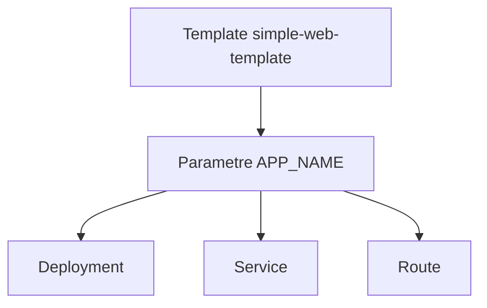
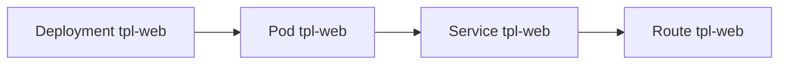
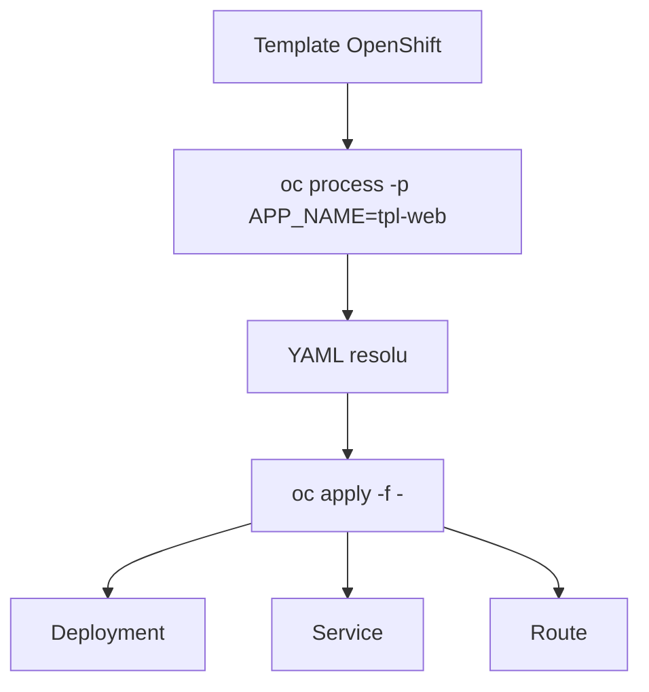
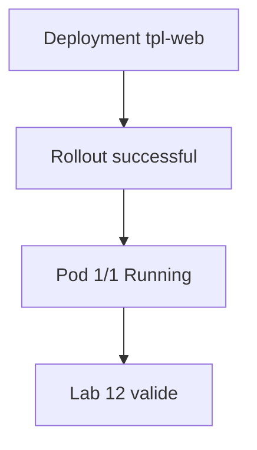

# Lab 12 corrigé — EX280 sur CRC
**Templates OpenShift — support complet, corrigé et commenté**

## 1. Objectif du lab

Ce lab sert à pratiquer :

- la création d’un **Template OpenShift**
- l’usage d’un **paramètre**
- l’instanciation avec `oc process`
- la création automatique d’un :
  - `Deployment`
  - `Service`
  - `Route`
- la vérification finale du rollout

---

## 2. Contexte du lab

Environnement utilisé pendant la séance :

- **Plateforme** : CRC / OpenShift Local
- **Terminal** : Git Bash sous Windows 11
- **Namespace** : `ex280-lab12-zidane`
- **Répertoire de travail** : `certifications/ex280/work/lab12`

Point important observé :

- le bloc `here-doc` saisi pour le template a été visuellement abîmé dans le terminal ;
- malgré cela, le `Template` a bien été créé ;
- l’instanciation a produit les trois objets attendus. fileciteturn17file0

---

## 3. Notions et concepts abordés

### 3.1 Template OpenShift

Un **Template** OpenShift permet de regrouper plusieurs objets Kubernetes/OpenShift dans un seul artefact réutilisable.

Dans ce lab, le template sert à générer :

- un `Deployment`
- un `Service`
- une `Route`

Le support du lab demande précisément cette logique d’instanciation multiple via `oc process`. fileciteturn17file0

### 3.2 Paramètres

Le template utilise un paramètre :

- `APP_NAME`

Ce paramètre alimente plusieurs champs :

- nom du `Deployment`
- nom du `Service`
- nom de la `Route`
- labels / selectors

Cela permet d’instancier plusieurs variantes d’un même modèle sans dupliquer le YAML.

### 3.3 `oc process`

La commande :

```bash
oc process simple-web-template -p APP_NAME=tpl-web
```

sert à :

- résoudre les paramètres ;
- produire le YAML final instancié.

Ensuite, le flux :

```bash
oc process ... | oc apply -f -
```

permet d’appliquer immédiatement les objets générés.

### 3.4 Chaînage Deployment / Service / Route

Le lab démontre une chaîne classique OpenShift :

- `Deployment` déploie le pod ;
- `Service` expose le pod dans le cluster ;
- `Route` publie le service vers l’extérieur.

### 3.5 Vérification finale

Le support du lab demande de vérifier que `tpl-web` existe bien sous forme de :

- `Deployment`
- `Service`
- `Route` fileciteturn17file0

Sur ton environnement, on a en plus validé :

- le rollout complet du `Deployment`
- le pod final en `Running`

---

## 4. Schémas Mermaid

### 4.1 Logique du template



### 4.2 Chaîne d’exposition



### 4.3 Flux `oc process`



### 4.4 Vérification finale



---

## 5. Déroulé corrigé du lab

## 5.1 Préparation du namespace

```bash
export LAB=12
export NS=ex280-lab${LAB}-zidane
oc get project "$NS" || oc new-project "$NS"
oc project "$NS"
```

### Commentaire
- crée le namespace si nécessaire ;
- positionne le contexte sur `ex280-lab12-zidane`.

---

## 5.2 Création du Template

Le support du lab attend un `Template` contenant :

- `Deployment`
- `Service`
- `Route`
- paramètre `APP_NAME` requis. fileciteturn17file0

Version logique attendue :

```yaml
apiVersion: template.openshift.io/v1
kind: Template
metadata:
  name: simple-web-template
objects:
- apiVersion: apps/v1
  kind: Deployment
  metadata:
    name: ${APP_NAME}
  spec:
    replicas: 1
    selector:
      matchLabels:
        app: ${APP_NAME}
    template:
      metadata:
        labels:
          app: ${APP_NAME}
      spec:
        containers:
        - name: ${APP_NAME}
          image: registry.access.redhat.com/ubi8/httpd-24
          ports:
          - containerPort: 8080
- apiVersion: v1
  kind: Service
  metadata:
    name: ${APP_NAME}
  spec:
    selector:
      app: ${APP_NAME}
    ports:
    - port: 8080
      targetPort: 8080
- apiVersion: route.openshift.io/v1
  kind: Route
  metadata:
    name: ${APP_NAME}
  spec:
    to:
      kind: Service
      name: ${APP_NAME}
parameters:
- name: APP_NAME
  required: true
```

### Ce qui a été observé pendant la séance

La saisie terminal a été partiellement corrompue visuellement, avec une sortie de type :

```text
YAMLquired: trueP_NAME}nshift.io/v1
```

Mais malgré cette corruption d’affichage :

- `template.template.openshift.io/simple-web-template created`

Donc le cluster a bien accepté un objet `Template`.

---

## 5.3 Instanciation du template

```bash
oc process simple-web-template -p APP_NAME=tpl-web | oc apply -f -
oc get all
oc get route tpl-web
```

### Résultat observé
Les objets ont bien été créés :

- `deployment.apps/tpl-web created`
- `service/tpl-web created`
- `route.route.openshift.io/tpl-web created`

### Commentaire
Cela valide le cœur du lab : un template paramétré qui instancie plusieurs objets en une seule commande. fileciteturn17file0

---

## 5.4 Observation intermédiaire

Au moment du premier `oc get all`, le pod était encore en :

- `ContainerCreating`

C’est normal juste après l’application.

La route existait déjà :

- `tpl-web-ex280-lab12-zidane.apps-crc.testing`

---

## 5.5 Vérification finale du rollout

```bash
export KUBECONFIG="$HOME/.kube/crc-kubeconfig"
oc rollout status deploy/tpl-web
oc get pods -l app=tpl-web -o wide
```

### Résultat observé
```text
deployment "tpl-web" successfully rolled out
```

Et le pod :

- `1/1 Running`

### Conclusion
Le lab 12 est validé :

- template créé ;
- instanciation réussie ;
- `Deployment`, `Service`, `Route` présents ;
- pod final en `Running`.

---

## 6. Points à retenir pour EX280

1. Un `Template` OpenShift peut regrouper plusieurs objets.
2. Les paramètres permettent d’éviter la duplication de YAML.
3. `oc process` sert à matérialiser le YAML final à partir du template.
4. Le pipe `oc process ... | oc apply -f -` est très pratique.
5. Après instanciation, il faut toujours vérifier :
   - les objets créés
   - le rollout du déploiement
   - l’état final du pod
6. Une sortie terminal partiellement corrompue n’invalide pas forcément le résultat si l’objet est bien créé côté cluster.

---

## 7. Routine de diagnostic à mémoriser

```bash
oc get template
oc describe template <nom>
oc process <template> -p APP_NAME=<valeur>
oc process <template> -p APP_NAME=<valeur> | oc apply -f -
oc get all
oc get route <nom>
oc rollout status deploy/<nom>
oc get pods -l app=<nom> -o wide
```

---

## 8. Journal des commandes réellement exécutées pendant le lab

### 8.1 Préparation

```bash
export LAB=12
export NS=ex280-lab${LAB}-zidane
oc get project "$NS" || oc new-project "$NS"
oc project "$NS"
```

### 8.2 Création du template

```bash
cat <<'YAML' | oc apply -f -
apiVersion: template.openshift.io/v1
kind: Template
metadata:
  name: simple-web-template
objects:
- apiVersion: apps/v1
  kind: Deployment
  metadata:
    name: ${APP_NAME}
  spec:
    replicas: 1
    selector:
      matchLabels:
        app: ${APP_NAME}
    template:
      metadata:
        labels:
          app: ${APP_NAME}
      spec:
        containers:
        - name: ${APP_NAME}
          image: registry.access.redhat.com/ubi8/httpd-24
          ports:
          - containerPort: 8080
- apiVersion: v1
  kind: Service
  metadata:
    ...
YAML
```

> Remarque : la saisie observée dans le terminal a été tronquée/corrompue visuellement, mais le template a bien été accepté par le cluster.

### 8.3 Instanciation

```bash
oc process simple-web-template -p APP_NAME=tpl-web | oc apply -f -
oc get all
oc get route tpl-web
```

### 8.4 Vérification finale

```bash
export KUBECONFIG="$HOME/.kube/crc-kubeconfig"
oc rollout status deploy/tpl-web
oc get pods -l app=tpl-web -o wide
```

---

## 9. Résumé très court

Dans ce lab, on a appris à :

1. créer un template OpenShift ;
2. lui passer un paramètre ;
3. instancier plusieurs objets d’un coup avec `oc process` ;
4. vérifier la présence de `Deployment`, `Service` et `Route` ;
5. valider le rollout final du pod.
