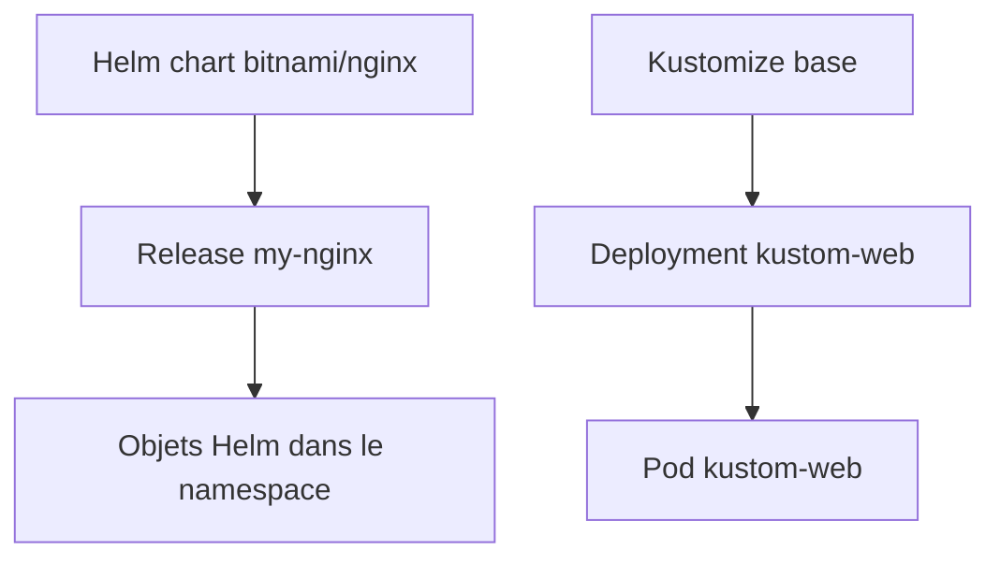
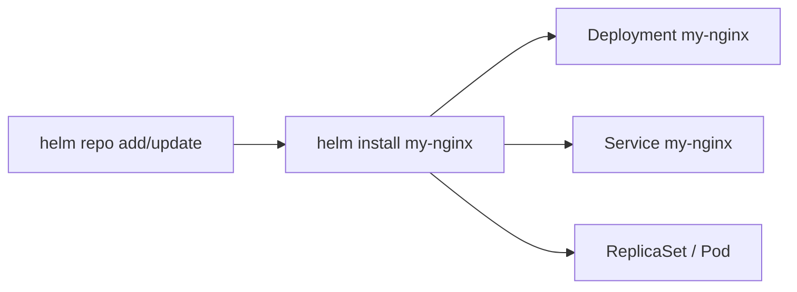
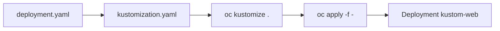
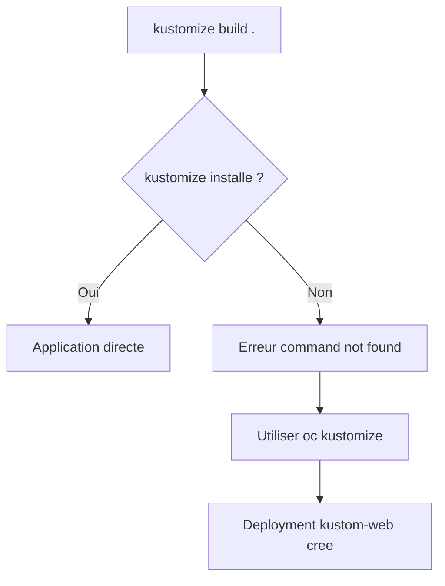

# Lab 13 corrigé — EX280 sur CRC
**Helm & Kustomize — support complet, corrigé et commenté**

## 1. Objectif du lab

Ce lab sert à pratiquer :

- l’installation d’une **release Helm** simple ;
- l’application d’une base **Kustomize** ;
- la vérification des objets créés ;
- l’identification des écarts d’environnement sur CRC.

---

## 2. Contexte du lab

Environnement utilisé pendant la séance :

- **Plateforme** : CRC / OpenShift Local
- **Terminal** : Git Bash sous Windows 11
- **Namespace** : `ex280-lab13-zidane`
- **Répertoire de travail** : `certifications/ex280/work/lab13`

Écarts observés :

- le binaire `kustomize` n’était **pas installé** localement ;
- le chart Helm Bitnami a créé un `Service` `LoadBalancer` avec `EXTERNAL-IP=<pending>`, ce qui est cohérent sur CRC ;
- le contournement correct a été d’utiliser `oc kustomize`.

---

## 3. Notions et concepts abordés

### 3.1 Helm

Helm sert à installer et gérer des applications packagées sous forme de charts.

Dans ce lab :

- repo utilisé : `bitnami`
- chart installé : `bitnami/nginx`
- release installée : `my-nginx`

Helm a créé automatiquement :

- un `Deployment`
- un `Service`
- les objets associés du chart

### 3.2 Release Helm

Une **release** est une instance d’un chart Helm dans un namespace donné.

Ici :

- nom de release : `my-nginx`
- namespace : `ex280-lab13-zidane`

La commande de vérification principale est :

```bash
helm list -n "$NS"
```

### 3.3 Kustomize

Kustomize permet de construire des manifests Kubernetes/OpenShift à partir de ressources de base et d’overlays.

Dans ce lab, on a utilisé une base très simple contenant :

- un `Deployment`
- un fichier `kustomization.yaml`

### 3.4 `kustomize` vs `oc kustomize`

Le support du lab utilise :

```bash
kustomize build . | oc apply -f - -n "$NS"
```

Mais sur ton poste :

- `kustomize: command not found`

Le bon contournement sur OpenShift a été :

```bash
oc kustomize . | oc apply -f - -n "$NS"
```

C’est le point principal à retenir de ce lab sur ton environnement. fileciteturn18file0

### 3.5 Vérification finale

Le lab demande essentiellement deux preuves :

- la release Helm est présente ;
- le `Deployment` `kustom-web` est présent. fileciteturn18file0

Sur ton environnement, on a validé plus que cela :

- `my-nginx` en `deployed`
- `kustom-web` en rollout réussi
- les deux pods en `Running`

---

## 4. Schémas Mermaid

### 4.1 Vue d’ensemble du lab



### 4.2 Flux Helm



### 4.3 Flux Kustomize



### 4.4 Écart d’environnement



---

## 5. Déroulé corrigé du lab

## 5.1 Préparation du namespace

```bash
export LAB=13
export NS=ex280-lab${LAB}-zidane
oc get project "$NS" || oc new-project "$NS"
oc project "$NS"
```

### Commentaire
- crée le namespace du lab si nécessaire ;
- positionne le contexte sur `ex280-lab13-zidane`.

---

## 5.2 Partie Helm

```bash
helm repo add bitnami https://charts.bitnami.com/bitnami
helm repo update
helm install my-nginx bitnami/nginx -n "$NS"
oc get pods -n "$NS"
```

### Résultats observés
- le repo `bitnami` existait déjà ;
- `helm repo update` a fonctionné ;
- la release `my-nginx` a été installée avec succès ;
- le pod `my-nginx` était d’abord en `Pending`.

### Point notable
Le chart a créé un `Service` de type `LoadBalancer`, avec :

- `EXTERNAL-IP=<pending>`

C’est cohérent sur CRC/local.

---

## 5.3 Préparation de la base Kustomize

Dans le dossier :

- `tmp/kustomize-lab13/base`

les fichiers créés étaient :

### `deployment.yaml`
```yaml
apiVersion: apps/v1
kind: Deployment
metadata:
  name: kustom-web
spec:
  replicas: 1
  selector:
    matchLabels:
      app: kustom-web
  template:
    metadata:
      labels:
        app: kustom-web
    spec:
      containers:
      - name: kustom-web
        image: registry.access.redhat.com/ubi8/httpd-24
```

### `kustomization.yaml`
```yaml
resources:
- deployment.yaml
```

---

## 5.4 Première tentative Kustomize — échec

Commande exécutée :

```bash
oc get all -n "$NS" oc apply -f - -n "$NS"
```

Puis message observé :

```text
bash: kustomize: command not found
error: no objects passed to apply
```

### Explication
Le binaire `kustomize` n’était pas présent localement.

La commande a aussi été mal recopiée visuellement dans le terminal, mais la vraie cause bloquante est l’absence de `kustomize`.

---

## 5.5 Correction avec `oc kustomize`

Depuis le dossier `.../lab13/tmp/kustomize-lab13/base` :

```bash
export KUBECONFIG="$HOME/.kube/crc-kubeconfig"
oc kustomize . | oc apply -f - -n "$NS"
oc get deploy kustom-web -n "$NS"
```

### Résultat observé
- `deployment.apps/kustom-web created`
- le `Deployment` `kustom-web` existe

### Conclusion
La partie Kustomize est validée grâce au contournement `oc kustomize`.

---

## 5.6 Vérification finale

```bash
export KUBECONFIG="$HOME/.kube/crc-kubeconfig"
helm list -n "$NS"
oc rollout status deploy/kustom-web -n "$NS"
oc get all -n "$NS"
```

### Résultats observés

#### Helm
- release `my-nginx` visible
- status : `deployed`

#### Kustomize
- `deployment "kustom-web" successfully rolled out`

#### Objets finaux
- pod `kustom-web` : `1/1 Running`
- pod `my-nginx` : `1/1 Running`
- `deployment.apps/kustom-web` : `1/1`
- `deployment.apps/my-nginx` : `1/1`

### Conclusion
Le **lab 13 est validé** :

- release Helm présente ;
- `Deployment` `kustom-web` présent ;
- workloads Helm et Kustomize opérationnels.

---

## 6. Points à retenir pour EX280

1. Helm et Kustomize sont deux approches complémentaires :
   - Helm pour installer un chart packagé
   - Kustomize pour construire / personnaliser des manifests
2. Une release Helm se vérifie avec :
   - `helm list -n <namespace>`
3. Sur OpenShift, `oc kustomize` peut remplacer `kustomize build` quand le binaire n’est pas installé.
4. Après application, toujours vérifier :
   - rollout
   - pods
   - objets finaux
5. Sur CRC, un `Service` `LoadBalancer` peut rester avec `EXTERNAL-IP=<pending>` sans que cela invalide le lab.

---

## 7. Routine de diagnostic à mémoriser

```bash
helm repo list
helm repo update
helm list -n <namespace>
oc get all -n <namespace>
oc rollout status deploy/<nom> -n <namespace>
oc kustomize .
oc kustomize . | oc apply -f - -n <namespace>
```

---

## 8. Journal des commandes réellement exécutées pendant le lab

### 8.1 Préparation

```bash
export LAB=13
export NS=ex280-lab${LAB}-zidane
oc get project "$NS" || oc new-project "$NS"
oc project "$NS"
```

### 8.2 Helm

```bash
helm repo add bitnami https://charts.bitnami.com/bitnami
helm repo update
helm install my-nginx bitnami/nginx -n "$NS"
oc get pods -n "$NS"
```

### 8.3 Préparation Kustomize

```bash
mkdir -p tmp/kustomize-lab13/base
cd tmp/kustomize-lab13/base

cat > deployment.yaml <<'YAML'
apiVersion: apps/v1
kind: Deployment
metadata:
  name: kustom-web
spec:
  replicas: 1
  selector:
    matchLabels:
      app: kustom-web
  template:
    metadata:
      labels:
        app: kustom-web
    spec:
      containers:
      - name: kustom-web
        image: registry.access.redhat.com/ubi8/httpd-24
YAML

cat > kustomization.yaml <<'YAML'
resources:
- deployment.yaml
YAML
```

### 8.4 Tentative Kustomize en échec

```bash
oc get all -n "$NS" oc apply -f - -n "$NS"
```

### Résultat observé
```text
bash: kustomize: command not found
error: no objects passed to apply
```

### 8.5 Correction avec `oc kustomize`

```bash
export KUBECONFIG="$HOME/.kube/crc-kubeconfig"
oc kustomize . | oc apply -f - -n "$NS"
oc get deploy kustom-web -n "$NS"
```

### 8.6 Vérification finale

```bash
export KUBECONFIG="$HOME/.kube/crc-kubeconfig"
helm list -n "$NS"
oc rollout status deploy/kustom-web -n "$NS"
oc get all -n "$NS"
```

---

## 9. Résumé très court

Dans ce lab, on a appris à :

1. installer une release Helm ;
2. créer une base Kustomize simple ;
3. contourner l’absence du binaire `kustomize` avec `oc kustomize` ;
4. vérifier le rollout final des objets Helm et Kustomize.
