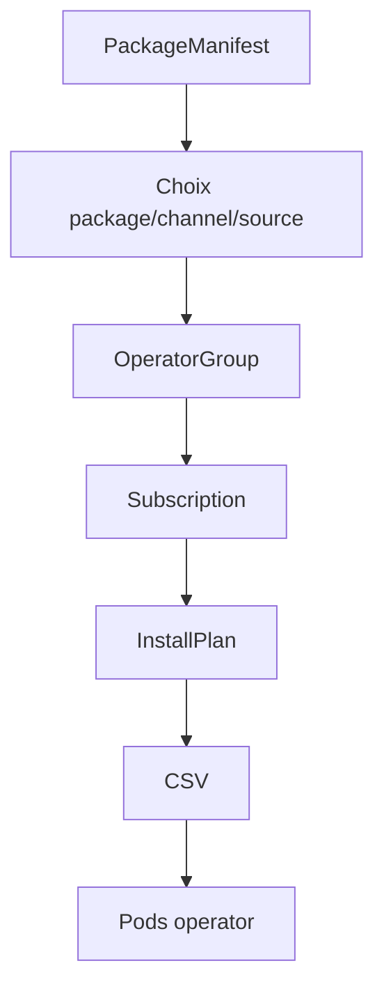
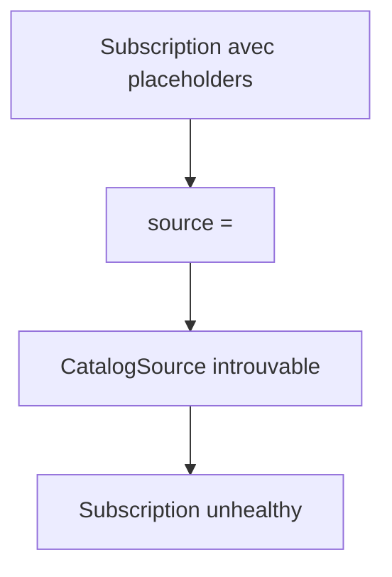
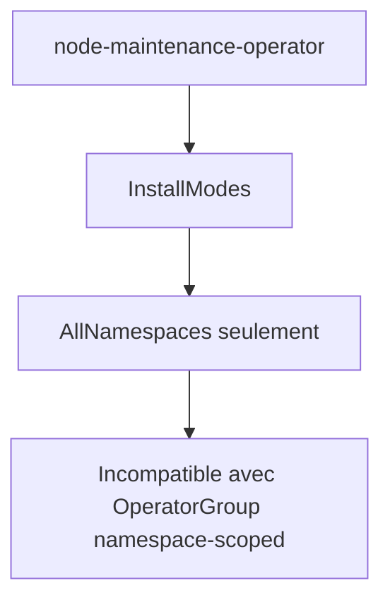
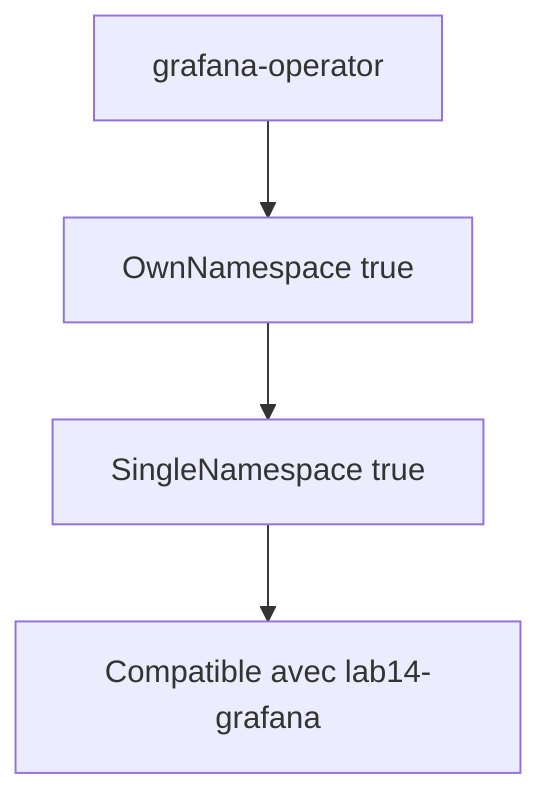
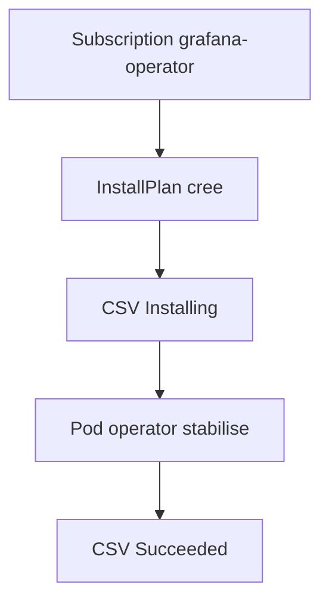

# Lab 14 corrigé — EX280 sur CRC
**Operators & OLM — support complet, corrigé et commenté**

## 1. Objectif du lab

Ce lab sert à pratiquer :

- l’exploration des **Operators** disponibles ;
- la création d’un **OperatorGroup** ;
- la création d’une **Subscription** ;
- la lecture des objets OLM :
  - `Subscription`
  - `InstallPlan`
  - `CSV`
- la validation finale d’une installation Operator.

Le critère principal de validation du lab est :

- un **CSV en `Succeeded`** si l’installation se passe correctement.

---

## 2. Contexte du lab

Environnement utilisé pendant la séance :

- **Plateforme** : CRC / OpenShift Local
- **Terminal** : Git Bash sous Windows 11
- **Namespace de départ** : `ex280-lab14-zidane`
- **Namespace finalement retenu pour l’installation valide** : `lab14-grafana`
- **Répertoire de travail** : `certifications/ex280/work/lab14`

Points importants rencontrés :

- première `Subscription` créée avec des **placeholders** littéraux ;
- premier choix d’operator non compatible avec un `OperatorGroup` namespace-scoped ;
- changement vers un operator compatible :
  - `grafana-operator`
- installation OLM ensuite réussie, avec convergence finale du CSV vers `Succeeded`.

---

## 3. Notions et concepts abordés

### 3.1 OLM

OLM (**Operator Lifecycle Manager**) gère le cycle de vie des operators sur OpenShift.

Les objets principaux manipulés dans ce lab :

- `OperatorGroup`
- `Subscription`
- `InstallPlan`
- `ClusterServiceVersion` (**CSV**)

### 3.2 PackageManifest

Le `PackageManifest` sert à découvrir :

- le nom du package ;
- les channels disponibles ;
- le `catalogSource` ;
- les `installModes` supportés.

C’est l’étape clé avant de créer une `Subscription`.

### 3.3 OperatorGroup

L’`OperatorGroup` définit le périmètre cible d’installation :

- `OwnNamespace`
- `SingleNamespace`
- `MultiNamespace`
- `AllNamespaces`

Dans ce lab, on a utilisé un périmètre ciblé sur un namespace.

### 3.4 Subscription

La `Subscription` décrit :

- quel operator installer ;
- depuis quel catalog ;
- sur quel channel ;
- avec quel mode d’approbation d’`InstallPlan`.

### 3.5 CSV

Le `CSV` est l’indicateur principal de réussite côté OLM.

Phases possibles vues ou évoquées dans ce lab :

- `Pending`
- `Installing`
- `Succeeded`

Pour valider le lab, on visait `Succeeded`.

---

## 4. Schémas Mermaid

### 4.1 Vue d’ensemble OLM



### 4.2 Première erreur rencontrée



### 4.3 Choix d’un operator incompatible



### 4.4 Choix final correct



### 4.5 Convergence finale



---

## 5. Déroulé corrigé du lab

## 5.1 Préparation du namespace initial

```bash
export LAB=14
export NS=ex280-lab${LAB}-zidane
oc get project "$NS" || oc new-project "$NS"
oc project "$NS"
```

### Commentaire
- crée le namespace de travail initial ;
- positionne le contexte `oc`.

## 5.2 Exploration des operators

```bash
oc get packagemanifests -n openshift-marketplace | head
```

### Commentaire
Permet d’identifier rapidement quelques packages candidats.

## 5.3 Premier OperatorGroup

```bash
cat <<'YAML' | oc apply -f -
apiVersion: operators.coreos.com/v1
kind: OperatorGroup
metadata:
  name: ex280-operatorgroup
  namespace: ex280-lab14-zidane
spec:
  targetNamespaces:
  - ex280-lab14-zidane
YAML

oc get operatorgroup -n "$NS"
```

### Résultat observé
- `OperatorGroup` créé correctement dans `ex280-lab14-zidane`.

## 5.4 Première Subscription incorrecte

```bash
cat <<'YAML' | oc apply -f -
apiVersion: operators.coreos.com/v1alpha1
kind: Subscription
metadata:
  name: ex280-operator-sub
  namespace: ex280-lab14-zidane
spec:
  channel: "<CHANNEL>"
  name: "<PACKAGE_NAME>"
  source: "<CATALOG_SOURCE>"
  sourceNamespace: "openshift-marketplace"
YAML
```

### Problème
Les placeholders ont été laissés littéralement.

### Conséquence observée
Dans `describe subscription` :

- `targeted catalogsource openshift-marketplace/<CATALOG_SOURCE> missing`

### Conclusion
Cette première `Subscription` n’était pas valide.

## 5.5 Premier choix d’operator : node-maintenance-operator

Lecture du `PackageManifest` :

```bash
oc get packagemanifest node-maintenance-operator -n openshift-marketplace -o yaml | sed -n '1,220p'
```

### Valeurs observées
- package : `node-maintenance-operator`
- channel : `stable`
- source : `community-operators`

### Mais problème important
Les `installModes` montrent :

- `OwnNamespace: false`
- `SingleNamespace: false`
- `MultiNamespace: false`
- `AllNamespaces: true`

### Conclusion
Cet operator est **incompatible** avec un `OperatorGroup` namespace-scoped.

Il n’était donc pas un bon choix pour valider ce lab dans un namespace dédié.

## 5.6 Deuxième choix : grafana-operator

Lecture ciblée :

```bash
oc get packagemanifest grafana-operator -n openshift-marketplace -o yaml | grep -n -A10 -B2 "installModes"
```

### Résultat observé
- `OwnNamespace: true`
- `SingleNamespace: true`
- `MultiNamespace: true`
- `AllNamespaces: true`

### Conclusion
`grafana-operator` est compatible avec une installation namespace-scoped.

## 5.7 Extraction des vraies valeurs

```bash
oc get packagemanifest grafana-operator -n openshift-marketplace -o jsonpath='{.status.packageName}{"\n"}{.status.defaultChannel}{"\n"}{.status.catalogSource}{"\n"}'
```

### Résultat observé
- `grafana-operator`
- `v5`
- `community-operators`

Ces trois valeurs ont ensuite été utilisées pour une vraie `Subscription`.

## 5.8 Création d’un namespace propre pour l’installation valide

```bash
export NS=lab14-grafana
oc new-project "$NS"
```

### Commentaire
On a séparé l’installation correcte dans un namespace propre.

## 5.9 OperatorGroup valide

```bash
export KUBECONFIG="$HOME/.kube/crc-kubeconfig"
export NS=lab14-grafana
cat <<EOF | oc apply -f -
apiVersion: operators.coreos.com/v1
kind: OperatorGroup
metadata:
  name: ${NS}-og
  namespace: ${NS}
spec:
  targetNamespaces:
  - ${NS}
EOF
```

### Résultat observé
- `operatorgroup.operators.coreos.com/lab14-grafana-og created`

## 5.10 Subscription valide

```bash
export KUBECONFIG="$HOME/.kube/crc-kubeconfig"
export NS=lab14-grafana
cat <<EOF | oc apply -f -
apiVersion: operators.coreos.com/v1alpha1
kind: Subscription
metadata:
  name: grafana-operator
  namespace: ${NS}
spec:
  channel: v5
  name: grafana-operator
  source: community-operators
  sourceNamespace: openshift-marketplace
  installPlanApproval: Automatic
EOF
```

### Résultat observé
- `subscription.operators.coreos.com/grafana-operator created`

## 5.11 Vérification OLM intermédiaire

```bash
export KUBECONFIG="$HOME/.kube/crc-kubeconfig"
export NS=lab14-grafana
oc get subscription -n "$NS"
oc get installplan -n "$NS"
oc get csv -n "$NS"
oc get pods -n "$NS"
```

### Ce qui a été observé
- la `Subscription` existe ;
- un `InstallPlan` / `CSV` ont été résolus ;
- le CSV `grafana-operator.v5.22.2` est passé par `Installing` ;
- le pod operator a connu une phase de `CrashLoopBackOff` puis a fini par se stabiliser.

## 5.12 Diagnostic pendant la phase Installing

Commandes utilisées :

```bash
oc describe subscription grafana-operator -n "$NS" | sed -n '1,240p'
oc get operatorgroup -n "$NS" -o yaml | sed -n '1,220p'
oc describe csv grafana-operator.v5.22.2 -n "$NS" | sed -n '1,260p'
oc logs deployment/grafana-operator-controller-manager-v5 -n "$NS" --tail=120
```

### Éléments importants observés
- `Current CSV: grafana-operator.v5.22.2`
- `Installed CSV: grafana-operator.v5.22.2`
- `State: AtLatestKnown`
- logs montrant des problèmes temporaires de `leader election lost`

### Interprétation
L’installation OLM avait bien avancé, mais l’operator n’était pas encore complètement stabilisé à ce moment.

## 5.13 Vérification finale

Commande décisive :

```bash
export KUBECONFIG="$HOME/.kube/crc-kubeconfig"
export NS=lab14-grafana
oc whoami
oc get csv grafana-operator.v5.22.2 -n "$NS"
```

### Résultat final observé
- `oc whoami` → `kubeadmin`
- CSV :
```text
grafana-operator.v5.22.2   Grafana Operator   5.22.2   grafana-operator.v5.21.2   Succeeded
```

### Conclusion
Le **lab 14 est validé** :

- exploration d’operators : OK
- `OperatorGroup` : OK
- `Subscription` : OK
- `CSV` finale : **Succeeded**

---

## 6. Points à retenir pour EX280

1. Toujours lire le `PackageManifest` avant de créer une `Subscription`.
2. Il faut relever exactement :
   - `packageName`
   - `channel`
   - `catalogSource`
3. Il faut vérifier les `installModes` avant de choisir un operator pour un namespace-scoped install.
4. Un operator `AllNamespaces` only n’est pas un bon candidat pour ce type de lab.
5. La preuve finale côté OLM reste le **CSV en `Succeeded`**.
6. Les phases intermédiaires `Installing`, `Pending`, `Replacing` ne suffisent pas à valider le lab.
7. Un problème temporaire de pod operator n’empêche pas toujours la convergence finale.

---

## 7. Routine de diagnostic à mémoriser

```bash
oc get packagemanifests -n openshift-marketplace | head
oc get packagemanifest <nom> -n openshift-marketplace -o yaml
oc get packagemanifest <nom> -n openshift-marketplace -o jsonpath='...'
oc get operatorgroup -n <ns>
oc get subscription -n <ns>
oc get installplan -n <ns>
oc get csv -n <ns>
oc describe subscription <nom> -n <ns>
oc describe csv <nom> -n <ns>
oc get pods -n <ns>
```

---

## 8. Journal des commandes réellement exécutées pendant le lab

### 8.1 Préparation

```bash
export LAB=14
export NS=ex280-lab${LAB}-zidane
oc get project "$NS" || oc new-project "$NS"
oc project "$NS"
```

### 8.2 Nettoyage de répertoire et repositionnement

```bash
cd ..
rm lab14/
rm -r lab14/
cd ..
cd ..
cd ..
mkdir lab14
cd lab14
```

### 8.3 Exploration OLM

```bash
oc get packagemanifests -n openshift-marketplace | head
```

### 8.4 Premier OperatorGroup

```bash
cat <<'YAML' | oc apply -f -
apiVersion: operators.coreos.com/v1
kind: OperatorGroup
metadata:
  name: ex280-operatorgroup
  namespace: ex280-lab14-zidane
spec:
  targetNamespaces:
  - ex280-lab14-zidane
YAML

oc get operatorgroup -n "$NS"
```

### 8.5 Première Subscription avec placeholders

```bash
cat <<'YAML' | oc apply -f -
apiVersion: operators.coreos.com/v1alpha1
kind: Subscription
metadata:
  name: ex280-operator-sub
  namespace: ex280-lab14-zidane
spec:
  channel: "<CHANNEL>"
  name: "<PACKAGE_NAME>"
  source: "<CATALOG_SOURCE>"
  sourceNamespace: "openshift-marketplace"
YAML

oc get subscription -n "$NS"
oc get csv -n "$NS"
oc describe subscription ex280-operator-sub -n "$NS" | sed -n '1,220p'
```

### 8.6 Étude de node-maintenance-operator

```bash
export KUBECONFIG="$HOME/.kube/crc-kubeconfig"
oc get packagemanifest node-maintenance-operator -n openshift-marketplace -o yaml | sed -n '1,220p'
```

### 8.7 Étude de grafana-operator

```bash
export KUBECONFIG="$HOME/.kube/crc-kubeconfig"
oc get packagemanifest grafana-operator -n openshift-marketplace -o yaml | sed -n '1,220p'
oc get packagemanifest grafana-operator -n openshift-marketplace -o yaml | grep -n -A10 -B2 "installModes"
oc get packagemanifest grafana-operator -n openshift-marketplace -o jsonpath='{.status.packageName}{"\n"}{.status.defaultChannel}{"\n"}{.status.catalogSource}{"\n"}'
```

### 8.8 Création d’un namespace propre

```bash
export NS=lab14-grafana
oc new-project "$NS"
```

### 8.9 OperatorGroup valide

```bash
export KUBECONFIG="$HOME/.kube/crc-kubeconfig"
export NS=lab14-grafana
cat <<EOF | oc apply -f -
apiVersion: operators.coreos.com/v1
kind: OperatorGroup
metadata:
  name: ${NS}-og
  namespace: ${NS}
spec:
  targetNamespaces:
  - ${NS}
EOF
```

### 8.10 Subscription valide

```bash
export KUBECONFIG="$HOME/.kube/crc-kubeconfig"
export NS=lab14-grafana
cat <<EOF | oc apply -f -
apiVersion: operators.coreos.com/v1alpha1
kind: Subscription
metadata:
  name: grafana-operator
  namespace: ${NS}
spec:
  channel: v5
  name: grafana-operator
  source: community-operators
  sourceNamespace: openshift-marketplace
  installPlanApproval: Automatic
EOF
```

### 8.11 Vérifications OLM et diagnostics

```bash
export KUBECONFIG="$HOME/.kube/crc-kubeconfig"
export NS=lab14-grafana
oc get subscription -n "$NS"
oc get installplan -n "$NS"
oc get csv -n "$NS"
oc get pods -n "$NS"

oc describe subscription grafana-operator -n "$NS" | sed -n '1,240p'
oc get operatorgroup -n "$NS" -o yaml | sed -n '1,220p'
oc describe csv grafana-operator.v5.22.2 -n "$NS" | sed -n '1,260p'
oc logs deployment/grafana-operator-controller-manager-v5 -n "$NS" --tail=120
```

### 8.12 Vérification finale

```bash
export KUBECONFIG="$HOME/.kube/crc-kubeconfig"
export NS=lab14-grafana
oc whoami
oc get csv grafana-operator.v5.22.2 -n "$NS"
```

---

## 9. Résumé très court

Dans ce lab, on a appris à :

1. explorer les operators disponibles ;
2. lire un `PackageManifest` pour choisir un operator compatible ;
3. créer un `OperatorGroup` namespace-scoped ;
4. créer une `Subscription` correcte ;
5. suivre `InstallPlan` et `CSV` ;
6. valider l’installation finale avec un CSV en `Succeeded`.
