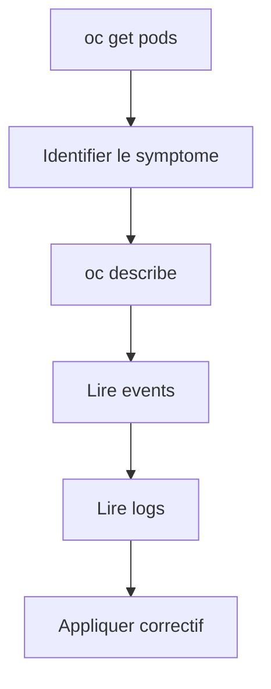
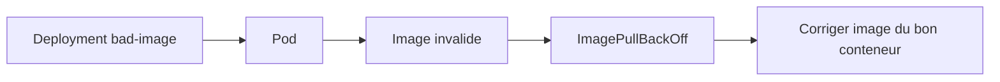
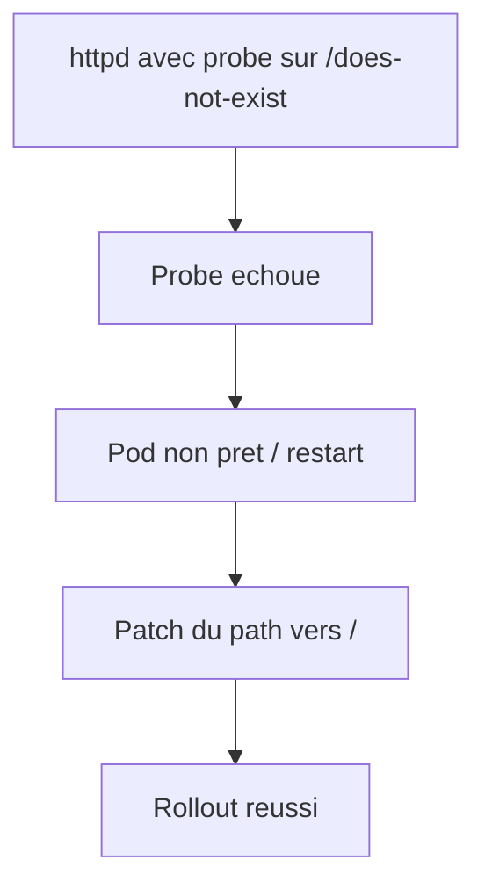
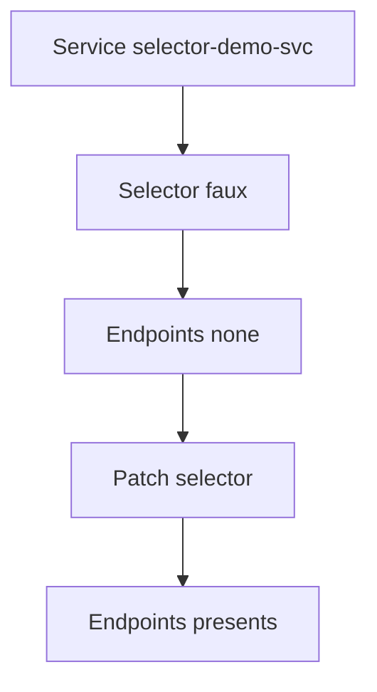
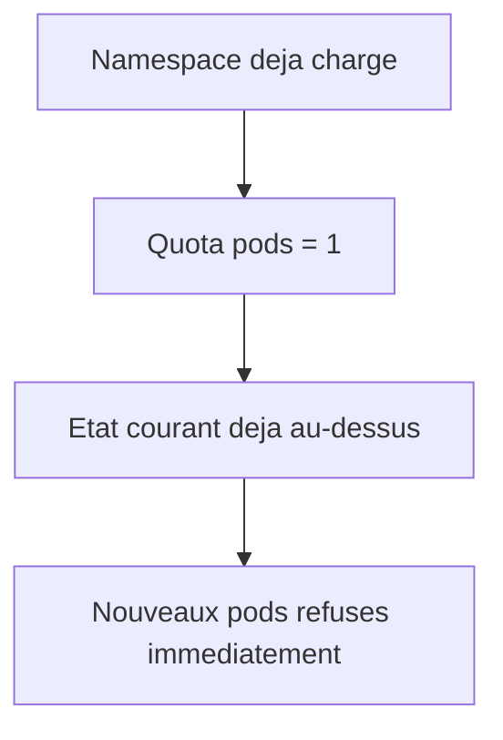

# Lab 15 corrigé — EX280 sur CRC
**Logging, Events & Troubleshooting — support complet, corrigé et commenté**

## 1. Objectif du lab

Ce lab sert à installer une routine de diagnostic stable sur OpenShift/CRC autour de quatre cas classiques :

- image invalide ;
- probe cassée ;
- Service sans Endpoints ;
- quota dépassé.

Le support de départ demande précisément d’observer puis corriger ces situations. fileciteturn23file0

---

## 2. Contexte du lab

Environnement utilisé pendant la séance :

- **Plateforme** : CRC / OpenShift Local
- **Terminal** : Git Bash sous Windows 11
- **Namespace** : `ex280-lab15-zidane`
- **Répertoire de travail** : `certifications/ex280/work/lab15`

Points importants rencontrés :

- des commandes génériques du support ont été recopiées **avec placeholders littéraux** :
  - `oc describe <ressource>`
  - `oc logs <pod> --all-containers --tail=200`
- une première tentative de correction d’image a visé un **mauvais nom de conteneur** ;
- le scénario quota a été lancé dans un namespace déjà chargé, ce qui a modifié le résultat attendu.

---

## 3. Notions et concepts abordés

### 3.1 Routine minimale de diagnostic

Le support propose une routine simple : fileciteturn23file0

```bash
oc project
oc get pods -o wide
oc get events --sort-by=.lastTimestamp | tail -n 30
oc describe <ressource>
oc logs <pod> --all-containers --tail=200
```

### Point pratique
Les deux dernières lignes sont des **modèles**, pas des commandes à lancer telles quelles.

Dans ta session, cela a produit :

- `bash: syntax error near unexpected token 'newline'`
- `bash: pod: No such file or directory`

Car `<ressource>` et `<pod>` doivent être remplacés par de vraies valeurs.

---

### 3.2 ImagePullBackOff

Quand une image est invalide ou introuvable :

- le pod reste bloqué ;
- les événements finissent généralement par montrer un échec de pull ;
- le statut attendu devient souvent :
  - `ImagePullBackOff`

Dans ce lab, l’image utilisée était volontairement fausse :

- `doesnotexist.invalid/foo:latest`

---

### 3.3 Correction d’image sur un Deployment

La commande de correction doit cibler :

- le **Deployment**
- et surtout le **nom réel du conteneur**

Dans ta session, le `describe pod` montrait :

- nom du conteneur : `foo`

Tu as lancé :

```bash
oc set image deployment/bad-image bad-image=registry.access.redhat.com/ubi8/httpd-24
```

Ce qui a échoué avec :

- `error: unable to find container named "bad-image"`

La bonne logique est de remplacer l’image du conteneur **`foo`**, pas `bad-image`.

---

### 3.4 Probes cassées

Une mauvaise `readinessProbe` ou `livenessProbe` peut provoquer :

- non disponibilité ;
- redémarrages ;
- rollout bloqué.

Dans ce lab, le chemin volontairement mauvais était :

- `/does-not-exist`

Puis le correctif attendu est de revenir sur :

- `/`

C’est exactement le pattern demandé dans le support. fileciteturn23file0

---

### 3.5 Service sans Endpoints

Un `Service` peut exister sans cibler aucun pod si :

- le `selector` est faux.

Dans ta session :

- le Service a été créé avec :
  - `app: wrong-label`
- puis corrigé avec :
  - `app: selector-demo`

Résultat :
- avant correction : `endpoints <none>`
- après correction : endpoint visible

C’est un très bon cas de troubleshooting réseau applicatif.

---

### 3.6 Quota dépassé

Le support propose un cas simple :

- quota `pods: "1"`
- création d’un premier pod ;
- refus du second pod. fileciteturn23file0

Dans ta session, le namespace contenait déjà **4 pods** au moment de la création du quota.

Donc le résultat observé a été :

- quota immédiatement incohérente par rapport à l’état courant :
  - `pods 4 / 1`
- refus dès `quota-pod-1`

Ce n’est pas faux techniquement, mais ce n’est pas la démonstration la plus pédagogique du lab.  
Le bon enseignement est :

- une `ResourceQuota` s’applique à l’état global du namespace, pas seulement aux nouveaux objets.

---

## 4. Schémas Mermaid

### 4.1 Routine de troubleshooting



### 4.2 Image invalide



### 4.3 Probe cassée



### 4.4 Service sans Endpoints



### 4.5 Quota



---

## 5. Déroulé corrigé du lab

## 5.1 Préparation

```bash
export KUBECONFIG="$HOME/.kube/crc-kubeconfig"
export LAB=15
export NS=ex280-lab${LAB}-zidane
oc get project "$NS" || oc new-project "$NS"
oc project "$NS"
```

### Point observé
Une ligne Markdown parasite a été collée dans le terminal :

```text
```
```

Cela a ouvert un prompt secondaire `>` puis nécessité un `Ctrl+C`.

---

## 5.2 Routine générique

Commandes lancées :

```bash
oc project
oc get pods -o wide
oc get events --sort-by=.lastTimestamp | tail -n 30
oc describe <ressource>
oc logs <pod> --all-containers --tail=200
```

### Résultat observé
- `No resources found`
- erreur de syntaxe sur `<ressource>`
- erreur sur `<pod>`

### Conclusion
Ces deux dernières lignes doivent toujours être remplacées par une vraie ressource et un vrai pod.

---

## 5.3 Scénario A — Image invalide

Commandes lancées :

```bash
oc create deployment bad-image --image=doesnotexist.invalid/foo:latest
oc get pods
oc describe pod -l app=bad-image
oc get events --sort-by=.lastTimestamp | tail -n 30
oc set image deployment/bad-image bad-image=registry.access.redhat.com/ubi8/httpd-24
oc rollout status deployment/bad-image
```

### Résultats observés
- `Deployment` créé
- pod `bad-image-...` en `Pending`, puis plus tard :
  - `ImagePullBackOff`
- `describe pod` montre :
  - conteneur nommé **`foo`**
  - image : `doesnotexist.invalid/foo:latest`

### Erreur observée
```text
error: unable to find container named "bad-image"
```

### Correctif logique
La bonne commande devait cibler le bon conteneur :

```bash
oc set image deployment/bad-image foo=registry.access.redhat.com/ubi8/httpd-24
```

---

## 5.4 Scénario B — Probe cassée

Le manifest collé dans le terminal a été partiellement corrompu visuellement, mais le `Deployment` a bien été créé.

Intention du lab : fileciteturn23file0

- `readinessProbe` sur `/does-not-exist`
- `livenessProbe` sur `/does-not-exist`

Puis correction par patch JSON :

```bash
oc patch deployment bad-probe --type='json' -p='[
  {"op":"replace","path":"/spec/template/spec/containers/0/readinessProbe/httpGet/path","value":"/"},
  {"op":"replace","path":"/spec/template/spec/containers/0/livenessProbe/httpGet/path","value":"/"}
]'
oc rollout status deployment/bad-probe
```

### Résultats observés
- `deployment.apps/bad-probe created`
- pod `bad-probe-...` vu en `ContainerCreating`
- `deployment.apps/bad-probe patched`
- rollout en cours :
  - `1 old replicas are pending termination...`

### Conclusion
Le scénario probe a bien été engagé et corrigé, même si la sortie terminal a été bruitée.

---

## 5.5 Scénario C — Service sans Endpoints

Commandes lancées :

```bash
oc create deployment selector-demo --image=registry.access.redhat.com/ubi8/httpd-24 --port=8080
oc rollout status deployment/selector-demo

cat <<'YAML' | oc apply -f -
apiVersion: v1
kind: Service
metadata:
  name: selector-demo-svc
spec:
  selector:
    app: wrong-label
  ports:
  - port: 8080
    targetPort: 8080
YAML

oc get svc,endpoints
oc describe svc selector-demo-svc
oc patch svc selector-demo-svc -p '{"spec":{"selector":{"app":"selector-demo"}}}'
oc get endpoints selector-demo-svc
```

### Résultats observés
Avant patch :
- `endpoints/selector-demo-svc   <none>`

Après patch :
- endpoint présent :
  - `10.217.1.173:8080`

### Conclusion
Le scénario a été validé proprement :
- service sans endpoints observé ;
- selector corrigé ;
- endpoints retrouvés.

---

## 5.6 Scénario D — Quota dépassé

Commandes lancées :

```bash
cat <<'YAML' | oc apply -f -
apiVersion: v1
kind: ResourceQuota
metadata:
  name: rq-trouble
spec:
  hard:
    pods: "1"
YAML

oc run quota-pod-1 --image=registry.access.redhat.com/ubi8/ubi-minimal --restart=Never -- sleep 300
oc run quota-pod-2 --image=registry.access.redhat.com/ubi8/ubi-minimal --restart=Never -- sleep 300 || true
oc describe quota rq-trouble
oc delete pod quota-pod-1
```

### Résultats observés
- quota créée
- refus immédiat de `quota-pod-1` et `quota-pod-2`
- quota décrite comme :
  - `pods 4 / 1`

### Interprétation
Le namespace contenait déjà trop de pods avant l’application de la quota.

### Remarque pédagogique
Pour refaire ce scénario proprement, il faudrait soit :
- nettoyer le namespace avant ;
- soit utiliser un namespace vide.

---

## 6. Points à retenir pour EX280

1. Les placeholders du support (`<ressource>`, `<pod>`) ne doivent jamais être lancés tels quels.
2. Pour `oc set image`, il faut connaître le **nom réel du conteneur**.
3. `oc describe pod` est souvent le point de départ le plus utile.
4. Un `Service` sans endpoints est très souvent un problème de selector.
5. Une `ResourceQuota` agit sur l’état courant du namespace, pas seulement sur les nouveaux pods.
6. Une démonstration de quota doit idéalement être faite dans un namespace propre.

---

## 7. Correctifs recommandés à rejouer proprement

### 7.1 Corriger l’image invalide
```bash
oc set image deployment/bad-image foo=registry.access.redhat.com/ubi8/httpd-24
oc rollout status deployment/bad-image
```

### 7.2 Vérifier la probe après patch
```bash
oc get pods -l app=bad-probe
oc describe pod -l app=bad-probe
oc rollout status deployment/bad-probe
```

### 7.3 Rejouer le scénario quota dans un namespace propre
```bash
oc delete all --all
oc delete quota rq-trouble --ignore-not-found

cat <<'YAML' | oc apply -f -
apiVersion: v1
kind: ResourceQuota
metadata:
  name: rq-trouble
spec:
  hard:
    pods: "1"
YAML

oc run quota-pod-1 --image=registry.access.redhat.com/ubi8/ubi-minimal --restart=Never -- sleep 300
oc run quota-pod-2 --image=registry.access.redhat.com/ubi8/ubi-minimal --restart=Never -- sleep 300 || true
oc describe quota rq-trouble
```

---

## 8. Journal des commandes réellement exécutées pendant le lab

```bash
export KUBECONFIG="$HOME/.kube/crc-kubeconfig"

oc project
oc get pods -o wide
oc get events --sort-by=.lastTimestamp | tail -n 30
oc describe <ressource>
oc logs <pod> --all-containers --tail=200

export LAB=15
export NS=ex280-lab${LAB}-zidane
oc get project "$NS" || oc new-project "$NS"
oc project "$NS"

oc project
oc get pods -o wide
oc get events --sort-by=.lastTimestamp | tail -n 30
oc describe <ressource>
oc logs <pod> --all-containers --tail=200

oc create deployment bad-image --image=doesnotexist.invalid/foo:latest
oc get pods
oc describe pod -l app=bad-image
oc get events --sort-by=.lastTimestamp | tail -n 30
oc set image deployment/bad-image bad-image=registry.access.redhat.com/ubi8/httpd-24
oc rollout status deployment/bad-image

cat <<'YAML' | oc apply -f -
apiVersion: apps/v1
kind: Deployment
metadata:
  name: bad-probe
...
YAML

oc create deployment selector-demo --image=registry.access.redhat.com/ubi8/httpd-24 --port=8080
oc rollout status deployment/selector-demo
cat <<'YAML' | oc apply -f -
apiVersion: v1
kind: Service
metadata:
  name: selector-demo-svc
...
YAML
oc get svc,endpoints
oc describe svc selector-demo-svc
oc patch svc selector-demo-svc -p '{"spec":{"selector":{"app":"selector-demo"}}}'
oc get endpoints selector-demo-svc

cat <<'YAML' | oc apply -f -
apiVersion: v1
kind: ResourceQuota
metadata:
  name: rq-trouble
spec:
  hard:
    pods: "1"
YAML
oc run quota-pod-1 --image=registry.access.redhat.com/ubi8/ubi-minimal --restart=Never -- sleep 300
oc run quota-pod-2 --image=registry.access.redhat.com/ubi8/ubi-minimal --restart=Never -- sleep 300 || true
oc describe quota rq-trouble
oc delete pod quota-pod-1
```

---

## 9. Résumé très court

Dans ce lab, on a appris à :

1. utiliser une routine stable de diagnostic ;
2. reconnaître un cas d’image invalide ;
3. corriger une image sur le bon conteneur ;
4. observer et corriger un service sans endpoints ;
5. comprendre l’effet réel d’une quota sur un namespace déjà chargé.
