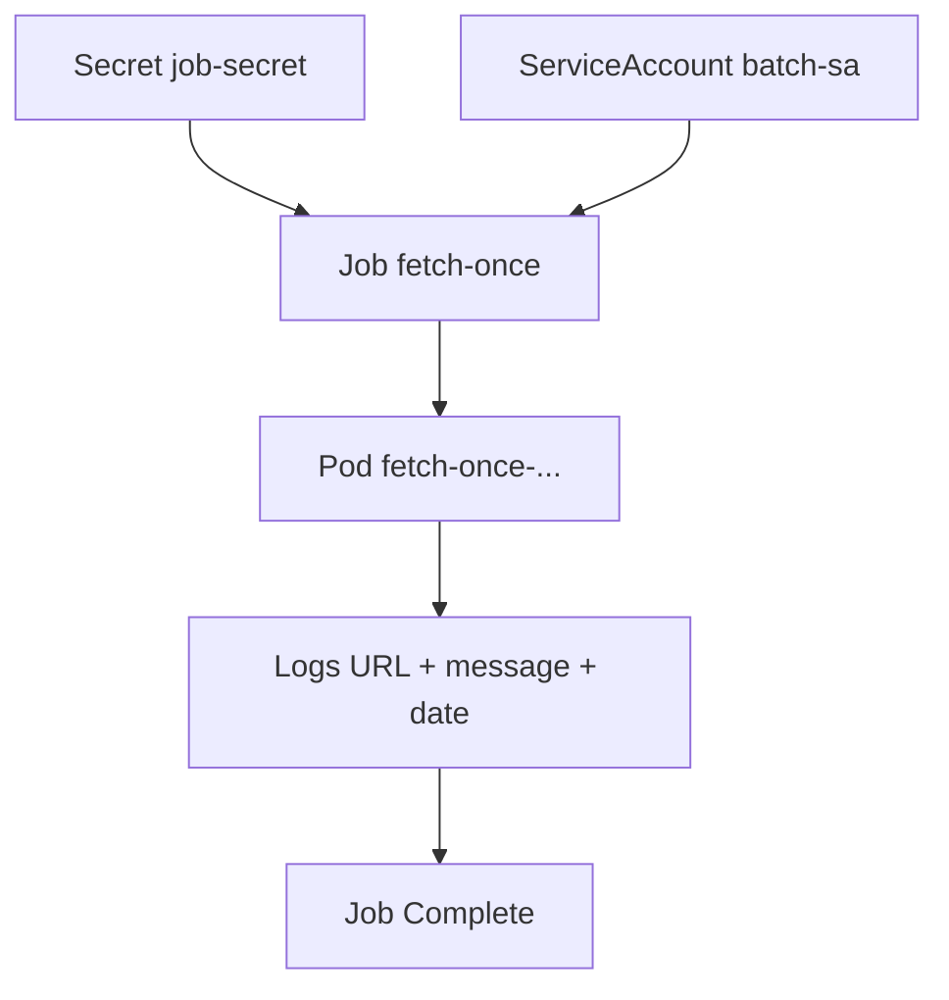
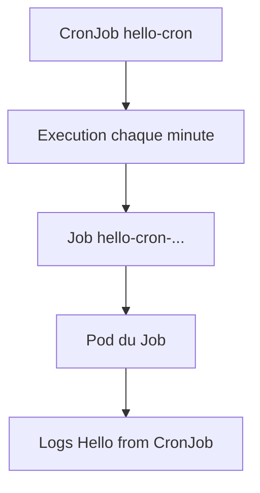

# Lab 16 corrigé — EX280 sur CRC
**Jobs & CronJobs — support complet, corrigé et commenté**

## 1. Objectif du lab

Ce lab sert à pratiquer :

- Job one-shot ;
- suivi d’exécution d’un Job ;
- lecture des pods et des logs ;
- Secret consommé par un Job ;
- ServiceAccount dédiée ;
- CronJob périodique ;
- déclenchement manuel depuis un CronJob ;
- suspension d’un CronJob.

---

## 2. Contexte du lab

Environnement utilisé pendant la séance :

- **Plateforme** : CRC / OpenShift Local
- **Terminal** : Git Bash sous Windows 11
- **Namespace** : `ex280-lab16-zidane`
- **Répertoire de travail** : `certifications/ex280/work/lab16`

Bilan de la séance :

- `Secret` : OK
- `ServiceAccount` : OK
- `Job` `fetch-once` : OK
- logs du Job : OK
- `CronJob` `hello-cron` : OK
- Job manuel `hello-cron-manual` : OK
- exécution périodique réelle du CronJob : OK
- **étape `suspend: true` : non encore exécutée**

---

## 3. Notions et concepts abordés

### 3.1 Secret consommé par un Job

Le lab utilise un secret :

- `job-secret`

avec une clé :

- `TARGET_URL`

Ce secret est injecté dans le Job via :

```yaml
env:
- name: TARGET_URL
  valueFrom:
    secretKeyRef:
      name: job-secret
      key: TARGET_URL
```

Cela permet au conteneur de récupérer une valeur sensible ou paramétrable sans la coder en dur dans le manifest.

### 3.2 ServiceAccount dédiée

Le lab crée une `ServiceAccount` :

- `batch-sa`

Puis elle est utilisée dans :

- le `Job`
- le `CronJob`

Cela permet d’exécuter les workloads batch avec une identité technique dédiée.

### 3.3 Job one-shot

Le `Job` `fetch-once` exécute une tâche unique :

- affiche `TARGET_URL`
- affiche un message
- affiche la date
- se termine avec succès

Le bon critère de validation est :

- `Complete`

### 3.4 Lecture des pods et logs

Un Job crée un pod éphémère.

Dans ce lab, on a utilisé :

```bash
oc get pods -l job-name=fetch-once -o wide
oc logs "$JOB_POD"
oc describe job fetch-once
```

Cela permet de vérifier :

- quel pod a été créé ;
- son état ;
- les logs applicatifs ;
- le statut du Job.

### 3.5 CronJob périodique

Le `CronJob` `hello-cron` a été défini avec :

- `schedule: "*/1 * * * *"`
- `concurrencyPolicy: Forbid`
- `successfulJobsHistoryLimit: 2`
- `failedJobsHistoryLimit: 2`

Il exécute périodiquement une commande simple :

- `echo "Hello from CronJob"`
- `date`
- `echo "cron hello"`

### 3.6 Déclenchement manuel depuis un CronJob

Le lab demande aussi de créer immédiatement un Job à partir du CronJob :

```bash
oc create job --from=cronjob/hello-cron hello-cron-manual
```

C’est utile pour :

- tester sans attendre la prochaine minute ;
- vérifier rapidement que le template du CronJob fonctionne.

### 3.7 Suspension du CronJob

Le support fusionné du lab 16 prévoit une étape finale :

```bash
oc patch cronjob hello-cron -p '{"spec":{"suspend":true}}'
oc get cronjob hello-cron -o jsonpath='{.spec.suspend}{"\n"}'
```

Cette étape **n’a pas encore été exécutée** dans ta séance.

Donc le lab est **très avancé**, mais pas encore complet à 100 % si on suit la version fusionnée.

---

## 4. Schémas Mermaid

### 4.1 Vue d’ensemble du Job



### 4.2 Vue d’ensemble du CronJob



### 4.3 Déclenchement manuel


### 4.4 Suspension


---

## 5. Déroulé corrigé du lab

## 5.1 Préparation du namespace

```bash
export KUBECONFIG="$HOME/.kube/crc-kubeconfig"
export LAB=16
export NS=ex280-lab${LAB}-zidane
oc get project "$NS" || oc new-project "$NS"
oc project "$NS"
```

### Résultat observé
- namespace `ex280-lab16-zidane` créé ;
- contexte projet correctement positionné.

## 5.2 Création du Secret et de la ServiceAccount

```bash
oc create secret generic job-secret --from-literal=TARGET_URL=https://example.org
oc create serviceaccount batch-sa
```

### Résultat observé
- `secret/job-secret created`
- `serviceaccount/batch-sa created`

### Conclusion
Étape validée.

## 5.3 Création du Job `fetch-once`

Le manifeste collé a été partiellement bruité visuellement dans le terminal, mais le Job a bien été créé :

```bash
cat <<'YAML' | oc apply -f -
apiVersion: batch/v1
kind: Job
metadata:
  name: fetch-once
spec:
  backoffLimit: 1
  template:
    spec:
      serviceAccountName: batch-sa
      restartPolicy: Never
      containers:
      - name: fetch
        image: registry.access.redhat.com/ubi9/ubi-minimal
        command: ["/bin/sh","-c"]
        args:
          - |
            echo "URL=$TARGET_URL"
            echo "Hello from Job"
            date
            echo "Done"
        env:
        - name: TARGET_URL
          valueFrom:
            secretKeyRef:
              name: job-secret
              key: TARGET_URL
YAML
```

Puis :

```bash
oc get job fetch-once
oc wait --for=condition=complete job/fetch-once --timeout=120s
oc get jobs
```

### Résultat observé
- `job.batch/fetch-once created`
- Job passé de `Running` à `Complete`

### Conclusion
Le Job est validé.

## 5.4 Lecture du pod et des logs du Job

```bash
oc get pods -l job-name=fetch-once -o wide
JOB_POD=$(oc get pods -l job-name=fetch-once -o jsonpath='{.items[0].metadata.name}')
echo "$JOB_POD"
oc logs "$JOB_POD"
oc describe job fetch-once | sed -n '1,220p'
```

### Résultat observé
Le pod du Job :

- `fetch-once-vfs2j`
- `STATUS=Completed`

Les logs :

```text
URL=https://example.org
Hello from Job
Mon Apr 13 14:11:07 UTC 2026
Done
```

Le `describe job` montre bien :

- `Service Account: batch-sa`
- `1 Succeeded`
- `Job completed`

### Conclusion
La partie Job + Secret + ServiceAccount est validée proprement.

## 5.5 Création du CronJob

Le manifest CronJob collé a été très bruité visuellement dans le terminal, mais la ressource a bien été créée.

Intention correcte :

```bash
cat <<'YAML' | oc apply -f -
apiVersion: batch/v1
kind: CronJob
metadata:
  name: hello-cron
spec:
  schedule: "*/1 * * * *"
  concurrencyPolicy: Forbid
  successfulJobsHistoryLimit: 2
  failedJobsHistoryLimit: 2
  jobTemplate:
    spec:
      template:
        spec:
          serviceAccountName: batch-sa
          restartPolicy: Never
          containers:
          - name: hello
            image: registry.access.redhat.com/ubi9/ubi-minimal
            command: ["/bin/sh","-c"]
            args:
              - |
                echo "Hello from CronJob"
                date
                echo "cron hello"
YAML
```

Puis :

```bash
oc get cronjob hello-cron -o wide
oc describe cronjob hello-cron | sed -n '1,220p'
```

### Résultat observé
- `cronjob.batch/hello-cron created`
- schedule :
  - `*/1 * * * *`
- `Suspend: False`
- `Service Account: batch-sa`

### Conclusion
Le CronJob est créé correctement.

## 5.6 Déclenchement manuel depuis le CronJob

```bash
oc create job --from=cronjob/hello-cron hello-cron-manual
oc wait --for=condition=complete job/hello-cron-manual --timeout=120s
oc get jobs
oc get pods -l job-name=hello-cron-manual -o wide
MANUAL_POD=$(oc get pods -l job-name=hello-cron-manual -o jsonpath='{.items[0].metadata.name}')
echo "$MANUAL_POD"
oc logs "$MANUAL_POD"
```

### Résultat observé
- `job.batch/hello-cron-manual created`
- `job.batch/hello-cron-manual condition met`
- Job manuel en `Complete`

Logs du pod manuel :

```text
Hello from CronJob
Mon Apr 13 14:13:58 UTC 2026
cron hello
```

### Conclusion
Le déclenchement manuel est validé.

## 5.7 Exécution réelle du CronJob

Dans `oc get jobs`, on observe aussi :

- `hello-cron-29601494   Running`

Et dans le YAML du CronJob :

- `status.lastScheduleTime`
- `status.lastSuccessfulTime`

### Conclusion
Le CronJob ne se contente pas d’exister :
- il a réellement commencé à produire des Jobs planifiés.

## 5.8 Vérification YAML du CronJob

```bash
oc get cronjob hello-cron -o yaml | sed -n '1,220p'
```

### Éléments importants observés
- `schedule: '*/1 * * * *'`
- `concurrencyPolicy: Forbid`
- `serviceAccountName: batch-sa`
- `suspend: false`
- `lastScheduleTime` présent
- `lastSuccessfulTime` présent

### Interprétation
Le CronJob fonctionne correctement.

## 5.9 Étape manquante : suspension

Selon la version fusionnée du lab, il reste à exécuter :

```bash
oc patch cronjob hello-cron -p '{"spec":{"suspend":true}}'
oc get cronjob hello-cron -o jsonpath='{.spec.suspend}{"\n"}'
```

### État actuel
Cette étape n’a pas encore été lancée.

### Conséquence
Le lab est **quasi complet**, mais il manque cette dernière preuve si tu veux coller exactement au support fusionné.

---

## 6. Commandes finales recommandées

Pour terminer le lab 16 à 100 % :

```bash
export KUBECONFIG="$HOME/.kube/crc-kubeconfig"
export NS=ex280-lab16-zidane
oc patch cronjob hello-cron -p '{"spec":{"suspend":true}}'
oc get cronjob hello-cron -o jsonpath='{.spec.suspend}{"\n"}'
```

### Résultat attendu
```text
true
```

---

## 7. Points à retenir pour EX280

1. Un `Job` est un workload batch one-shot.
2. Un `CronJob` produit des `Jobs` selon une planification.
3. Les labels `job-name=...` sont très utiles pour retrouver les pods.
4. Un `Secret` peut être consommé proprement via `env.valueFrom.secretKeyRef`.
5. Une `ServiceAccount` dédiée renforce la lisibilité et le contrôle des workloads batch.
6. `oc create job --from=cronjob/...` permet de tester immédiatement un CronJob.
7. `suspend: true` est la bonne façon d’arrêter temporairement les futures exécutions planifiées.

---

## 8. Journal des commandes réellement exécutées pendant le lab

```bash
export KUBECONFIG="$HOME/.kube/crc-kubeconfig"

export LAB=16
export NS=ex280-lab${LAB}-zidane
oc get project "$NS" || oc new-project "$NS"
oc project "$NS"

cd ..
mkdir lab16
cd lab16

oc create secret generic job-secret --from-literal=TARGET_URL=https://example.org
oc create serviceaccount batch-sa

cat <<'YAML' | oc apply -f -
apiVersion: batch/v1
kind: Job
metadata:
  name: fetch-once
spec:
  backoffLimit: 1
  template:
    spec:
      serviceAccountName: batch-sa
      restartPolicy: Never
      containers:
      - name: fetch
        image: registry.access.redhat.com/ubi9/ubi-minimal
        command: ["/bin/sh","-c"]
        args:
          - |
            echo "URL=$TARGET_URL"
            echo "Hello from Job"
            date
            echo "Done"
        env:
        - name: TARGET_URL
          valueFrom:
            secretKeyRef:
              name: job-secret
              key: TARGET_URL
YAML

oc get job fetch-once
oc wait --for=condition=complete job/fetch-once --timeout=120s
oc get jobs

oc get pods -l job-name=fetch-once -o wide
JOB_POD=$(oc get pods -l job-name=fetch-once -o jsonpath='{.items[0].metadata.name}')
echo "$JOB_POD"
oc logs "$JOB_POD"
oc describe job fetch-once | sed -n '1,220p'

cat <<'YAML' | oc apply -f -
apiVersion: batch/v1
kind: CronJob
metadata:
  name: hello-cron
spec:
  schedule: "*/1 * * * *"
  concurrencyPolicy: Forbid
  successfulJobsHistoryLimit: 2
  failedJobsHistoryLimit: 2
  jobTemplate:
    spec:
      template:
        spec:
          serviceAccountName: batch-sa
          restartPolicy: Never
          containers:
          - name: hello
            image: registry.access.redhat.com/ubi9/ubi-minimal
            command: ["/bin/sh","-c"]
            args:
              - |
                echo "Hello from CronJob"
                date
                echo "cron hello"
YAML

oc get cronjob hello-cron -o wide
oc describe cronjob hello-cron | sed -n '1,220p'

oc create job --from=cronjob/hello-cron hello-cron-manual
oc wait --for=condition=complete job/hello-cron-manual --timeout=120s
oc get jobs
oc get pods -l job-name=hello-cron-manual -o wide
MANUAL_POD=$(oc get pods -l job-name=hello-cron-manual -o jsonpath='{.items[0].metadata.name}')
echo "$MANUAL_POD"
oc logs "$MANUAL_POD"

oc get cronjob hello-cron -o yaml | sed -n '1,220p'
```

---

## 9. Résumé très court

Dans ce lab, on a appris à :

1. créer un `Secret` et une `ServiceAccount` ;
2. exécuter un `Job` one-shot ;
3. lire les logs et le `describe` du Job ;
4. créer un `CronJob` ;
5. lancer un Job manuel depuis le CronJob ;
6. observer une exécution planifiée réelle ;
7. il reste seulement à appliquer `suspend: true` pour terminer le lab à 100 %.
