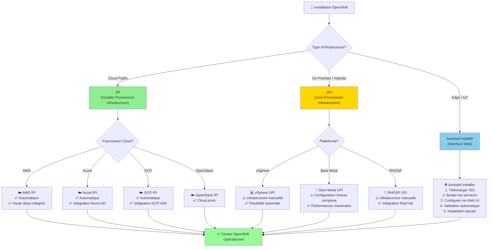
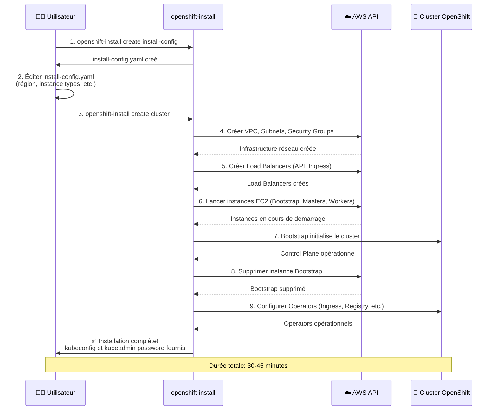

# Installation d'OpenShift

## Objectif

Cette section a pour but de vous guider à travers les différentes méthodes d'installation de Red Hat OpenShift Container Platform (OCP). Elle couvre les concepts clés, les prérequis et les liens vers la documentation officielle pour chaque type d'installation.

## Concepts

L'installation d'OpenShift peut être réalisée de deux manières principales :

- **Installer-Provisioned Infrastructure (IPI)** : L'installateur OpenShift provisionne et gère l'infrastructure sous-jacente (machines virtuelles, réseaux, etc.). C'est la méthode la plus simple et la plus automatisée, mais elle est limitée à certains fournisseurs de cloud (AWS, Azure, GCP, etc.).
- **User-Provisioned Infrastructure (UPI)** : Vous êtes responsable de la création et de la gestion de l'infrastructure. L'installateur OpenShift déploie ensuite le cluster sur cette infrastructure existante. Cette méthode offre plus de flexibilité et est utilisée pour les déploiements sur des infrastructures sur site (bare metal, vSphere, etc.).

### Diagramme : Méthodes d'Installation OpenShift



### Diagramme : Flux d'Installation IPI (AWS)



## Où chercher dans la documentation officielle

La documentation d'installation est l'une des plus importantes. Voici les points d'entrée principaux :

- **Page principale de l'installation** : [https://docs.openshift.com/container-platform/latest/installing/index.html](https://docs.openshift.com/container-platform/latest/installing/index.html)
- **Installation sur AWS (IPI)** : [https://docs.openshift.com/container-platform/latest/installing/installing_aws/installing-aws-default.html](https://docs.openshift.com/container-platform/latest/installing/installing_aws/installing-aws-default.html)
- **Installation sur vSphere (UPI)** : [https://docs.openshift.com/container-platform/latest/installing/installing_vsphere/installing-vsphere.html](https://docs.openshift.com/container-platform/latest/installing/installing_vsphere/installing-vsphere.html)
- **Installation sur Bare Metal (UPI)** : [https://docs.openshift.com/container-platform/latest/installing/installing_bare_metal/installing-bare-metal.html](https://docs.openshift.com/container-platform/latest/installing/installing_bare_metal/installing-bare-metal.html)

## Commandes clés

L'installation d'OpenShift est principalement pilotée par l'outil `openshift-install`.

```bash
# Créer un fichier de configuration pour l'installation
openshift-install create install-config

# Créer les manifestes Kubernetes pour la personnalisation
openshift-install create manifests

# Lancer la création du cluster
openshift-install create cluster

# Détruire un cluster
openshift-install destroy cluster
```

## À retenir / Pièges fréquents

- **DNS** : La configuration DNS est l'un des points les plus critiques et les plus sujets aux erreurs lors de l'installation. Assurez-vous que les enregistrements DNS requis sont correctement configurés avant de lancer l'installation.
- **Prérequis** : Chaque type d'installation a des prérequis spécifiques en termes de ressources (CPU, RAM, stockage), de réseau et de permissions. Lisez attentivement la documentation avant de commencer.
- **Fichier `install-config.yaml`** : Ce fichier est le cœur de votre configuration d'installation. Sauvegardez-le précieusement, car il est nécessaire pour ajouter des nœuds au cluster ou pour le détruire.
