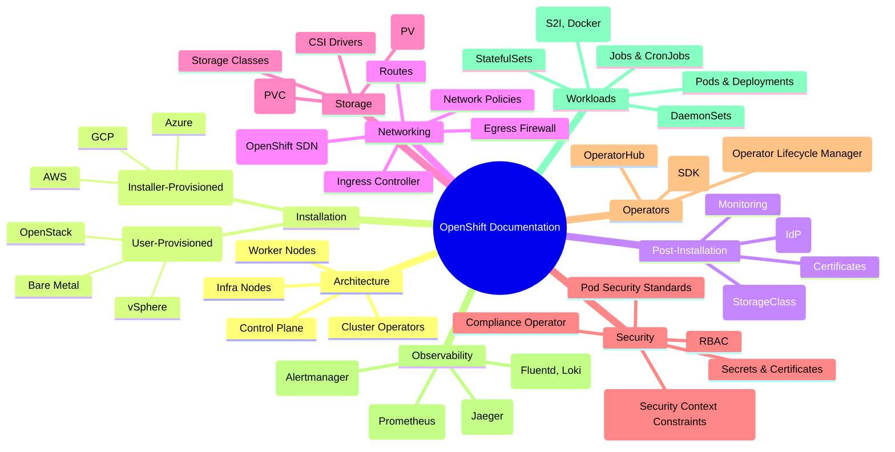

# Mindmap de la Documentation OpenShift

## Objectif

Cette page présente une vue d\"ensemble visuelle de la documentation OpenShift sous forme de mindmap. Elle vous aide à comprendre la structure globale et les relations entre les différents chapitres.

## Concepts

La mindmap ci-dessous est générée avec Mermaid. Elle représente les principaux domaines de la documentation OpenShift et leurs sous-sections.

## Mindmap

## Où chercher dans la documentation officielle

Cette mindmap est une représentation de la structure que vous trouverez sur le portail de la documentation Red Hat.

- **Portail de la documentation** : [https://docs.openshift.com/container-platform/latest/welcome/index.html](https://docs.openshift.com/container-platform/latest/welcome/index.html)

## Commandes clés

Il n\"y a pas de commandes spécifiques pour cette section, car elle est purement conceptuelle. Les commandes pertinentes se trouvent dans chaque chapitre fonctionnel.

## À retenir / Pièges fréquents

- **Ceci est une simplification** : La documentation officielle est beaucoup plus détaillée. Cette mindmap est un guide pour vous orienter, pas un substitut.
- **La structure peut évoluer** : Red Hat met à jour sa documentation à chaque version. La structure générale reste similaire, mais des détails peuvent changer.
