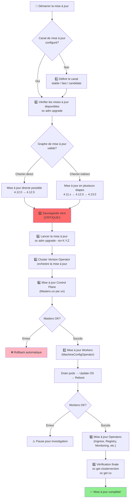
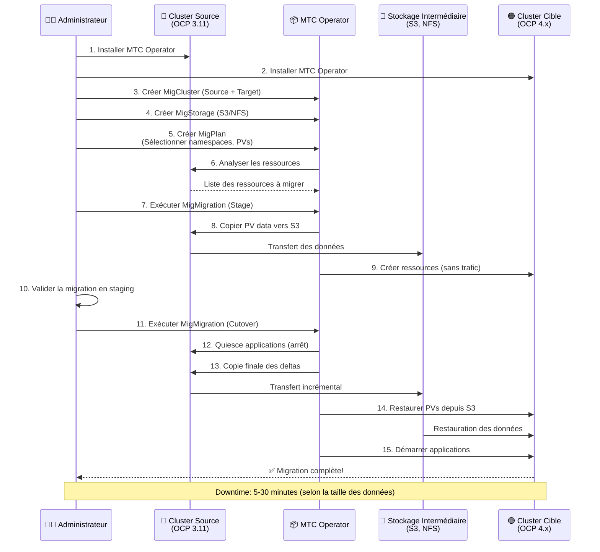

# Mise à jour & Migration

## Objectif

Cette section explique comment mettre à jour un cluster OpenShift vers une nouvelle version et comment migrer des applications et des données entre clusters. Elle couvre les concepts de canaux de mise à jour, de graphes de mise à jour et les stratégies de migration.

## Concepts

### Mise à jour du cluster

La mise à jour d'un cluster OpenShift est un processus géré par le **Cluster Version Operator (CVO)**. Le CVO surveille les opérateurs du cluster et s'assure qu'ils sont à la bonne version.

- **Canaux de mise à jour (Update Channels)** : Ils vous permettent de choisir la cadence à laquelle vous recevez les mises à jour. Les canaux courants sont `stable`, `fast` et `candidate`.
- **Graphe de mise à jour (Update Graph)** : Il définit les chemins de mise à jour valides entre les versions d'OpenShift. Vous ne pouvez pas sauter des versions mineures lors de la mise à jour.

### Migration

La migration fait référence au déplacement d'applications, de données et de configurations d'un cluster OpenShift à un autre. Cela peut être nécessaire pour des raisons de mise à niveau matérielle, de changement de fournisseur de cloud ou de reprise après sinistre.

- **Migration Toolkit for Containers (MTC)** : Un outil qui aide à migrer les applications stateful et stateless entre les clusters OpenShift.

### Diagramme : Processus de Mise à Jour du Cluster



### Diagramme : Migration avec MTC (Migration Toolkit for Containers)



## Où chercher dans la documentation officielle

- **Mise à jour d'un cluster** : [https://docs.openshift.com/container-platform/latest/updating/understanding-openshift-updates.html](https://docs.openshift.com/container-platform/latest/updating/understanding-openshift-updates.html)
- **Migration de clusters** : [https://docs.openshift.com/container-platform/latest/migration/migrating_from_ocp3_to_4/about-migration.html](https://docs.openshift.com/container-platform/latest/migration/migrating_from_ocp3_to_4/about-migration.html)

## Commandes clés

```bash
# Voir les mises à jour disponibles
oc adm upgrade

# Lancer une mise à jour vers une version spécifique
oc adm upgrade --to=<version>

# Voir l'état de la mise à jour
oc get clusterversion

# Voir l'historique des mises à jour
oc adm upgrade history
```

## À retenir / Pièges fréquents

- **Lisez les notes de version** : Avant de lancer une mise à jour, lisez attentivement les notes de version pour connaître les changements, les dépréciations et les problèmes connus.
- **Sauvegardez votre cluster** : Avant toute mise à jour majeure, effectuez une sauvegarde complète de votre cluster, y compris etcd.
- **Testez la mise à jour** : Si possible, testez le processus de mise à jour sur un environnement de non-production avant de le faire en production.
- **Planifiez la migration** : La migration d'applications, en particulier les applications stateful, nécessite une planification minutieuse. Testez votre plan de migration avant de l'exécuter en production.
