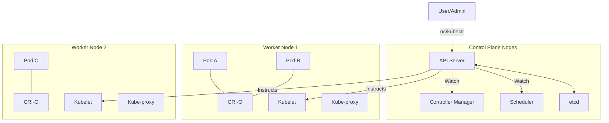
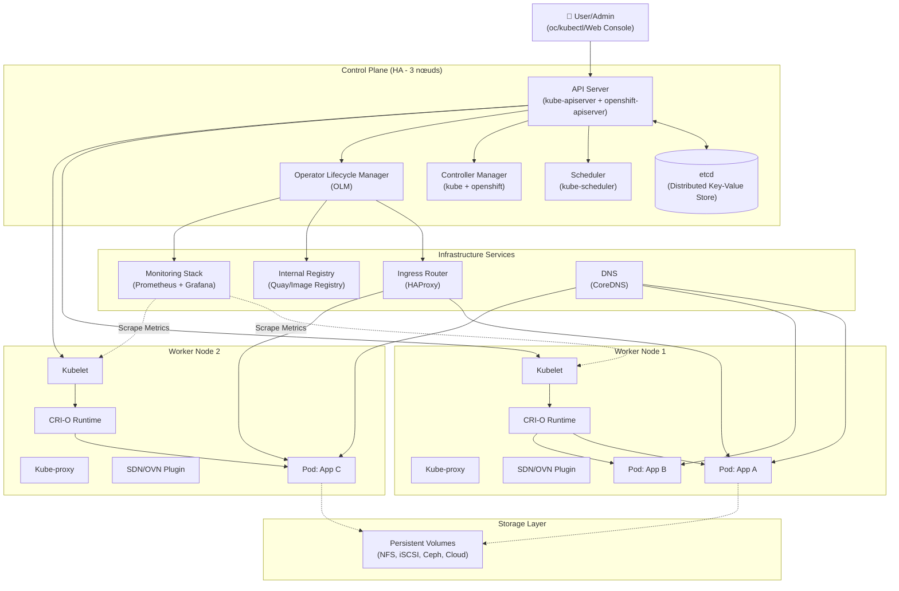

# Architecture Core d'OpenShift

## Objectif

Cette section approfondit l\'architecture d\'OpenShift en décrivant les composants clés du control plane et des nœuds worker, ainsi que leurs interactions. Comprendre cette architecture est fondamental pour l\'administration, le dépannage et l\'optimisation d\'un cluster.

## Concepts

L\'architecture d\'OpenShift repose sur Kubernetes et y ajoute des dizaines de composants pour offrir une plateforme de conteneurs complète.

### Control Plane

Le control plane est le cerveau du cluster. Il est généralement réparti sur 3 nœuds maîtres pour la haute disponibilité.

| Composant | Description |
|---|---|
| **API Server (kube-apiserver)** | Point d\'entrée central pour toutes les opérations de gestion du cluster. Valide et traite les requêtes REST. |
| **etcd** | Base de données clé-valeur distribuée qui stocke l\'état complet du cluster. Source de vérité unique. |
| **Scheduler (kube-scheduler)** | Assigne les nouveaux pods aux nœuds worker en fonction des ressources disponibles et des contraintes. |
| **Controller Manager (kube-controller-manager)** | Exécute les contrôleurs qui régulent l\'état du cluster (par ex., contrôleur de réplication, contrôleur de nœud). |
| **OpenShift API Server** | Fournit les API spécifiques à OpenShift (par ex., pour les `Routes`, `Projects`, `Builds`). |
| **OpenShift Controller Manager** | Exécute les contrôleurs spécifiques à OpenShift (par ex., contrôleur de projet, contrôleur de route). |

### Nœuds Worker

Les nœuds worker exécutent les charges de travail des applications.

| Composant | Description |
|---|---|
| **Kubelet** | Agent qui s\'exécute sur chaque nœud. S\'assure que les conteneurs décrits dans les PodSpecs sont en cours d\'exécution et en bonne santé. |
| **Container Runtime (CRI-O)** | Moteur d\'exécution de conteneurs qui gère le cycle de vie des conteneurs (tirer les images, démarrer/arrêter les conteneurs). OpenShift utilise CRI-O. |
| **Kube-proxy** | Gère la communication réseau à l\'intérieur et à l\'extérieur du cluster. Maintient les règles réseau sur les nœuds. |

### Diagramme d\'Architecture Simplifié



### Diagramme d'Architecture Complète avec Opérateurs



## Où chercher dans la documentation officielle

- **Architecture du Control Plane** : [https://docs.openshift.com/container-platform/latest/architecture/control-plane.html](https://docs.openshift.com/container-platform/latest/architecture/control-plane.html)
- **Architecture des nœuds Worker** : [https://docs.openshift.com/container-platform/latest/architecture/worker-nodes.html](https://docs.openshift.com/container-platform/latest/architecture/worker-nodes.html)
- **Composants du cluster** : [https://docs.openshift.com/container-platform/latest/architecture/understanding-the-architecture.html](https://docs.openshift.com/container-platform/latest/architecture/understanding-the-architecture.html)

## Commandes clés

```bash
# Lister les pods des composants du control plane
oc get pods -n openshift-kube-apiserver
oc get pods -n openshift-etcd
oc get pods -n openshift-kube-scheduler
oc get pods -n openshift-kube-controller-manager

# Afficher les logs d\'un composant du control plane
oc logs <pod-name> -n openshift-kube-apiserver

# Inspecter la configuration du kubelet sur un nœud
oc get node <node-name> -o json | jq .spec
```

## À retenir / Pièges fréquents

- **etcd est critique** : Une perte du quorum etcd signifie la perte du cluster. La sauvegarde d\'etcd est la tâche de maintenance la plus importante.
- **Le Kubelet est roi sur son nœud** : Le Kubelet est l\'agent principal qui gère tout sur un nœud worker. Si le Kubelet est en panne, le nœud est considéré comme `NotReady`.
- **CRI-O vs Docker** : OpenShift n\'utilise plus Docker comme moteur de conteneurs. Il utilise CRI-O, une implémentation légère de l\'interface CRI (Container Runtime Interface) de Kubernetes.
