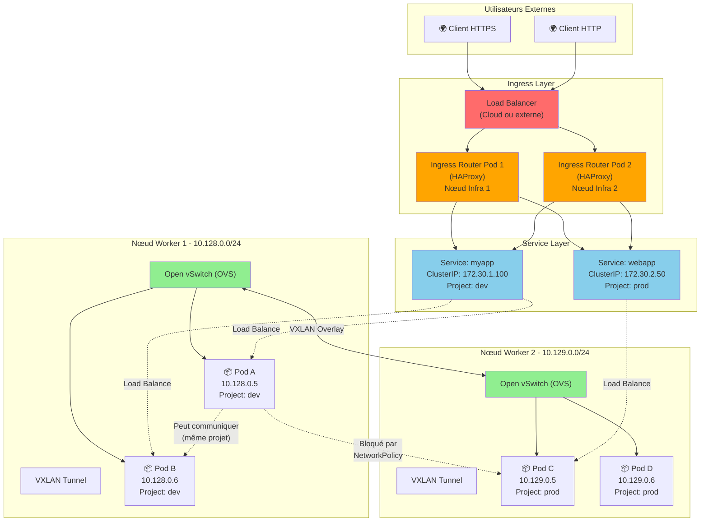
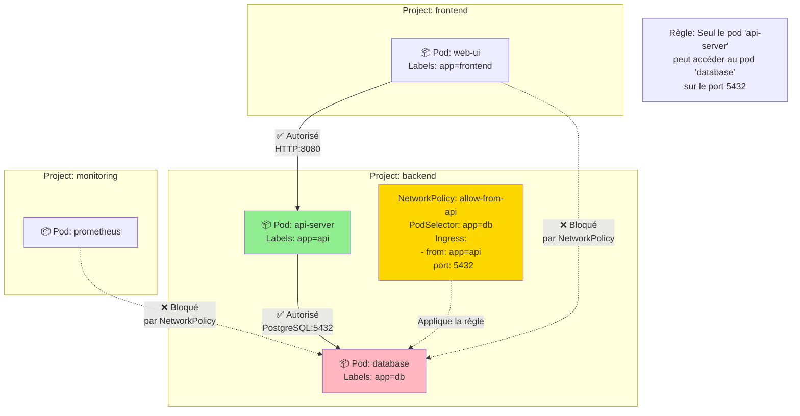

# Networking

## Objectif

Cette section couvre les concepts fondamentaux du réseau dans OpenShift. Elle explique comment les pods communiquent entre eux et avec le monde extérieur, et comment sécuriser ces communications.

## Concepts

### Software-Defined Networking (SDN)

OpenShift utilise un SDN pour créer un réseau virtuel pour les pods et les services. Le SDN par défaut est **OpenShift SDN**, qui est basé sur Open vSwitch (OVS). Il offre trois modes :

- **`network-policy` (par défaut)** : Mode le plus sécurisé. Il active les `NetworkPolicy` pour isoler les projets.
- **`multitenant`** : Isole complètement les projets les uns des autres.
- **`subnet`** : Mode le plus simple où tous les pods peuvent communiquer entre eux à travers tous les projets.

### Communication Pod-à-Pod

Chaque pod a sa propre adresse IP unique au sein du cluster. Le SDN garantit que les pods peuvent communiquer directement entre eux, même s'ils sont sur des nœuds différents.

### Services

Les services fournissent un point d'accès stable pour un groupe de pods. `kube-proxy` sur chaque nœud programme les règles réseau (iptables ou IPVS) pour router le trafic destiné à l'IP d'un service vers l'un des pods correspondants.

### Ingress Controller & Routes

L'**Ingress Controller** est un routeur qui gère tout le trafic externe entrant dans le cluster. Il est généralement déployé sur les nœuds d'infrastructure. Il lit les objets `Route` et configure le routage en conséquence.

### Network Policies

Les **Network Policies** sont des règles de pare-feu pour les pods. Elles permettent de définir de manière granulaire quels pods peuvent communiquer avec quels autres pods. Par défaut, dans un projet, tous les pods peuvent communiquer entre eux, mais les `NetworkPolicy` peuvent restreindre ce comportement.

### Diagramme : Architecture Réseau OpenShift SDN



### Diagramme : Exemple de NetworkPolicy



## Où chercher dans la documentation officielle

- **Vue d'ensemble du réseau** : [https://docs.openshift.com/container-platform/latest/networking/understanding-networking.html](https://docs.openshift.com/container-platform/latest/networking/understanding-networking.html)
- **OpenShift SDN** : [https://docs.openshift.com/container-platform/latest/networking/openshift_sdn/about-openshift-sdn.html](https://docs.openshift.com/container-platform/latest/networking/openshift_sdn/about-openshift-sdn.html)
- **Network Policies** : [https://docs.openshift.com/container-platform/latest/networking/network_policy/about-network-policy.html](https://docs.openshift.com/container-platform/latest/networking/network_policy/about-network-policy.html)

## Commandes clés

```bash
# Voir la configuration réseau du cluster
oc get network.config.openshift.io cluster -o yaml

# Lister les NetworkPolicies dans le projet courant
oc get networkpolicy

# Créer une NetworkPolicy à partir d'un fichier YAML
oc create -f my-network-policy.yaml

# Lister les pods et leurs adresses IP
oc get pods -o wide

# Lister les services et leurs adresses IP de cluster
oc get services
```

## À retenir / Pièges fréquents

- **Le mode SDN est immuable** : Le mode de l'OpenShift SDN est défini à l'installation et ne peut pas être changé par la suite.
- **La politique par défaut est `allow-all`** : Au sein d'un projet, si aucune `NetworkPolicy` n'est appliquée, tous les pods peuvent communiquer entre eux. La première `NetworkPolicy` appliquée à un pod change ce comportement en `deny-all` (sauf ce qui est explicitement autorisé).
- **Isolation des projets** : L'isolation entre les projets est une fonctionnalité clé du SDN d'OpenShift. Comprenez comment votre mode SDN gère cette isolation.
- **DNS du cluster** : OpenShift dispose d'un DNS interne qui permet aux pods de se trouver en utilisant les noms des services. Par exemple, un pod peut atteindre un service nommé `database` dans le même projet en utilisant simplement l'adresse `database`.
