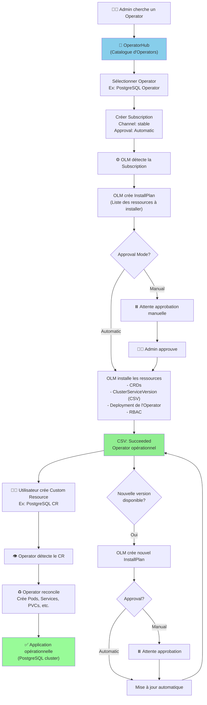
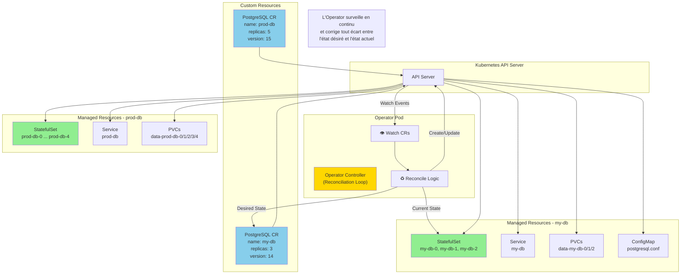

# Operators & OLM

## Objectif

Cette section présente le concept d'Operators et comment l'Operator Lifecycle Manager (OLM) simplifie le déploiement et la gestion des applications complexes sur OpenShift.

## Concepts

### Operators

Un **Operator** est une méthode de packaging, de déploiement et de gestion d'une application Kubernetes. C'est un contrôleur spécifique à une application qui étend l'API Kubernetes pour créer, configurer et gérer des instances d'applications complexes pour le compte d'un utilisateur.

Un Operator encode la connaissance opérationnelle humaine d'un service dans un logiciel. Par exemple, un Operator de base de données pourrait automatiser des tâches comme la sauvegarde, la restauration, le redimensionnement et la mise à jour de la base de données.

### Operator Lifecycle Manager (OLM)

L'**OLM** est un composant d'OpenShift qui gère le cycle de vie des Operators dans un cluster. Il s'occupe de l'installation, de la mise à jour et de la gestion des dépendances des Operators.

| Objet OLM | Description |
|---|---|
| **OperatorHub** | Une collection d'Operators prêts à être installés, disponible directement dans la console web d'OpenShift. |
| **Subscription** | Un objet qui exprime l'intention d'installer un Operator. Il spécifie le canal de mise à jour et la politique d'approbation. |
| **InstallPlan** | Créé par l'OLM en réponse à une `Subscription`. Il décrit l'ensemble des ressources qui doivent être créées pour installer ou mettre à jour un Operator. |
| **ClusterServiceVersion (CSV)** | Représente une version spécifique d'un Operator. Il contient les métadonnées (icône, description) et les définitions techniques (CRD, déploiements, RBAC) nécessaires pour exécuter l'Operator. |

### Custom Resource Definitions (CRD)

Les Operators fonctionnent en définissant leurs propres types d'objets via des **Custom Resource Definitions (CRD)**. Par exemple, l'Operator Prometheus définit une CRD `Prometheus` qui permet de créer une instance de Prometheus en créant simplement un objet `Prometheus`.

### Diagramme : Cycle de Vie d'un Operator avec OLM



### Diagramme : Architecture Operator Pattern



## Où chercher dans la documentation officielle

- **Comprendre les Operators** : [https://docs.openshift.com/container-platform/latest/operators/understanding/operators-understanding.html](https://docs.openshift.com/container-platform/latest/operators/understanding/operators-understanding.html)
- **Gestion des Operators avec OLM** : [https://docs.openshift.com/container-platform/latest/operators/olm-managing-operators.html](https://docs.openshift.com/container-platform/latest/operators/olm-managing-operators.html)

## Commandes clés

```bash
# Lister les Operators disponibles dans OperatorHub
oc get packagemanifests -n openshift-marketplace

# Lister les Operators installés dans un projet
oc get subscriptions

# Lister les ClusterServiceVersions (versions d'Operators installées)
oc get clusterserviceversions
oc get csv

# Approuver un plan d'installation manuel
oc patch installplan <installplan-name> --type merge --patch '{"spec":{"approved":true}}'

# Créer une ressource personnalisée (CR) pour déployer une application
# (Exemple pour l'Operator etcd)
oc create -f etcd-cluster.yaml
```

## À retenir / Pièges fréquents

- **Les Operators simplifient la complexité** : Le but principal des Operators est de rendre les applications complexes aussi faciles à gérer que les services cloud natifs.
- **OperatorHub est votre ami** : Avant de déployer manuellement une application complexe (par ex., une base de données, une file de messages), vérifiez si un Operator existe dans OperatorHub.
- **Canaux de mise à jour** : Faites attention au canal de mise à jour que vous choisissez dans votre `Subscription`. Il détermine la rapidité avec laquelle vous recevrez les nouvelles versions de l'Operator.
- **Dépendances** : L'OLM gère les dépendances entre les Operators. Si l'Operator A dépend de l'Operator B, l'OLM s'assurera que l'Operator B est installé et à la bonne version.
