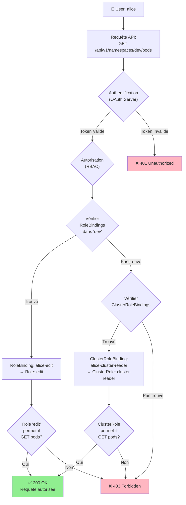
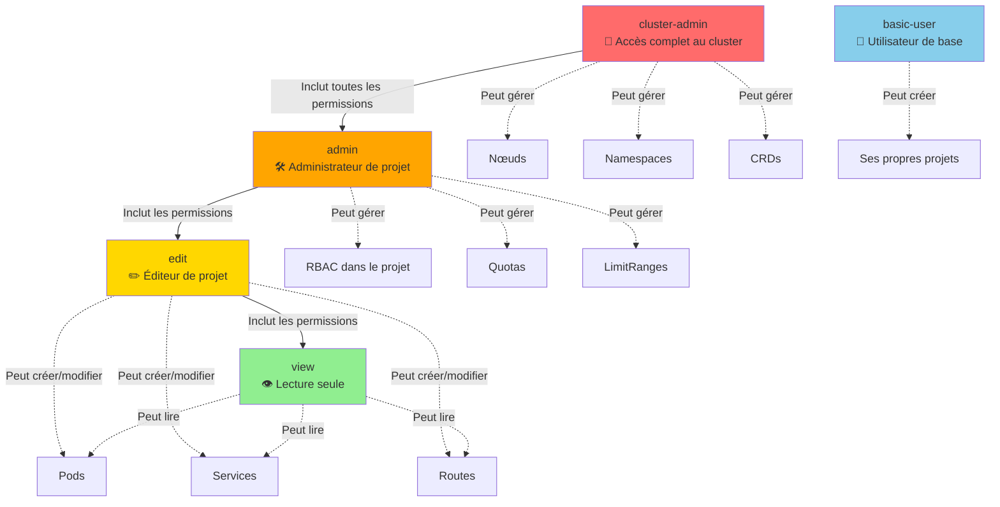

# Projets & RBAC

## Objectif

Cette section explique comment OpenShift gère le multi-tenancy à l\'aide des Projets et comment le contrôle d\'accès basé sur les rôles (RBAC) est utilisé pour sécuriser l\'accès aux ressources du cluster.

## Concepts

### Projets (Projects)

Un **Projet** est un espace de noms Kubernetes (`Namespace`) avec des annotations supplémentaires. C\'est l\'unité de base de l\'isolation des ressources dans OpenShift. Chaque projet a son propre ensemble de politiques, de contraintes et de comptes de service.

- **Isolation** : Les ressources d\'un projet sont isolées des autres projets.
- **Quotas** : Des quotas de ressources (CPU, mémoire, stockage) peuvent être appliqués à chaque projet.
- **Réseau** : Par défaut, les pods d\'un projet ne peuvent pas communiquer avec les pods d\'autres projets (via `NetworkPolicy`).

### Contrôle d\'accès basé sur les rôles (RBAC)

RBAC est le mécanisme standard de Kubernetes pour contrôler l\'accès à l\'API. OpenShift étend ce modèle avec des rôles et des bindings supplémentaires.

| Objet RBAC | Description |
|---|---|
| **Role** | Un ensemble de permissions (verbes : `get`, `list`, `create`, etc.) sur des ressources (`pods`, `services`, etc.) au sein d\'un projet (namespaced). |
| **ClusterRole** | Un ensemble de permissions sur des ressources à l\'échelle du cluster (non-namespaced, comme `nodes`) ou sur des ressources dans tous les projets. |
| **RoleBinding** | Lie un `Role` à un ou plusieurs sujets (utilisateurs, groupes, comptes de service) au sein d\'un projet. |
| **ClusterRoleBinding** | Lie un `ClusterRole` à un ou plusieurs sujets à l\'échelle du cluster. |

OpenShift fournit plusieurs `ClusterRole` par défaut :

- `cluster-admin` : Super-utilisateur, accès complet à tout le cluster.
- `admin` : Administrateur d\'un projet.
- `edit` : Peut modifier la plupart des objets dans un projet, mais ne peut pas gérer les rôles et les bindings.
- `view` : Accès en lecture seule à un projet.

### Diagramme RBAC : Flux d'Autorisation



### Diagramme : Hiérarchie des Rôles par Défaut



## Où chercher dans la documentation officielle

- **Gestion des projets** : [https://docs.openshift.com/container-platform/latest/applications/projects/working-with-projects.html](https://docs.openshift.com/container-platform/latest/applications/projects/working-with-projects.html)
- **Utilisation de RBAC** : [https://docs.openshift.com/container-platform/latest/authentication/using-rbac.html](https://docs.openshift.com/container-platform/latest/authentication/using-rbac.html)

## Commandes clés

```bash
# Créer un nouveau projet
oc new-project my-project

# Lister les projets
oc get projects

# Changer de projet courant
oc project my-project

# Ajouter le rôle \'admin\' à l\'utilisateur \'alice\' sur le projet courant
oc adm policy add-role-to-user admin alice

# Ajouter le rôle \'view\' au groupe \'developers\' sur le projet \'test-project\'
oc adm policy add-role-to-group view developers -n test-project

# Vérifier si un utilisateur peut effectuer une action
oc adm policy can-i <verb> <resource> -n <project>
# Exemple : oc adm policy can-i create pods -n my-project

# Décrire un rôle pour voir ses permissions
oc describe clusterrole admin
```

## À retenir / Pièges fréquents

- **`oc new-project` vs `oc new-app`** : `oc new-project` crée un nouveau projet et y bascule. `oc new-app` crée des applications au sein du projet courant.
- **Privilège minimum** : Appliquez toujours le principe du moindre privilège. N\'accordez que les permissions strictement nécessaires. Évitez d\'utiliser `cluster-admin` pour les tâches quotidiennes.
- **`Role` vs `ClusterRole`** : Utilisez un `Role` pour les permissions limitées à un seul projet. Utilisez un `ClusterRole` pour les permissions qui s\'appliquent à l\'ensemble du cluster ou à plusieurs projets.
- **Comptes de service (ServiceAccounts)** : Les pods utilisent des `ServiceAccounts` pour interagir avec l\'API server. Sécurisez également les permissions de vos `ServiceAccounts`.
