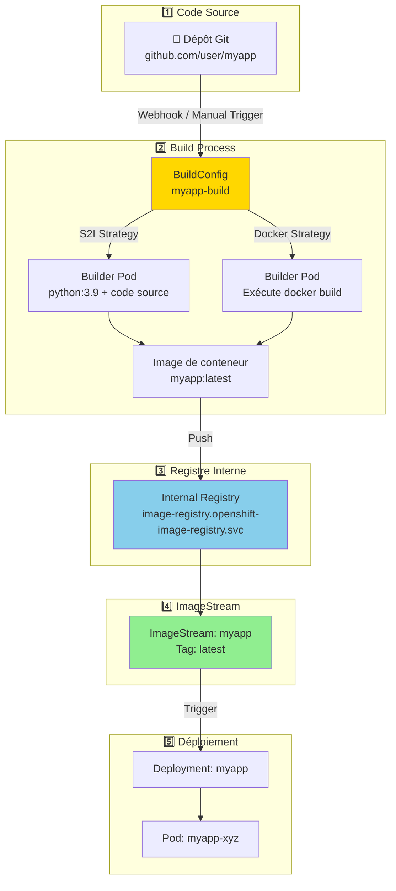
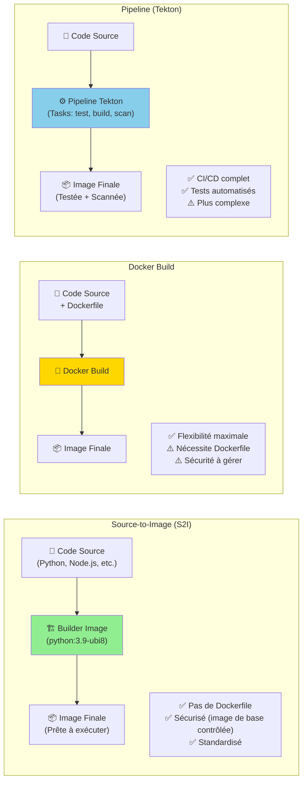

# Registre d'Images & Gestion des Images

## Objectif

Cette section explique comment OpenShift gère les images de conteneurs, y compris le registre d'images intégré, les ImageStreams et les stratégies de build pour créer des images à partir du code source.

## Concepts

### Registre d'Images Intégré

OpenShift inclut un **registre d'images intégré** qui stocke les images de conteneurs créées par les builds ou poussées manuellement. Ce registre est géré par l'**Image Registry Operator**.

- **Stockage** : Le registre nécessite un stockage persistant (par ex., NFS, S3, Azure Blob).
- **Sécurité** : L'accès au registre est contrôlé par RBAC. Seuls les utilisateurs autorisés peuvent pousser ou tirer des images.
- **Haute disponibilité** : Le registre peut être déployé en mode HA avec plusieurs réplicas.

### ImageStreams

Un **ImageStream** est un objet spécifique à OpenShift qui fournit une abstraction au-dessus des images de conteneurs. Il permet de référencer des images par des tags symboliques (par ex., `latest`, `v1.0`) plutôt que par des digests SHA256.

**Avantages des ImageStreams :**

- **Découplage** : Les déploiements peuvent référencer un ImageStream au lieu d'une image spécifique, ce qui facilite les mises à jour.
- **Déclencheurs automatiques** : Lorsqu'une nouvelle image est poussée vers un ImageStream, cela peut déclencher automatiquement un nouveau déploiement.
- **Importation d'images externes** : Les ImageStreams peuvent pointer vers des images dans des registres externes (par ex., Docker Hub, Quay.io).

### Stratégies de Build

OpenShift peut créer des images de conteneurs à partir de code source en utilisant différentes stratégies de build :

| Stratégie | Description |
|---|---|
| **Source-to-Image (S2I)** | Combine le code source avec une image de base (builder image) pour produire une nouvelle image exécutable. Pas besoin de Dockerfile. |
| **Docker** | Utilise un Dockerfile présent dans le dépôt de code source pour construire l'image. |
| **Pipeline** | Utilise un pipeline Tekton ou Jenkins pour orchestrer le processus de build. |

### Diagramme : Flux de Build et Push d'Image



### Diagramme : Stratégies de Build Comparées



## Où chercher dans la documentation officielle

- **Registre d'images intégré** : [https://docs.openshift.com/container-platform/latest/registry/index.html](https://docs.openshift.com/container-platform/latest/registry/index.html)
- **ImageStreams** : [https://docs.openshift.com/container-platform/latest/openshift_images/image-streams-manage.html](https://docs.openshift.com/container-platform/latest/openshift_images/image-streams-manage.html)
- **Builds** : [https://docs.openshift.com/container-platform/latest/cicd/builds/understanding-builds.html](https://docs.openshift.com/container-platform/latest/cicd/builds/understanding-builds.html)

## Commandes clés

```bash
# Lister les ImageStreams
oc get imagestreams
oc get is

# Décrire un ImageStream
oc describe is myapp

# Importer une image externe dans un ImageStream
oc import-image myapp --from=docker.io/myuser/myapp:latest --confirm

# Créer un build à partir de code source (S2I)
oc new-build python:3.9~https://github.com/user/myapp.git

# Démarrer un build manuellement
oc start-build myapp

# Suivre les logs d'un build
oc logs -f bc/myapp

# Lister les builds
oc get builds
```

## À retenir / Pièges fréquents

- **Le registre nécessite du stockage** : Le registre d'images intégré ne fonctionnera pas sans un backend de stockage configuré. Sur les clouds publics, il utilise généralement le stockage objet (S3, Azure Blob).
- **ImageStreams vs Images** : Un ImageStream n'est pas une image, c'est un pointeur vers une ou plusieurs images. Pensez-y comme un tag Git qui peut pointer vers différents commits.
- **S2I est puissant** : La stratégie S2I est l'une des fonctionnalités les plus puissantes d'OpenShift. Elle permet aux développeurs de déployer du code sans avoir à écrire de Dockerfile.
- **Les builds consomment des ressources** : Les builds s'exécutent dans des pods et consomment des ressources (CPU, mémoire). Assurez-vous de dimensionner correctement vos projets et de définir des quotas si nécessaire.
