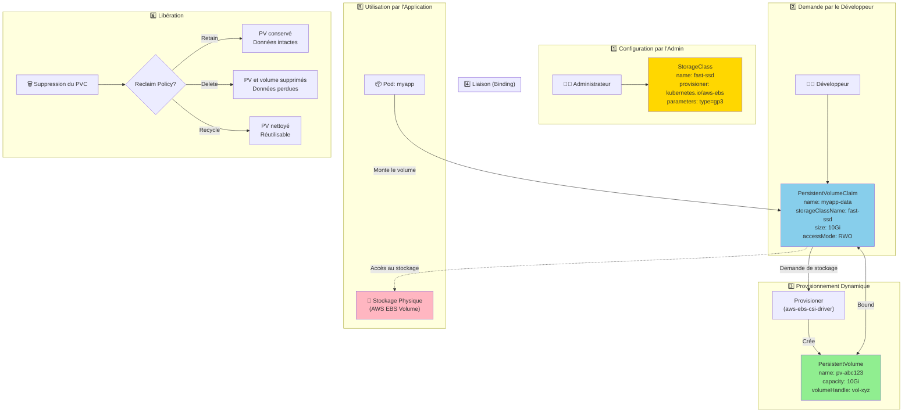
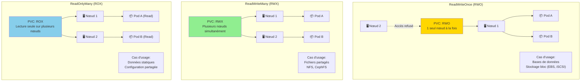

# Stockage

## Objectif

Cette section explique comment les applications peuvent demander et utiliser du stockage persistant dans OpenShift. Elle couvre les concepts de Volumes Persistants (PV), de Revendications de Volumes Persistants (PVC) et de Classes de Stockage (StorageClasses).

## Concepts

La gestion du stockage dans Kubernetes et OpenShift est basée sur une séparation claire des responsabilités entre les administrateurs de cluster et les développeurs.

| Objet | Description | Qui le gère ? |
|---|---|---|
| **PersistentVolume (PV)** | Un morceau de stockage dans le cluster qui a été provisionné par un administrateur. C\"est une ressource du cluster, comme un nœud. | Administrateur |
| **PersistentVolumeClaim (PVC)** | Une demande de stockage par un utilisateur. C\"est comme un pod qui consomme des ressources de nœud ; un PVC consomme des ressources de PV. | Développeur |
| **StorageClass** | Fournit un moyen pour les administrateurs de décrire les "classes" de stockage qu\"ils offrent. Différentes classes peuvent correspondre à des niveaux de service (par ex., `rapide`, `lent`) ou à des politiques de sauvegarde. | Administrateur |

### Provisionnement Dynamique

Le provisionnement dynamique permet de créer des volumes de stockage à la demande. Lorsqu\"un développeur crée un PVC, s\"il n\"y a pas de PV statique disponible qui correspond à la demande, une `StorageClass` peut provisionner automatiquement un nouveau PV pour ce PVC.

- **Provisioner** : Chaque `StorageClass` a un `provisioner` qui détermine quel plugin de volume est utilisé pour provisionner les PV.

### Diagramme : Cycle de Vie du Stockage Persistant



### Diagramme : Modes d'Accès au Stockage



## Où chercher dans la documentation officielle

- **Comprendre le stockage persistant** : [https://docs.openshift.com/container-platform/latest/storage/understanding-persistent-storage.html](https://docs.openshift.com/container-platform/latest/storage/understanding-persistent-storage.html)
- **Provisionnement dynamique** : [https://docs.openshift.com/container-platform/latest/storage/dynamic-provisioning.html](https://docs.openshift.com/container-platform/latest/storage/dynamic-provisioning.html)

## Commandes clés

```bash
# Lister les StorageClasses
oc get storageclass
oc get sc

# Lister les PersistentVolumes
oc get persistentvolume
oc get pv

# Lister les PersistentVolumeClaims dans le projet courant
oc get persistentvolumeclaim
oc get pvc

# Créer un PVC à partir d\"un fichier YAML
oc create -f my-pvc.yaml

# Décrire un PV pour voir ses détails et son statut
oc describe pv <pv-name>

# Décrire un PVC pour voir à quel PV il est lié
oc describe pvc <pvc-name>
```

## À retenir / Pièges fréquents

- **Modes d\"accès (Access Modes)** : Un PV peut être monté de différentes manières : `ReadWriteOnce` (RWO - monté en lecture/écriture par un seul nœud), `ReadOnlyMany` (ROX - monté en lecture seule par plusieurs nœuds), et `ReadWriteMany` (RWX - monté en lecture/écriture par plusieurs nœuds). Tous les types de stockage ne supportent pas tous les modes.
- **Politique de récupération (Reclaim Policy)** : La `reclaimPolicy` d\"un PV indique au cluster quoi faire du volume après qu\"il a été libéré de sa revendication. Les options sont `Retain` (garder le volume), `Recycle` (déprécié) et `Delete` (supprimer le volume).
- **Binding** : Un PVC se lie à un PV. Pour que le binding réussisse, le PV doit satisfaire les exigences du PVC (taille, mode d\"accès). Dans le cas du provisionnement dynamique, le PV est créé pour correspondre exactement au PVC.
- **Configurer une `StorageClass` par défaut** : Il est crucial d\"avoir une `StorageClass` par défaut pour que le provisionnement dynamique fonctionne de manière transparente pour les développeurs.
