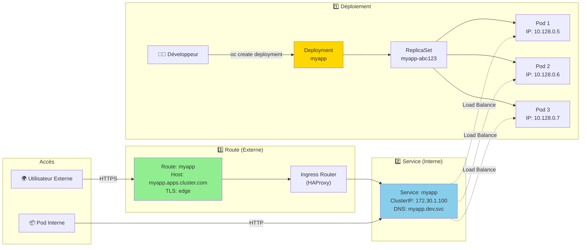

# Workloads, Services & Routes

## Objectif

Cette section explique comment déployer et exposer des applications sur OpenShift. Elle couvre les principaux types de charges de travail (Workloads) pour exécuter des conteneurs, et comment les rendre accessibles de l'intérieur (Services) et de l'extérieur (Routes) du cluster.

## Concepts

### Charges de travail (Workloads)

Les charges de travail sont les objets Kubernetes qui gèrent les pods.

| Workload | Description |
|---|---|
| **Deployment** | Le plus courant. Idéal pour les applications stateless. Gère les ReplicaSets pour assurer qu'un nombre spécifié de pods est toujours en cours d'exécution et permet des mises à jour progressives (rolling updates). |
| **StatefulSet** | Pour les applications stateful qui nécessitent une identité réseau stable et un stockage persistant stable (par ex., bases de données). |
| **DaemonSet** | Assure qu'un pod s'exécute sur chaque nœud (ou un sous-ensemble de nœuds) du cluster. Utile pour les agents de logging ou de monitoring. |
| **Job / CronJob** | Un `Job` exécute une tâche jusqu'à sa complétion. Un `CronJob` exécute un `Job` à une heure ou un intervalle programmé. |

OpenShift étend ces concepts avec le **DeploymentConfig (DC)**, un objet hérité qui offre des stratégies de déploiement plus avancées (par ex., Blue-Green, A/B). Bien que toujours supporté, `Deployment` est maintenant la méthode recommandée.

### Services

Un **Service** est une abstraction qui définit un ensemble logique de pods et une politique pour y accéder. Il fournit une adresse IP et un nom DNS stables pour un groupe de pods. Les services permettent aux applications de communiquer entre elles à l'intérieur du cluster sans avoir à connaître les adresses IP individuelles des pods, qui sont éphémères.

### Routes

Une **Route** est un objet spécifique à OpenShift qui expose un service à l'extérieur du cluster. C'est l'équivalent d'un `Ingress` dans Kubernetes, mais avec des fonctionnalités supplémentaires.

- **Hôte** : La route associe un nom d'hôte (par ex., `myapp.apps.mycluster.com`) à un service.
- **Terminaison TLS** : Les routes peuvent gérer le chiffrement TLS de différentes manières (`edge`, `passthrough`, `re-encrypt`).

### Diagramme : Flux de Déploiement et Exposition d'Application



### Diagramme : Types de Terminaison TLS pour les Routes

```mermaid
graph TD
    subgraph "Edge Termination"
        CLIENT1["👤 Client"] -->|"HTTPS"| ROUTER1["Router<br/>(Termine TLS)"]
        ROUTER1 -->|"HTTP"| POD1["📦 Pod"]
    end

    subgraph "Passthrough Termination"
        CLIENT2["👤 Client"] -->|"HTTPS"| ROUTER2["Router<br/>(Passe le trafic)"]
        ROUTER2 -->|"HTTPS"| POD2["📦 Pod<br/>(Termine TLS)"]
    end

    subgraph "Re-encrypt Termination"
        CLIENT3["👤 Client"] -->|"HTTPS"| ROUTER3["Router<br/>(Termine TLS)"]
        ROUTER3 -->|"HTTPS<br/>(Nouveau cert)"| POD3["📦 Pod<br/>(Termine TLS)"]
    end

    NOTE1["Edge: TLS terminé au router<br/>Communication interne en HTTP<br/>✅ Plus simple, plus rapide"]
    NOTE2["Passthrough: TLS de bout en bout<br/>Router ne déchiffre pas<br/>✅ Sécurité maximale"]
    NOTE3["Re-encrypt: Double TLS<br/>Router déchiffre puis rechiffre<br/>✅ Sécurité + inspection"]

    style ROUTER1 fill:#FFD700
    style ROUTER2 fill:#87CEEB
    style ROUTER3 fill:#90EE90
```



## Où chercher dans la documentation officielle

- **Gestion des déploiements** : [https://docs.openshift.com/container-platform/latest/applications/deployments/what-deployments-are.html](https://docs.openshift.com/container-platform/latest/applications/deployments/what-deployments-are.html)
- **Services** : [https://docs.openshift.com/container-platform/latest/networking/services.html](https://docs.openshift.com/container-platform/latest/networking/services.html)
- **Routes** : [https://docs.openshift.com/container-platform/latest/networking/routes/route-configuration.html](https://docs.openshift.com/container-platform/latest/networking/routes/route-configuration.html)

## Commandes clés

```bash
# Créer un déploiement à partir d'une image
oc create deployment myapp --image=nginx

# Mettre à l'échelle un déploiement
oc scale deployment myapp --replicas=3

# Exposer un déploiement avec un service
oc expose deployment myapp --port=80 --target-port=8080

# Exposer un service avec une route
oc expose service myapp

# Lister les routes
oc get routes

# Décrire une route pour voir ses détails
oc describe route myapp
```

## À retenir / Pièges fréquents

- **`Deployment` vs `DeploymentConfig`** : Privilégiez `Deployment` pour les nouvelles applications, car c'est le standard Kubernetes. `DeploymentConfig` reste utile pour ses stratégies de déploiement avancées et ses déclencheurs (triggers).
- **Sélecteurs (Selectors)** : Un service trouve les pods qu'il doit exposer en utilisant des labels et des sélecteurs. Assurez-vous que les labels de vos pods correspondent aux sélecteurs de votre service.
- **Port vs TargetPort** : Dans un service, `port` est le port sur lequel le service est exposé, tandis que `targetPort` est le port sur lequel les conteneurs des pods écoutent.
- **Routes sécurisées** : Utilisez toujours des routes sécurisées (HTTPS) en production. La terminaison `edge` est la plus simple à configurer.
